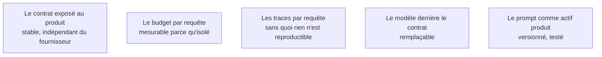

Le découpage qui fonctionne en équipe réduite : la fonction à base de modèle est un service séparé, avec son propre contrat d'API, ses propres tests et son propre budget. Le reste du produit ne sait pas qu'il y a un modèle derrière.

## Ce qu'il faut savoir faire

- Exposer la fonction derrière un contrat d'API qui ne mentionne ni fournisseur, ni modèle, ni prompt. Le reste du produit appelle « résumer ce document », pas « appeler tel modèle ».
- Rendre trois choses possibles par ce découpage : changer de fournisseur, mettre la fonction en mode dégradé, et mesurer son coût isolément. Les trois sont impossibles quand les appels sont dispersés dans le code applicatif.
- Versionner le prompt comme du code : dans le dépôt, avec les tests qui l'accompagnent, revu comme une modification de code. Pas une chaîne dans un fichier de configuration modifiée en production.
- Instrumenter par requête le coût, la latence et la trace complète — entrée, sortie, version du prompt, modèle appelé. C'est ce qui rend un incident reproductible.
- Poser un plafond de dépense sur le service et définir ce qui se passe quand il est atteint. Un plafond sans comportement défini est une coupure surprise.
- Prévoir le mode dégradé dès le premier jour : la fonction indisponible ne doit pas empêcher le reste du produit de fonctionner.

## Les notions mobilisées

- [[notions/conception-d-api]] — le contrat est ce qui rend le fournisseur remplaçable ; sans lui, changer de modèle est une modification transverse du produit.
- [[notions/cout-et-latence-inference]] — facturation, mise en cache, traitement par lots : les leviers ne sont actionnables que si le coût est mesuré au bon endroit.
- [[notions/observabilite]] — traces par requête et coût par requête, sans quoi aucun incident sur une fonction à base de modèle n'est reproductible.
- [[notions/choix-de-modele]] — l'isolation transforme le choix de modèle en paramètre, ce qui permet de le rouvrir quand les prix bougent.
- [[notions/ingenierie-de-prompt]] — ici le prompt est un actif produit, avec un historique, des tests et une procédure de modification.
