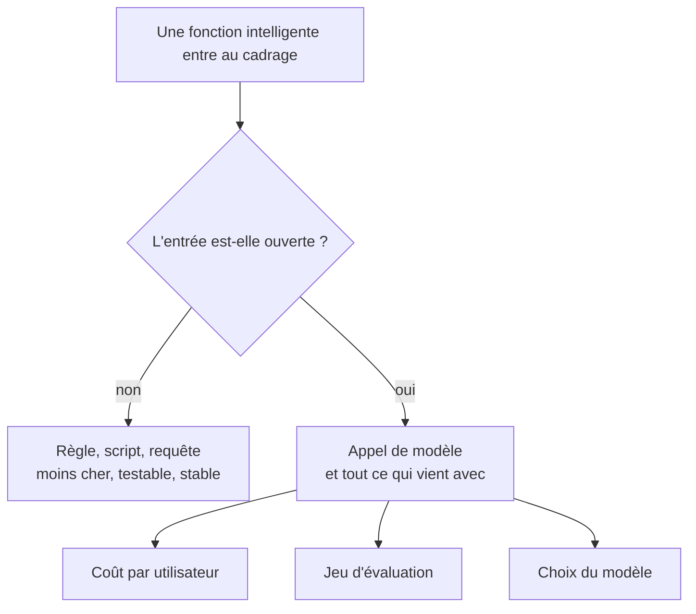

La première question, et celle qu'on saute. Une classification à sept catégories stables, un calcul, un routage : ce sont des règles. On n'y met un modèle que si l'entrée est du langage libre ou si les cas sont ouverts.

## Ce qu'il faut savoir faire

- Poser la question dans le bon sens : qu'est-ce qui, dans cette fonction, ne peut pas s'écrire en règles ? Si la réponse est « rien », la fonction est déterministe et le restera.
- Reconnaître les deux seuls déclencheurs légitimes : l'entrée est du langage libre, ou l'ensemble des cas est ouvert et évolue. Le reste — « ça ferait moderne », « le générateur l'a proposé » — n'en est pas un.
- Estimer le coût par utilisateur actif avant de décider, pas après la première facture. Un produit grand public ne survit pas à un gros modèle appelé à chaque interaction.
- Choisir le plus petit modèle qui passe le jeu d'évaluation, pas le meilleur disponible. Le critère dominant ici n'est pas la qualité de tête de gamme.
- Préparer le repli déterministe. Une fonction probabiliste qui n'a pas de comportement de secours rend le produit entier dépendant de la disponibilité d'un fournisseur.
- Écrire la décision et son motif. C'est celle qu'on rouvrira quand le coût augmentera, et personne ne s'en souviendra.

## Les notions mobilisées

- [[notions/arbitrage-deterministe-probabiliste]] — pour ce métier, l'erreur courante est inversée : on met un modèle là où une règle de quinze lignes suffisait, parce que la génération l'a suggéré et que c'était gratuit à écrire.
- [[notions/choix-de-modele]] — le critère dominant est le coût par utilisateur actif, pas la performance de tête de gamme.
- [[notions/cout-et-latence-inference]] — le budget par utilisateur et par mois est une contrainte de modèle économique, pas une ligne d'infrastructure ; il se calcule avant de livrer.
- [[notions/evaluation-llm]] — décider d'appeler un modèle, c'est s'engager à construire un jeu d'évaluation ; sans cet engagement, la décision n'est pas prise.

> [!warning] Piège
> Ajouter un assistant conversationnel au produit parce qu'il en faut un. C'est la fonction la plus demandée, la plus chère à évaluer, la moins utilisée après le premier mois et la plus exposée en cas de dérapage. Dans la plupart des produits, une recherche qui comprend les formulations approximatives et deux ou trois champs pré-remplis intelligemment apportent plus de valeur d'usage pour un dixième du risque.
