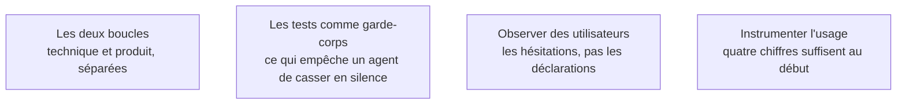

Deux boucles qu'on confond souvent : « est-ce que ça marche encore » se ferme en secondes, « est-ce que ça sert » se ferme en semaines. Les deux se surveillent séparément.

## Les quatre sujets

## Ma progression

- [ ] [[parcours/ai-product-builder/tests-et-mesure-d-usage/les-deux-boucles|Les deux boucles]] — pourquoi une application sans erreur peut être un produit mort
- [ ] [[parcours/ai-product-builder/tests-et-mesure-d-usage/les-tests-comme-garde-corps|Les tests comme garde-corps]] — la pyramide qui s'inverse sur une base générée
- [ ] [[parcours/ai-product-builder/tests-et-mesure-d-usage/observer-des-utilisateurs|Observer des utilisateurs]] — une tâche, aucune aide, et l'observateur se tait
- [ ] [[parcours/ai-product-builder/tests-et-mesure-d-usage/instrumenter-l-usage|Instrumenter l'usage]] — dix événements nommés, branchés avant la mise en ligne
