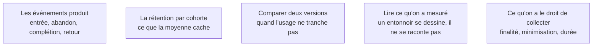

Les gens répondent qu'une fonction leur est utile et ne l'ouvrent jamais. L'instrumentation est la seule donnée qui arbitre les priorités de la v2 — et elle se branche avant la première mise en ligne, pas après le premier désaccord.

## Ce qu'il faut savoir faire

- Se limiter à quatre chiffres au début : combien de personnes commencent le parcours principal, combien le finissent, combien reviennent la semaine suivante, où exactement se situe l'abandon. Tout le reste est du raffinement.
- Nommer une dizaine d'événements et les déclarer dans un fichier unique, écrit à la main. C'est un de ceux qu'on ne délègue pas : un nom d'événement mal choisi contamine toutes les analyses ultérieures.
- Brancher l'instrumentation **avant** la première mise en ligne. Rétablir des données d'usage a posteriori demande de relivrer et d'attendre un mois, pendant lequel les arbitrages se prennent à l'opinion.
- Lire la rétention par cohorte d'entrée plutôt qu'en moyenne. Une moyenne stable peut cacher une première semaine qui s'effondre et une base historique qui la compense.
- Mesurer ce qui est utilisé contre ce qui est déclaré, et trancher avec le premier. La déclaration sert à expliquer l'observation, pas à la remplacer.
- Vérifier ce qu'on a le droit de collecter avant de collecter : finalité, minimisation, durée de conservation, et ce que le service d'analyse choisi fait des données.

## Les notions mobilisées

- [[notions/mesure-d-usage-produit]] — l'instrumentation d'événements, l'entonnoir et l'activation ; pour ce métier c'est l'unique arbitre des priorités de la v2.
- [[notions/analyse-de-cohorte]] — la rétention ne se lit qu'en cohortes d'entrée, sans quoi l'effet de composition masque exactement ce qu'on cherche.
- [[notions/ab-testing]] — utilisable seulement quand le volume le permet ; sur un produit qui démarre, l'observation directe tranche plus vite.
- [[notions/visualisation-de-donnees]] — un entonnoir mal représenté fait prendre une baisse saisonnière pour une régression produit.
- [[notions/rgpd]] — un identifiant d'utilisateur dans un service d'analyse tiers est un traitement de données personnelles, avec tout ce que cela implique.

> [!warning] Piège
> Instrumenter cinquante événements « pour ne rien rater ». Personne ne les lit, leurs noms divergent au bout de trois semaines et l'analyse devient impossible. Dix événements nommés proprement et effectivement consultés valent mieux que cinquante inexploitables.
