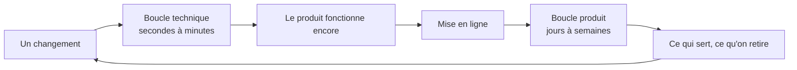

Niveau attendu : **autonomie**. Séparer « ça marche encore » de « ça sert » est une décision d'organisation du produit, pas une pratique à appliquer : les confondre est l'erreur qu'aucun outil ne signale.

« Est-ce que ça marche encore » et « est-ce que ça sert » sont deux questions différentes, avec deux instruments différents et deux fréquences différentes. Les confondre produit soit un produit vert et mort, soit un produit utile qu'on casse sans le voir.

## Ce qu'il faut savoir faire

- Tenir les deux boucles séparément et ne jamais laisser l'une servir de preuve pour l'autre. Une application sans erreur en production peut n'avoir aucun utilisateur qui atteint la fin du parcours.
- Fermer la boucle technique en secondes : tests, typage, linter, exécutés localement et à chaque poussée. C'est aussi ce qui empêche un assistant de casser en silence ce qu'il ne comprend pas.
- Fermer la boucle produit en semaines : une mise en ligne, des utilisateurs, des événements mesurés, une décision de retirer ou d'ajouter. Plus court, on mesure du bruit ; plus long, on arbitre à l'opinion.
- Instrumenter la seconde boucle **avant** la première mise en ligne, sans quoi elle ne se fermera qu'au mois suivant.
- Savoir laquelle des deux boucles décide : la technique autorise à livrer, la produit décide s'il faut continuer.
- Ne pas répondre à une alerte produit par du travail technique. « Les gens abandonnent à l'étape trois » n'est presque jamais un problème de performance.

## Les notions mobilisées

- [[notions/tests-logiciels]] — la boucle technique de ce métier a une fonction particulière : elle sert de garde-corps aux modifications automatisées, pas seulement de preuve de justesse.
- [[notions/mesure-d-usage-produit]] — la boucle produit n'existe que si des événements sont nommés et comptés ; sinon elle se réduit à des impressions.
- [[notions/integration-continue]] — ce qui rend la boucle technique automatique au lieu de dépendre de la mémoire de chacun.
- [[notions/observabilite]] — la couche qui permet de savoir, quand les deux boucles divergent, laquelle dit vrai.

> [!warning] Piège
> Confondre absence de bug et absence de problème. La boucle technique peut être verte pendant que le produit meurt, et c'est le scénario le plus courant sur un produit généré rapidement : la qualité d'exécution est correcte et personne n'a vérifié que quelqu'un s'en servait.
