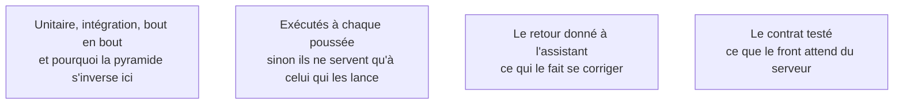

Sur une base de code générée, les tests ne servent pas d'abord à prouver la justesse : ils sont le seul retour d'exécution qui empêche un assistant de casser en silence ce qu'il ne comprend pas. Cela change ce qu'il faut couvrir en priorité — les parcours, pas les fonctions.

## Ce qu'il faut savoir faire

- Couvrir en priorité les parcours qui rapportent de l'argent, en bout en bout. Trois tests de ce type protègent plus que cinquante tests unitaires sur des fonctions utilitaires que le générateur réécrira de toute façon.
- Écrire soi-même les tests de bout en bout des parcours critiques, ou au moins les relire ligne à ligne. Ce sont eux qui définissent ce que « le produit fonctionne » veut dire : c'est une décision, pas une tâche.
- Vérifier qu'un test peut échouer. En casser un volontairement, constater qu'il rougit, le remettre. Un test qui n'a jamais échoué n'a rien prouvé.
- Exécuter la suite à chaque poussée, pas à la demande. Un test qui ne tourne pas automatiquement ne protège rien contre un agent qui modifie quinze fichiers.
- Tester le contrat entre le front et le serveur, qui est l'endroit où deux générations successives se désaccordent le plus souvent.
- Traiter un bug corrigé comme un test à ajouter. C'est la seule façon d'empêcher un assistant de le réintroduire trois semaines plus tard.

## Les notions mobilisées

- [[notions/tests-logiciels]] — la pyramide classique s'inverse partiellement ici, parce que la valeur d'un test se mesure à ce qu'il empêche une machine de casser.
- [[notions/integration-continue]] — un garde-corps qui n'est pas posé automatiquement n'est pas un garde-corps.
- [[notions/assistants-de-codage]] — un agent branché sur des tests se corrige ; le même agent sans rien produit du code plausible et faux avec une confiance identique.
- [[notions/conception-d-api]] — le contrat est la couture la plus fragile d'une application générée, donc la plus rentable à tester.

## Pour apprendre

- [What is Unit Testing?](https://www.guru99.com/unit-testing-guide.html) et [Integration Testing](https://www.guru99.com/integration-testing.html) — les deux premiers étages, pour le vocabulaire et la mécanique.
- [End to End Testing](https://microsoft.github.io/code-with-engineering-playbook/automated-testing/e2e-testing/) — l'étage qui compte le plus ici, avec les pièges de stabilité qu'il faut connaître avant de s'y mettre.
