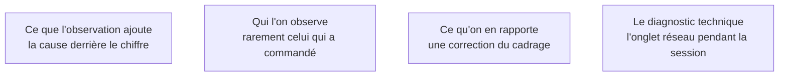

Le pendant qualitatif de l'instrumentation. Les chiffres disent **où** les gens s'arrêtent ; seule l'observation dit **pourquoi**. Aucun des deux ne remplace l'autre, et celui qu'on néglige est presque toujours le second.

## Ce qu'il faut savoir faire

- Partir d'un point d'abandon mesuré et aller l'observer. Une session menée sans hypothèse produit une liste d'avis ; une session menée sur un abandon connu produit une cause.
- Donner une tâche et se taire. L'observateur qui explique corrige le comportement qu'il était venu mesurer.
- Noter les hésitations, pas les phrases. Un silence de quatre secondes devant un libellé est une donnée ; « c'est très clair » n'en est pas une.
- Garder l'onglet réseau ouvert pendant la session. Une part des hésitations n'est pas une incompréhension mais une réponse serveur lente, et on ne les distingue pas autrement.
- Refaire une session après correction, sur la même tâche. C'est la seule façon de savoir si la correction a corrigé quelque chose.
- Réinjecter le résultat dans le fichier de cadrage plutôt que dans un compte rendu séparé, pour qu'il atteigne les outils à la génération suivante.

## Les notions mobilisées

- [[notions/mesure-d-usage-produit]] — la satisfaction déclarée sert à comprendre un comportement déjà observé, jamais à le prédire.
- [[notions/gestion-parties-prenantes]] — obtenir du temps d'utilisateurs réels est une négociation, et elle se gagne au cadrage, pas la veille de la session.
- [[notions/cadrage-besoin]] — ce qui ressort d'une session est une correction du problème, pas une liste de retouches d'interface.
- [[notions/observabilite]] — la lenteur perçue se confirme par les traces ; sans elles on refait l'interface d'un problème de requête.

> [!tip] La question qui ouvre
> Demander à la personne de raconter la dernière fois qu'elle a fait cette tâche sans le produit. On obtient le contournement réel, les outils officieux qu'elle utilise, et souvent la raison pour laquelle le parcours prévu ne lui convient pas — trois choses qu'aucune question sur l'interface ne fait sortir.
