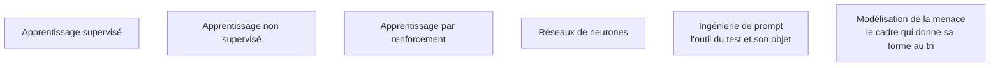

Niveau attendu : **usage**. Le socle d'apprentissage sert à savoir où un modèle casse, pas à en entraîner un : un confirmé le mobilise documentation ouverte, et n'a jamais à concevoir une architecture de réseau.

Savoir trier ce qui, dans un système d'IA, relève de la sécurité applicative ordinaire et ce qui est réellement propre au modèle — et comprendre assez du modèle pour savoir où il est fragile.

## Le tri qui ouvre toute mission

Dans un audit réel, la grande majorité des constats est de la sécurité applicative ordinaire : une clé d'API dans le dépôt, un point d'accès sans authentification, une absence de limitation de débit, un contrôle d'accès manquant sur l'index de récupération. Ce qui est propre aux modèles tient en peu de choses, mais ces choses n'ont pas d'équivalent : la confusion instruction/donnée, la mémorisation du corpus d'entraînement, la sensibilité à des perturbations imperceptibles, et l'absence de frontière nette entre un fonctionnement normal et un fonctionnement détourné.

La question qui range un constat dans l'une ou l'autre catégorie tient en une ligne : **cette faille existerait-elle encore si le modèle était remplacé par une fonction déterministe ?** Si oui, c'est de la sécurité applicative — outillage habituel, équipe existante, correction connue. Si non, c'est un constat propre au modèle, et il appelle un arbitrage d'architecture plutôt qu'un correctif. Les deux vont dans le rapport, dans deux parties séparées, parce qu'elles ne s'adressent pas aux mêmes personnes. Cette question évite aussi le biais inverse, plus insidieux : imputer au modèle une fuite qui vient en réalité d'un index vectoriel sans filtrage par utilisateur.

## Ce qu'il faut savoir faire

- **Justifier pourquoi les méthodes de test standard échouent** sur trois propriétés : le système est non déterministe, son comportement dépend de données qu'il lit à l'exécution, et il n'a pas de spécification complète contre laquelle vérifier. Un scanner de vulnérabilités ne trouvera jamais une politique de sécurité contournée par une reformulation.
- **Distinguer évaluation de vulnérabilité et red teaming** : la première énumère des faiblesses connues contre un référentiel, le second poursuit un objectif adverse sans référentiel et mesure ce qu'un attaquant obtiendrait réellement. Les deux sont utiles, ils ne répondent pas à la même question.
- **Décliner la triade confidentialité / intégrité / disponibilité sur le modèle** : fuite du corpus et extraction du prompt système ; empoisonnement des données et manipulation du contexte récupéré ; requêtes conçues pour maximiser le coût de génération. La troisième branche est la plus souvent oubliée alors qu'elle a un effet direct sur la facture.
- **Poser le cadre d'engagement avant de toucher au système** : périmètre écrit, autorisation écrite, données de test qui ne sont pas des données réelles de clients, divulgation responsable. Sans mandat, la même action est une intrusion.
- **Situer le système sur le tableau ci-dessous** pour savoir quelles surfaces sont dans le périmètre avant de dimensionner l'effort.
- **Dimensionner la part humaine** : sur un classifieur, l'espace des sorties est fini, on mesure un taux d'erreur sous attaque et le test s'automatise presque entièrement ; sur un modèle génératif, l'espace des sorties est ouvert, aucun oracle automatique n'est fiable sans calibrage, et une part irréductible du travail reste humaine.

| Paradigme d'apprentissage | Ce qu'il ouvre comme surface |
|---|---|
| Supervisé | frontière de décision approximative donc franchissable par une entrée perturbée ; fuite par mémorisation si le modèle est surajusté |
| Non supervisé | un regroupement révèle ce que l'anonymisation devait masquer ; une réduction de dimension efface le signal sur lequel repose une détection |
| Par renforcement | la fonction de récompense est l'objectif réel, pas celui qu'on croit avoir donné — le *reward hacking* est à tester explicitement, y compris sous sa forme de complaisance envers l'utilisateur |
| Réseaux de neurones | l'accès aux gradients change tout : perturbation ciblée par optimisation en boîte blanche, recherche et transférabilité en boîte noire |
| Génératif | pas de sortie « invalide » détectable par typage — un texte hostile, confidentiel ou anodin ont la même forme, donc tout contrôle de sortie est sémantique, donc faillible |

> [!warning] Piège
> Réviser la théorie de l'apprentissage automatique en profondeur avant de commencer à tester, et livrer un rapport composé exclusivement de jailbreaks réussis. Sur un système d'IA générative d'entreprise, l'écrasante majorité des constats exploitables ne demande aucune connaissance des gradients : ils portent sur le contexte récupéré, les outils exposés et les droits d'accès. Les constats qui changent quelque chose montrent un chemin complet — entrée non fiable, action privilégiée, donnée sortie du périmètre.

## Les notions mobilisées

- [[notions/apprentissage-supervise]] — les cibles sont la robustesse aux exemples adverses et la fuite par mémorisation du jeu étiqueté.
- [[notions/apprentissage-non-supervise]] — le regroupement et la réduction de dimension comme fuites d'information, pas comme outils d'analyse.
- [[notions/apprentissage-par-renforcement]] — là où naissent le détournement de récompense et la complaisance, deux modes de défaillance testables.
- [[notions/reseaux-de-neurones]] — l'accès aux gradients, seul discriminant entre attaque par optimisation et attaque par recherche.
- [[notions/ingenierie-de-prompt]] — l'outil du test et son objet à la fois : les mêmes leviers qui font suivre une consigne permettent d'en imposer une autre.
- [[notions/modelisation-de-la-menace]] — le cadre qui donne sa forme au tri décrit ici.

## Pour apprendre

- [OWASP GenAI Security Project](https://genai.owasp.org/) — le Top 10 des risques des applications LLM. Le référentiel que les équipes sécurité connaissent déjà, et donc le vocabulaire commun pour faire passer un constat.
- [Adversarial Testing for Generative AI](https://developers.google.com/machine-learning/guides/adv-testing) — une méthode de test adverse structurée, orientée évaluation plutôt que exploit.
- [Jailbroken: How Does LLM Safety Training Fail?](https://arxiv.org/abs/2307.02483) — pourquoi l'alignement échoue, mécanisme par mécanisme, plutôt qu'une liste de contournements.
- [[parcours/computer-science/index|Roadmap Computer Science]] — réseau, système et bases applicatives : le prérequis réel que l'amont ne formule pas.
- [[parcours/machine-learning/index|Machine Learning]] — le socle d'apprentissage automatique, si les paradigmes du tableau ci-dessus ne parlent pas.
