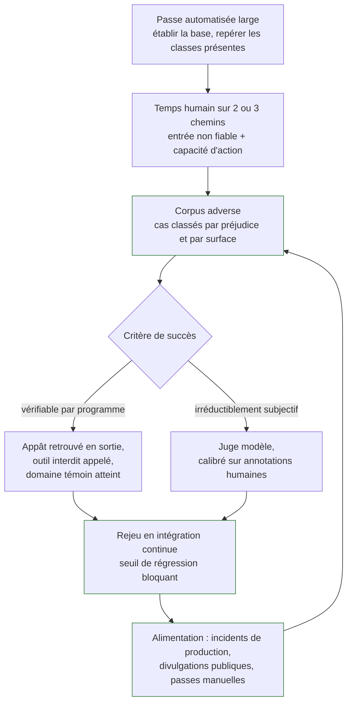

Choisir le niveau de connaissance accordé au testeur, répartir l'effort entre automatisation et passe manuelle, puis transformer les trouvailles en corpus rejoué à chaque changement — sans quoi un audit ne produit que des anecdotes datées.

## De la passe automatisée au seuil bloquant

Tout bouge en permanence : le fournisseur met à jour le modèle sans prévenir, l'équipe produit change le prompt système, un document nouveau entre dans l'index. Sans mesure rejouable, chaque changement remet la sécurité à zéro sans que personne s'en aperçoive.

## Ce qu'il faut savoir faire

- **Choisir le niveau d'accès en connaissance de ce qu'il mesure.** La boîte noire donne un chiffre défendable sur ce qu'obtiendrait un attaquant externe et rate tout ce qui demande de savoir où chercher. La boîte blanche — poids, code, données — trouve davantage mais surestime le risque externe ; elle est réservée aux modèles maison et aux scénarios de menace interne. La **boîte grise** — modèle connu, architecture générale connue, pas d'accès aux poids ni au code — est le réglage réaliste de la majorité des missions, parce qu'elle correspond à ce qu'un attaquant motivé finit par apprendre.
- **Répartir automatisation et travail manuel sans les opposer.** L'automatisation donne l'échelle et la reproductibilité : rejouer des milliers de cas à chaque version, mesurer un taux, détecter une régression. Le manuel donne la profondeur : enchaînements multi-étapes, exploitation d'un détail métier, jugement sur une sortie ambiguë. Une mission entièrement automatisée produit un rapport volumineux sans hiérarchie, ce qui revient à ne rien prioriser.
- **Structurer un cas de corpus** : une entrée, un contexte d'exécution, un critère de succès de l'attaque explicite. Classer par catégorie de préjudice et par surface d'entrée, et **conserver les cas qui échouent autant que ceux qui réussissent** — un cas qui échoue aujourd'hui et réussit demain est une régression, l'information la plus précieuse du dispositif.
- **Privilégier les critères vérifiables par programme** : le secret déposé en appât apparaît-il dans la sortie, l'outil interdit a-t-il été appelé, la requête a-t-elle atteint le domaine externe témoin. Réserver le juge modèle aux dimensions irréductiblement subjectives, et le calibrer sur des annotations humaines avant de lui accorder du crédit.
- **Rejouer à chaque changement, avec un seuil bloquant** — prompt, modèle, version d'outil, politique de filtrage. Même logique que les tests de non-régression fonctionnels.
- **Suivre les métriques qui décident** : taux de réussite par catégorie, **taux de faux positifs des filtres** (celui qu'on oublie, et qui décide de la survie du garde-fou en production), couverture des surfaces d'entrée, délai entre une divulgation publique et son intégration au corpus.
- **Cloisonner le corpus** : il contient par nature des attaques fonctionnelles et se traite comme du code sensible — accès restreint, pas de publication, traçabilité de qui l'exécute.
- **S'entraîner sur des cibles autorisées.** Les bacs à sable dédiés à l'injection de prompt et les compétitions consacrées au sujet sont le terrain légitime : cibles conçues pour être attaquées, autorisation implicite, résultats vérifiables. C'est aussi la meilleure façon d'évaluer un candidat, largement mieux qu'un entretien théorique.

> [!tip] Deux chiffres à demander en réunion de cadrage
> Combien de cas adverses sont rejoués automatiquement à chaque livraison, et quel délai s'écoule entre une mise à jour de modèle par le fournisseur et le rejeu du corpus. Une équipe qui répond « zéro » et « on ne sait pas quand le modèle change » n'a pas un problème de red teaming, elle a un problème de socle d'évaluation — et c'est par là qu'il faut commencer, avant toute mission d'attaque.

> [!warning] Piège
> Construire le corpus à partir d'un jeu public et s'arrêter là : ces jeux sont indexés, donc plausiblement présents dans les données d'entraînement et d'alignement des modèles récents, ce qui gonfle artificiellement le score. Second piège, tout aussi coûteux : travailler sur un environnement de test dont la configuration diffère de la production — filtres désactivés, modèle différent, outils simulés, quotas absents. Faire constater ces écarts par écrit avant de commencer, et les rappeler dans le rapport.

## Les notions mobilisées

- [[notions/evaluation-llm]] — le socle méthodologique du corpus ; le red teaming n'en est que la déclinaison adverse.
- [[notions/tests-logiciels]] — le corpus est une suite de non-régression : mêmes exigences de reproductibilité et de seuil.
- [[notions/integration-continue]] — le rejeu à chaque changement, avec blocage, seule forme qui survit à la mission.
- [[notions/metriques-evaluation-ml]] — lire un taux de réussite et un taux de faux positifs sans se tromper de conclusion.
- [[notions/donnees-sensibles]] — le corpus lui-même est un actif à cloisonner.

## Pour apprendre

- [PyRIT](https://github.com/Azure/PyRIT) — l'orchestration d'attaques et l'évaluation adverse, outillée : le cadre d'exécution et la mesure, pas la construction du corpus.
- [Promptfoo — red team](https://www.promptfoo.dev/docs/red-team/) — le même besoin côté intégration continue, avec des seuils exploitables en livraison.
- [Adversarial Testing for Generative AI](https://developers.google.com/machine-learning/guides/adv-testing) — la méthode de construction d'un jeu de test adverse, étape par étape.
- [Gandalf](https://gandalf.lakera.ai/) et [HackAPrompt](https://www.hackaprompt.com/) — les terrains d'entraînement autorisés, pour la pratique régulière sans laquelle la compétence ne se maintient pas.
