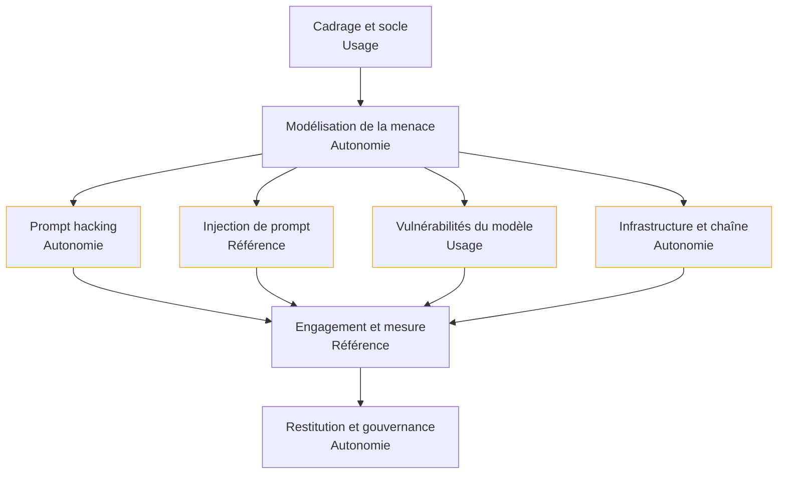

Tester un système d'IA en adversaire pour le rendre défendable : trouver ce qu'un attaquant obtiendrait réellement, le démontrer par un chemin complet, et le transformer en mesure qu'on rejoue à chaque changement.

## La roadmap

Chaque case mène à sa page. La deuxième ligne donne le niveau attendu chez un profil **confirmé** — de *notion* (reconnaître le sujet, savoir qui appeler) à *référence* (faire autorité dans la salle), en passant par *usage* (se servir d'un chemin balisé) et *autonomie* (concevoir, déboguer sous pression, défendre un arbitrage). Cochez les étapes acquises en bas de page pour suivre votre progression.

## Ma progression

- [ ] [[parcours/ai-red-teaming/cadrage-et-socle|Cadrage et socle technique]] — trier ce qui relève de la sécurité applicative et ce qui est propre au modèle
- [ ] [[parcours/ai-red-teaming/modelisation-de-la-menace|Modélisation de la menace]] — surfaces d'entrée, gradation des adversaires, priorisation par impact
- [ ] [[parcours/ai-red-teaming/prompt-hacking|Prompt hacking]] — jailbreak, contournement des filtres, contre-mesures et leur mesure
- [ ] [[parcours/ai-red-teaming/injection-de-prompt|Injection de prompt]] — la forme indirecte, les canaux d'exfiltration, les parades d'architecture
- [ ] [[parcours/ai-red-teaming/vulnerabilites-du-modele|Vulnérabilités du modèle]] — empoisonnement, exemples adverses, inversion, extraction
- [ ] [[parcours/ai-red-teaming/infrastructure-et-chaine|Infrastructure et chaîne d'approvisionnement]] — API, identité, poids, serveurs d'outils, détection
- [ ] [[parcours/ai-red-teaming/engagement-et-mesure|Engagement et mesure]] — niveaux d'accès, outillage, corpus adverse et non-régression
- [ ] [[parcours/ai-red-teaming/restitution-et-gouvernance|Restitution et gouvernance]] — rapport, divulgation responsable, cadres réglementaires, veille
