La partie du travail qui ressemble le plus à un test d'intrusion classique, et celle qui produit le plus de constats corrigeables : un système d'IA reste une application web avec des dépendances lourdes.

```mermaid
flowchart TD
  API["Conception d'API<br/>points d'accès, quotas, validation côté serveur"]
  IDE["Contrôle d'accès<br/>propager l'identité de bout en bout"]
  SUP["Chaîne d'approvisionnement<br/>poids, SDK, serveurs d'outils"]
  CTN["Conteneurisation<br/>l'isolation d'exécution"]
  OBS["Observabilité<br/>la détection, évaluée comme la prévention"]
  COU["Coût et latence d'inférence<br/>la disponibilité se lit sur la facture"]
  MCP["MCP<br/>la couche partagée devenue vecteur"]

  click API "/notions/conception-d-api"
  click IDE "/notions/controle-d-acces"
  click SUP "/notions/chaine-d-approvisionnement-logicielle"
  click CTN "/notions/conteneurisation"
  click OBS "/notions/observabilite"
  click COU "/notions/cout-et-latence-inference"
  click MCP "/notions/mcp"
```

## Où l'identité se perd

Le constat le plus fréquent en mission n'est pas une faille du modèle : l'application authentifie correctement l'utilisateur, puis interroge l'index de récupération avec un compte de service unique qui voit tout. L'identité est perdue entre la porte d'entrée et la couche de données, et le même défaut se reproduit un cran plus loin, quand l'application appelle un serveur d'outils distant sous sa propre identité plutôt que sous celle de l'appelant.

Vérifier la propagation de l'identité **de bout en bout**, y compris jusqu'aux serveurs d'outils distants, est le contrôle qui rapporte le plus par heure passée.

## Ce qu'il faut savoir faire

- **Passer l'OWASP API Security Top 10 sans adaptation** : authentification cassée, autorisation au niveau objet absente, exposition excessive de données, absence de limitation de ressources. Sur un service d'IA, la dernière ligne prend un sens financier direct — un point d'accès sans quota est une facture ouverte autant qu'une porte ouverte.
- **Contrôler la provenance et l'intégrité des fichiers de poids.** Les formats de sérialisation historiques exécutent du code à la lecture : charger un fichier de poids depuis un dépôt public revient à exécuter du code d'origine inconnue. Les formats de tenseurs sans exécution sont la parade standard.
- **Traiter l'exécution de code à distance comme un aboutissement, pas comme une faille isolée** : elle vient d'une injection de code, d'une désérialisation, ou d'un agent doté d'une capacité d'exécution à qui l'on fait exécuter autre chose que prévu.
- **Inventorier la chaîne d'approvisionnement de l'IA** : serveurs d'outils installés, origine des poids, versions des SDK, confiance accordée entre serveurs. Les agents partagent désormais des couches de protocole communes au lieu d'exécuter chacun du code sur mesure ; une faille dans cette couche partagée se propage d'un coup à tout l'écosystème. En avril 2026, une faille d'architecture permettant l'exécution de code à distance a été divulguée sur les SDK officiels du Model Context Protocol — Python, TypeScript, Java et Rust —, touchant environ 200 000 serveurs déployés.
- **Évaluer la détection autant que la prévention** : l'attaque a-t-elle produit une alerte, et une alerte exploitable. La supervision doit couvrir des anomalies propres au domaine — dérive du taux de refus, explosion du nombre de tours d'un agent, pics de consommation de jetons, changement soudain de la distribution des sorties — en plus de la supervision d'infrastructure habituelle.
- **Négocier le périmètre au cadrage.** Un rapport qui conclut à une bonne robustesse du modèle sur un système dont le point d'accès d'administration est accessible sans authentification est trompeur dans son ensemble.

> [!warning] Piège
> Cantonner l'audit au modèle parce que c'est l'objet de la commande. Si l'infrastructure d'hébergement et les intégrations sont exclues du périmètre, l'écrire noir sur blanc dans le rapport et préciser que la conclusion ne porte donc pas sur le risque réel.

## Les notions mobilisées

- [[notions/conception-d-api]] — les points d'accès, leurs quotas et la validation côté serveur, là où se concentrent les constats corrigeables.
- [[notions/controle-d-acces]] — la propagation de l'identité de bout en bout, jusqu'à l'index et jusqu'aux serveurs d'outils.
- [[notions/chaine-d-approvisionnement-logicielle]] — poids, SDK, serveurs d'outils : le même problème que les dépendances logicielles, avec des artefacts qui exécutent du code à la lecture.
- [[notions/conteneurisation]] — l'isolation d'exécution, parade à la désérialisation comme au code généré.
- [[notions/observabilite]] — la détection, évaluée au même titre que la prévention.
- [[notions/cout-et-latence-inference]] — pourquoi la disponibilité se lit ici sur la facture.
- [[notions/mcp]] — le protocole dont la couche partagée est devenue un vecteur à part entière.

## Pour apprendre

- [OWASP API Security Project](https://api-security.owasp.org/) — le référentiel applicable tel quel, et la check-list par laquelle commencer cette partie de l'engagement.
- [Model Context Protocol — Authorization Specification](https://modelcontextprotocol.io/specification/2025-11-25/basic/authorization) — ce que le protocole prévoit pour l'identité entre agent et serveurs d'outils, donc ce qu'on vient vérifier.
- [MCP Supply Chain Advisory](https://www.ox.security/blog/mcp-supply-chain-advisory-rce-vulnerabilities-across-the-ai-ecosystem/) — le cas réel de la faille propagée par la couche partagée, avec son ampleur.
- [[roadmaps/08 - Roadmap — MLOps]] — cycle de vie des modèles, provenance des artefacts et déploiement : le terrain de cette page vu du côté de ceux qui l'exploitent.
- [[roadmaps/01 - Roadmap — Computer Science]] — réseau, système et bases applicatives, prérequis réel de tout ce qui précède.
