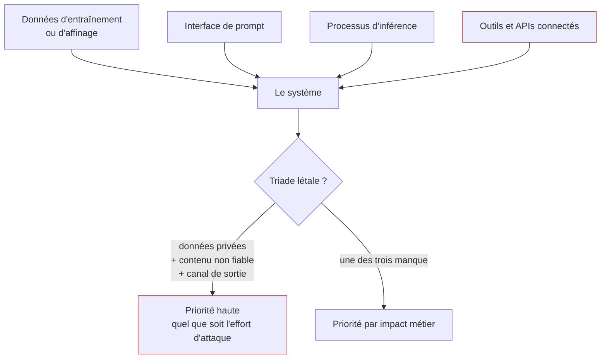

Répondre dans l'ordre à trois questions — qui attaque et avec quels moyens, par où il entre, et ce qu'il obtient s'il réussit — pour que l'engagement porte sur ce qui coûterait cher plutôt que sur ce qui est amusant à trouver.

## Les quatre surfaces, et celle qui concentre le risque

Sur un système d'entreprise bâti sur un modèle du commerce, la première surface est hors de portée et la quatrième concentre le risque réel. La triade létale — accès à des données privées, exposition à du contenu non fiable, capacité de communiquer vers l'extérieur — est le critère de priorisation le plus efficace en revue d'architecture.

## Ce qu'il faut savoir faire

- **Cartographier les surfaces sur le système en fonctionnement**, pas sur le schéma d'architecture fourni. Celui-ci est presque toujours périmé et il omet ce qui a été branché en urgence : le connecteur vers le lac de données ajouté pour une démonstration, le serveur d'outils tiers installé par une équipe produit, le compte de service aux droits trop larges créé pendant l'intégration.
- **Graduer les adversaires** — l'utilisateur curieux qui teste les limites, le client légitime qui veut voir les données d'un autre locataire, l'employé interne, le concurrent qui veut répliquer le service, l'attaquant qui vise l'infrastructure. Chacun a un budget de requêtes et un niveau d'accès différents : un scénario qui suppose dix millions de requêtes sur une API facturée n'est pas le même risque qu'un scénario à trois requêtes.
- **Classer les constats par ce qu'ils permettent** — lire les données d'un autre client, déclencher un virement, dégrader un service réglementé — et non par la sophistication de la technique employée. C'est le seul critère qui parle à la direction qui finance l'audit, et c'est celui que les rapports négligent.
- **Appliquer le test de la triade létale** à chaque chemin identifié, et traiter en priorité ceux qui cumulent les trois propriétés, même quand l'attaque paraît coûteuse.
- **Modéliser la couche de connexion aux outils avec la même rigueur que les prompts** : un serveur d'outils qui transmet les identifiants de son appelant à un service en aval pour lequel ils n'ont jamais été émis est un cas d'école de délégué confus, et une instruction dissimulée dans un contenu non maîtrisé peut faire exfiltrer des données par un outil entièrement légitime.
- **Raccrocher les constats à un registre de risques existant** plutôt que de produire un document isolé : le vocabulaire commun du NIST AI RMF (cartographier, mesurer, gérer, gouverner) sert d'abord à cela.

> [!warning] Piège
> Dériver vers ce qui se démontre bien. Sans modèle de menace écrit, un engagement produit une collection de trouvailles spectaculaires et aucune hiérarchie. Le livrable de cette étape est une carte : les entrées non fiables, les capacités d'action, les canaux de sortie, et pour chaque combinaison ce qu'un attaquant obtiendrait.

## Les notions mobilisées

- [[notions/modelisation-de-la-menace]] — la méthode générale ; l'angle IA est que les entrées non fiables ne sont pas toutes des entrées utilisateur.
- [[notions/gouvernance-ia]] — le NIST AI RMF et le registre de risques, c'est-à-dire le format dans lequel les constats survivent à la mission.
- [[notions/controle-d-acces]] — qui a le droit de quoi, question qui décide de la gravité de la plupart des chemins trouvés.
- [[notions/mcp]] — le protocole de connexion aux outils, dont l'autorisation est la surface montante.
- [[notions/donnees-sensibles]] — ce qui donne son impact à une fuite : la nature de la donnée, pas le nombre de requêtes qu'il a fallu.

## Pour apprendre

- [OWASP Threat Modeling](https://owasp.org/www-community/Threat_Modeling) — la méthode de modélisation, applicable telle quelle : l'IA change les surfaces, pas la démarche.
- [NIST AI Risk Management Framework](https://www.nist.gov/itl/ai-risk-management-framework) — le cadre de gestion du risque de référence, et le vocabulaire commun avec les équipes de conformité.
- [Model Context Protocol — Authorization Specification](https://modelcontextprotocol.io/specification/2025-11-25/basic/authorization) — la référence sur l'autorisation entre un agent et ses serveurs d'outils, donc sur le délégué confus.
- [[roadmaps/07 - Roadmap — AI Agents]] — la triade létale y est détaillée côté agents : la note à lire avant celle-ci si la cible est un système agentique.
