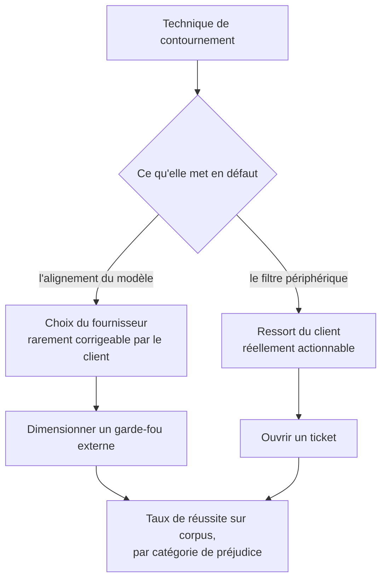

Obtenir d'un modèle un comportement que sa politique interdit — et surtout savoir ce que ce résultat mesure, ce qu'il permet de corriger, et sous quelle forme il vaut la peine d'être livré.

## Le mécanisme commun à toutes les familles de technique

Mise en scène fictive, jeu de rôle, fractionnement d'une demande en morceaux anodins, changement de langue ou d'encodage, dilution dans un contexte long, appel à une autorité fictive : les familles sont stables depuis plusieurs années et leur point commun est de **réduire la distance entre la demande interdite et une demande légitime** jusqu'à ce que le classifieur d'alignement se trompe. Comprendre cette mécanique suffit à construire une politique de test ; connaître les formulations précises qui marchent cette semaine ne sert que cette semaine.

Ce partage décide de ce qu'on fait du résultat. Un jailbreak sur un modèle du commerce sert à dimensionner un garde-fou externe ; il ne sert pas à ouvrir un ticket chez le client.

## Ce qu'il faut savoir faire

- **Reconnaître les familles de technique sans les mémoriser** : elles se recombinent, et c'est le mécanisme — réduire la distance à une demande légitime — qui permet de générer des variantes plutôt que de les collectionner.
- **Éprouver les filtres périphériques là où ils échouent classiquement** : vocabulaire détourné, langues peu couvertes, obfuscations au niveau des caractères, enfouissement d'une demande dans un texte par ailleurs anodin. Un filtre à base de mots-clés se contourne toujours ; un classifieur sémantique résiste mieux et coûte en latence.
- **Vérifier que les contre-mesures sont réellement activées en production** — assainissement d'entrée, filtrage de sortie, balisage explicite des blocs non fiables, vérification de cohérence entre la demande et la tâche autorisée, moindre privilège sur les capacités exposées. Les tester dans l'ordre inverse de leur coût, en commençant par constater leur présence.
- **Interroger le comportement en cas d'incertitude** : la bonne question au concepteur n'est pas « que fait le système quand tout va bien » mais « que fait-il quand le filtre est incertain ». Un système qui répond quand même est un système sans garde-fou.
- **Exiger la journalisation des déclenchements** : un filtre dont les déclenchements ne sont ni comptés ni relus ne peut pas être réglé, et son taux de faux positifs finit par pousser une équipe produit à le désactiver.
- **Livrer un taux, pas une anecdote** : un taux de réussite mesuré sur un corpus de cas classés par catégorie de préjudice, rejoué à l'identique après chaque changement de modèle, de prompt système ou de version de filtre. C'est la seule forme qui permet de dire si une modification a amélioré ou dégradé la posture. La construction de ce corpus est traitée dans [[parcours/ai-red-teaming/engagement-et-mesure]].

> [!warning] Piège
> Confondre « le modèle a produit un texte interdit » et « il y a un risque ». Si le système n'expose ni données privées ni capacité d'action, un texte problématique affiché à l'utilisateur qui l'a lui-même sollicité est un problème de réputation et de conformité, pas une compromission. Inversement, un contournement mineur sur un agent doté d'outils d'écriture est un incident majeur. L'impact se lit dans l'architecture, pas dans la sortie.

## Les notions mobilisées

- [[notions/garde-fous]] — le détail des dispositifs ; ce qui est propre au red teaming, c'est de les tester dans l'ordre inverse de leur coût.
- [[notions/ingenierie-de-prompt]] — les leviers qui font suivre une consigne sont exactement ceux qui permettent d'en imposer une autre.
- [[notions/evaluation-llm]] — sans mesure rejouable, un contournement réussi ne dit rien de la posture du système.
- [[notions/apprentissage-par-renforcement]] — l'alignement par retour humain, et pourquoi il produit une complaisance exploitable.

## Pour apprendre

- [SoK: Prompt Hacking of LLMs](https://arxiv.org/abs/2410.13901) — la taxonomie systématique du domaine, à lire une fois pour ranger toutes les techniques rencontrées ensuite.
- [Jailbroken: How Does LLM Safety Training Fail?](https://arxiv.org/abs/2307.02483) — l'article qui explique pourquoi l'alignement échoue, plutôt que de lister des contournements.
- [Prompt Hacking Defensive Measures](https://learnprompting.org/docs/prompt_hacking/defensive_measures/introduction) — le pendant défensif, structuré par contre-mesure : la check-list de ce qu'on vérifie chez le client.
- [Gandalf](https://gandalf.lakera.ai/) et [HackAPrompt](https://www.hackaprompt.com/) — environnements d'entraînement autorisés, cibles conçues pour être attaquées, résultats vérifiables.
