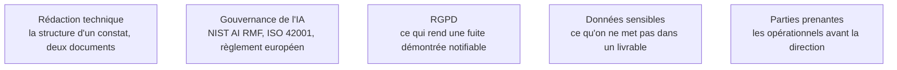

Niveau attendu : **autonomie**. Il rédige, hiérarchise et chiffre l'atténuation en tenant sa position face à un éditeur qui conteste ; la classification réglementaire, elle, se pose au lancement et s'instruit avec le juriste, au niveau de la notion.

Le rapport est le produit de la mission ; tout le reste n'en est que la fabrication. Un constat mal restitué ne sera pas corrigé, et sa valeur est donc nulle quelle que soit la difficulté de sa découverte.

## Deux publics, deux documents, et un troisième usage

Un constat se rédige toujours dans le même ordre : ce qui a été obtenu, le **chemin complet et reproductible** qui y mène, les **conditions requises** — niveau d'accès, nombre de requêtes, connaissance préalable —, l'**impact métier** chiffré quand c'est possible, et l'**atténuation réaliste avec son coût**. Sans les conditions requises, un lecteur ne peut pas juger la gravité.

Ce matériau alimente deux documents et un troisième usage. Une **synthèse d'une page** pour la direction, qui porte des risques et des décisions. Un **détail technique** reproductible, vérifiable après correctif. Et le versement des deux au **dossier de conformité**, où ils constituent la preuve que la gestion des risques est effective et non déclarative. Mélanger les deux premiers fait que personne ne lit ni l'un ni l'autre.

## Ce qu'il faut savoir faire

- **Traduire un chemin d'exploitation en décision.** La compétence centrale de cette phase : passer du détail technique à une phrase que le comité qui arbitre le budget comprend et peut trancher.
- **Hiérarchiser et chiffrer l'atténuation.** Sans hiérarchie, le client corrige les trois constats les plus faciles, ignore les deux structurels — ceux qui demandent une refonte d'architecture — et se déclare couvert. La mention explicite du coût de correction fait partie du travail, pas du service après-vente.
- **Retirer du rapport ce qui n'a rien à y faire** : charges utiles complètes prêtes à rejouer, données réelles extraites pendant le test, secrets découverts. Référencer, décrire le mécanisme, joindre les éléments sensibles par un canal séparé à durée de rétention courte. Le rapport circule plus que prévu.
- **Conduire une divulgation responsable** : signalement privé à l'éditeur, délai raisonnable avant publication, coordination. Les programmes de primes et les plateformes dédiées à l'IA fournissent un cadre ; hors de ce cadre, tester un système tiers reste une intrusion, quelle que soit l'intention.
- **Poser la classification réglementaire dès la réunion de lancement.** Sur un système classé à haut risque, les constats de biais et de traitement inéquitable ont le même statut que les constats de sécurité, et l'absence de journalisation exploitable est en elle-même un constat. Le règlement européen impose gestion des risques, qualité des données, documentation technique, journalisation, transparence et supervision humaine ; le red teaming n'y est pas nommé comme obligation autonome, mais c'est le moyen le plus direct de produire la preuve que la gestion des risques est effective et non déclarative.
- **Inscrire le red teaming dans un processus, pas dans une dépense.** Le NIST AI RMF donne le vocabulaire et la structure ; l'ISO/IEC 42001, certifiable, donne le point d'ancrage qui fait exister l'exercice comme récurrent et budgété.
- **Entretenir la compétence par les mécanismes, pas par les formulations.** Suivre les publications de recherche et les divulgations — qui décrivent des mécanismes — plutôt que les recueils de contournements, qui décrivent des états instables. Les instituts publics de sécurité de l'IA, les laboratoires universitaires et les équipes de red team des éditeurs publient l'essentiel de ce qui fait avancer le domaine.
- **Faire reconnaître son travail par ses réalisations** : une divulgation significative, un outil libre utilisé par d'autres, une contribution de recherche, un classement en compétition. Il n'existe pas encore de certification dominante propre au red teaming IA.

> [!tip] L'habitude qui rapporte le plus
> À chaque divulgation publique intéressante, écrire le cas correspondant dans le corpus d'évaluation dans la journée. Au bout d'un an, ce corpus vaut plus que n'importe quelle certification : il est spécifique au contexte, il est mesurable, et c'est un actif transmissible à l'équipe.

> [!warning] Piège
> Confondre veille et collection de contournements. Les recueils de formulations qui marchent se périment à chaque mise à jour de modèle, et l'expertise qu'ils donnent est une expertise de consommateur. Ce qui se capitalise, ce sont les classes d'attaque, les conditions de leur réussite et les parades — c'est-à-dire ce qui reste vrai quand le modèle change.

## Les notions mobilisées

- [[notions/redaction-technique]] — la structure d'un constat et la discipline des deux documents ; l'angle red teaming est qu'un rapport circule toujours plus loin que prévu.
- [[notions/gouvernance-ia]] — NIST AI RMF, ISO/IEC 42001 et règlement européen : le cadre dans lequel le rapport devient une pièce de dossier.
- [[notions/rgpd]] — ce qui transforme une fuite démontrée en obligation de notification.
- [[notions/donnees-sensibles]] — ce qu'on ne met pas dans un livrable, et par quel canal on le transmet.
- [[notions/gestion-parties-prenantes]] — restituer aux opérationnels avant la direction, et pourquoi l'ordre compte.

## Pour apprendre

- [NIST AI Risk Management Framework](https://www.nist.gov/itl/ai-risk-management-framework) — le cadre de gestion du risque de référence, volontaire, et le vocabulaire commun avec la conformité.
- [ISO/IEC 42001](https://www.iso.org/standard/81230.html) — la norme de système de management de l'IA, certifiable : ce qui permet d'inscrire le red teaming dans un processus récurrent.
- [Huntr](https://huntr.com/) et [0din.ai](https://0din.ai/policy) — deux cadres de divulgation responsable propres à l'IA, avec leurs politiques de délai et de publication.
- [AI Security Institute](https://www.aisi.gov.uk/), [Center for AI Safety](https://www.safe.ai/) et [Anthropic Research](https://www.anthropic.com/research) — les publications de recherche à suivre en continu, et les méthodes des équipes de red team des éditeurs.
