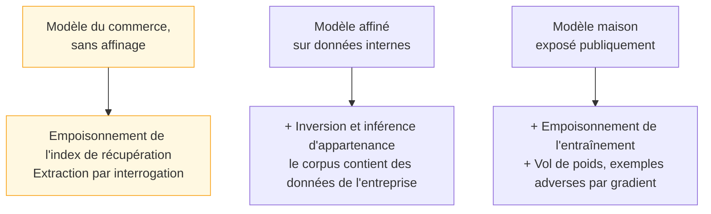

Les attaques qui visent le modèle lui-même plutôt que son interface : empoisonnement, exemples adverses, inversion, extraction — et le tri qui dit lesquelles sont dans le périmètre avant d'y consacrer une seule journée.

## Trois profils de déploiement, trois plans de test

C'est la partie la plus étudiée académiquement et la moins souvent applicable en mission. L'erreur habituelle consiste à appliquer le plan du troisième profil au premier.

## Ce qu'il faut savoir faire

- **Tester l'empoisonnement de l'index de récupération dès qu'il y a de la récupération.** C'est la variante qui concerne presque tout le monde et que l'amont ne distingue pas : il n'est pas nécessaire de toucher aux poids si l'on peut faire indexer un document. La charge est alors à la fois une injection indirecte et un empoisonnement persistant, et elle survit à tout changement de modèle.
- **Évaluer la provenance du corpus plutôt que le modèle en aval.** Ce qui rend l'empoisonnement d'entraînement réaliste, c'est la collecte : corpus ramassé sur le web, contributions utilisateurs, jeux de données publics repris tels quels. La parade est la validation et la traçabilité des données en amont, pas un contrôle du modèle après coup.
- **Situer les exemples adverses.** Des entrées légèrement perturbées qui franchissent une frontière de décision sans que la perturbation soit perceptible : très efficaces sur la vision et l'audio, applicables aux classifieurs de modération, moins directement transposables au texte libre où la perturbation se voit.
- **Préférer l'inférence d'appartenance à l'inversion complète.** Déterminer si un enregistrement donné faisait partie du corpus est techniquement plus faible et bien plus réaliste que de le reconstruire — et cela suffit à créer une violation de données personnelles quand l'appartenance est elle-même une information sensible.
- **Éprouver les parades à l'extraction** : limitation de débit, détection de motifs d'interrogation systématiques, réduction de la verbosité des sorties (ne pas exposer les probabilités complètes), tatouage numérique. Répliquer la fonction d'un modèle par un volume massif de requêtes sert à contourner sa facturation autant qu'à préparer des attaques transférables.
- **Interroger un durcissement au lieu de l'accepter.** Entraînement adverse et conception robuste sont des défenses à évaluer, pas des garanties : un modèle durci contre une famille d'attaques connue reste vulnérable à une famille nouvelle, et le durcissement coûte généralement en justesse nominale. La question est : contre quelle distribution d'attaques ce durcissement a-t-il été mesuré, et quand ?

> [!warning] Piège
> Traiter un affinage comme une opération sans conséquence de sécurité. Un modèle affiné sur des tickets de support a mémorisé des noms, des adresses et des numéros de contrat, et il les restituera sur une formulation adéquate — sans qu'aucune attaque sophistiquée soit nécessaire. Toute donnée entrée dans un affinage est à considérer comme publiable à partir du moment où le modèle est exposé.

## Les notions mobilisées

- [[notions/rag]] — l'index de récupération, cible d'empoisonnement la plus accessible et la plus persistante.
- [[notions/affinage-de-modele]] — ce qui décide si l'inversion et l'inférence d'appartenance sont dans le périmètre.
- [[notions/qualite-des-donnees]] — la validation et la traçabilité en amont, seule parade réelle à l'empoisonnement.
- [[notions/lignage-des-donnees]] — savoir d'où vient chaque enregistrement du corpus, condition pour instruire un soupçon d'empoisonnement.
- [[notions/rgpd]] — l'inférence d'appartenance produit une violation de données personnelles, pas seulement une curiosité de laboratoire.
- [[notions/metriques-evaluation-ml]] — pour lire ce qu'un durcissement a réellement coûté en justesse nominale.

## Pour apprendre

- [Extracting Training Data from Large Language Models](https://arxiv.org/abs/2012.07805) — la démonstration fondatrice de la mémorisation et de l'extraction, à citer quand un client doute de la réalité du risque.
- [Poisoning Web-Scale Training Datasets is Practical](https://arxiv.org/abs/2302.10149) — la faisabilité de l'empoisonnement à l'échelle du web, côté attaque.
- [Detecting and Preventing Data Poisoning Attacks on AI Models](https://arxiv.org/abs/2503.09302) — le même sujet côté défense et détection.
- [Model Inversion Attacks: A Survey of Approaches and Countermeasures](https://arxiv.org/html/2411.10023v1) — le panorama attaques et parades sur l'inversion.
- [Towards Evaluating the Robustness of Neural Networks](https://arxiv.org/abs/1608.04644) — la référence sur l'évaluation de robustesse, et sur les défenses qui n'en sont pas.
