# Parcours — BI Analyst

> [!abstract] Le parcours de celui qui **construit l'infrastructure décisionnelle** dont les autres se serviront : l'entrepôt, le modèle dimensionnel, la couche sémantique, les définitions partagées, la qualité et le lignage. Pour qui veut que le chiffre affiché en comité de direction soit le même dans tous les services, et sache dire d'où il vient.
> Si la question est ponctuelle — « pourquoi les ventes ont chuté en juin ? » — ce n'est pas ce parcours, c'est [[parcours/data-analyst]].

> [!info] Ce que cette note ne réexplique pas
> Les notions transverses — SQL, tableur, statistiques, visualisation, entrepôt, dbt — sont écrites une seule fois sous `notions/` et appelées par lien. Cette note dit ce qu'elles veulent dire **depuis le poste d'un BI Analyst**, et développe en propre ce qui lui appartient : l'entrepôt comme choix d'architecture, la modélisation dimensionnelle en pratique, la couche sémantique, la gouvernance.

---

## En un coup d'œil

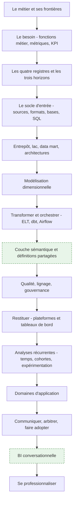

L'amont énumère 200 nœuds et beaucoup de produits interchangeables. Cette note traite les **catégories** et cite les produits comme exemples : savoir arbitrer entre un entrepôt et un lac vaut mieux que connaître par cœur la liste des bases relationnelles.

---

## 1. Le métier et ses frontières

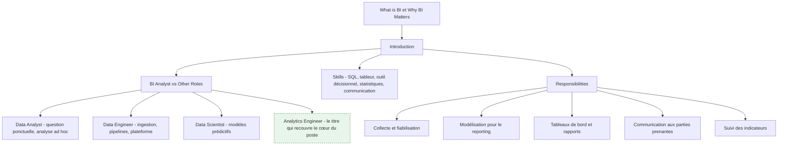

**À quoi ça sert.** La BI répond à « que s'est-il passé, et est-ce que ça va dans le bon sens ». Ce n'est pas la partie prestigieuse de la data, c'est celle qui décide des budgets. Le BI Analyst est le seul rôle dont le livrable est *un accord sur les chiffres* : un modèle, des définitions, des tableaux de bord que plusieurs services acceptent comme référence commune. Un Data Analyst produit une réponse, un BI Analyst produit un socle qui produira des réponses sans lui.

La frontière avec le [[03 - Roadmap — Data Engineer]] est celle de l'objet manipulé. Le data engineer garantit que la donnée **arrive**, fraîche, complète et à l'heure ; il raisonne en pipelines, en SLA et en plateforme. Le BI Analyst garantit qu'elle **veut dire quelque chose** ; il raisonne en grain, en dimension conforme et en définition métier. Les deux se rencontrent sur les tables de l'entrepôt : le data engineer les livre brutes et propres, le BI Analyst les transforme en modèle interrogeable. Dans une petite structure la même personne fait les deux ; dans une grande, confondre les deux produit soit des pipelines impeccables que personne ne sait interroger, soit un modèle élégant posé sur une ingestion qui casse chaque nuit.

**Ce qu'il faut savoir**

- BI Analyst contre Data Analyst — la question « combien » demande un modèle partagé, la question « pourquoi » demande une exploration. Le premier travail se mesure en réutilisation, le second en délai de réponse.
- BI Analyst contre Data Scientist — le second prédit et accepte une incertitude quantifiée ; le premier restitue le réalisé et n'a pas droit à l'approximation. Un écart de 2 % sur un chiffre d'affaires publié est un incident, pas un intervalle de confiance.
- Compétences réelles du poste — [[notions/sql]] à un niveau avancé (fenêtrage, CTE, plans d'exécution), un [[notions/outils-decisionnels]] maîtrisé en profondeur plutôt que trois survolés, le [[notions/tableur]] qu'on n'évite pas, assez de [[notions/statistiques-descriptives]] pour ne pas publier une moyenne trompeuse, et la capacité à tenir une réunion où deux directions n'ont pas le même chiffre.
- Responsabilités — l'amont en liste cinq. La sixième, absente et pourtant la plus lourde : **arbitrer une définition**. Décider que « client actif » veut dire ceci et pas cela, et le faire tenir.
- Renvois amont — la roadmap délègue à `roadmap.sh/sql`, `roadmap.sh/power-bi`, `roadmap.sh/python-data-analysis`, `roadmap.sh/r-programming` et `roadmap.sh/data-analyst`. C'est un aveu utile : le socle technique du BI Analyst est emprunté, sa valeur propre est ailleurs.

> [!tip] Ajout 2026
> Le titre qui décrit le mieux le cœur du poste n'est pas dans la roadmap : **analytics engineer**. C'est le BI Analyst qui a pris les outils du développeur — dépôt Git, revue de code, tests, documentation générée, environnements séparés — pour construire le modèle de l'entrepôt. Les offres l'appellent indifféremment BI Analyst, BI Developer, Analytics Engineer ou Data Analyst senior ; lis le périmètre, pas l'intitulé. Un indice fiable : si la fiche de poste mentionne un dépôt et une couche de transformation versionnée, c'est ce métier-là.

> [!warning] Piège
> Se laisser réduire au guichet de rapports. Le BI Analyst qui accepte toutes les demandes ponctuelles n'a jamais le temps de construire le modèle qui les rendrait inutiles, et se retrouve au bout de deux ans à maintenir quatre cents rapports dont il ne sait plus lesquels sont lus. La sortie de cette impasse est politique, pas technique : rendre visible le coût de chaque demande ad hoc et le comparer au coût du modèle qui l'absorberait.

---

## 2. Le besoin avant la donnée — fonctions métier, métriques, KPI

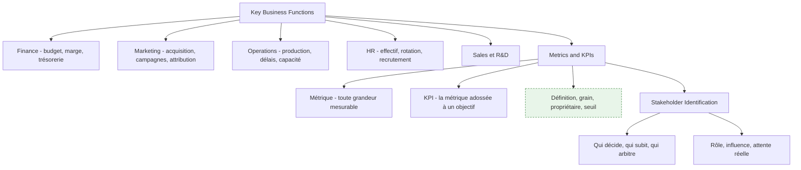

**À quoi ça sert.** Tout le reste du parcours est de la mécanique ; cette étape décide si la mécanique sert à quelque chose. Comprendre les fonctions de l'entreprise n'est pas de la culture générale : c'est ce qui permet d'entendre « je veux le chiffre d'affaires » et de demander *hors taxes ou TTC, à la commande ou à la facturation, net des avoirs ou brut, à la date de signature ou de livraison*. Les quatre réponses définissent quatre métriques différentes, et les quatre existent quelque part dans l'entreprise. Le travail d'un BI Analyst commence par transformer une demande en spécification — voir [[notions/cadrage-besoin]], qui décrit le recueil et la reformulation ; ce qui est propre à la BI, c'est que la spécification porte sur une **définition de mesure**, pas sur une fonctionnalité.

**Ce qu'il faut savoir**

- Métrique contre KPI — le trafic d'un site est une métrique, le taux de conversion adossé à un objectif trimestriel est un KPI. La différence n'est pas dans le calcul, elle est dans le fait qu'un KPI a un propriétaire et une cible. Une organisation avec quarante KPI n'en a aucun.
- Une définition de métrique complète tient en cinq lignes — le libellé métier, la formule, le grain (par jour ? par client ? par commande ?), la source de vérité, et le nom de la personne qui tranche en cas de désaccord. Sans la cinquième ligne, les quatre premières seront rediscutées tous les six mois.
- Les fonctions métier ont chacune leur maille et leur calendrier — la finance travaille en périodes comptables closes et refuse qu'un chiffre passé bouge ; le marketing travaille en fenêtres d'attribution glissantes et accepte que le chiffre d'hier soit révisé demain. Ces deux exigences sont contradictoires et doivent être modélisées séparément, pas moyennées.
- Parties prenantes — voir [[notions/gestion-parties-prenantes]]. En BI, la ligne de fracture est presque toujours la même : celui qui pilote veut une définition stable, celui qui est évalué veut la définition qui l'avantage. L'arbitrage se prépare avant la réunion, pas pendant.
- Le sponsor n'est pas l'utilisateur — celui qui finance le projet regarde trois chiffres par mois, celui qui l'utilise en regarde trente par jour. Concevoir pour le premier donne un tableau de bord que personne n'ouvre.

> [!tip] Ajout 2026
> Écris le **dictionnaire des métriques avant le premier modèle**, dans le dépôt, en Markdown, une métrique par entrée avec ses cinq lignes. Ça coûte deux jours et ça supprime la moitié des désaccords ultérieurs, parce que le désaccord devient un diff sur un fichier au lieu d'une discussion de couloir. C'est aussi ce fichier qui alimentera plus tard la couche sémantique (section 8) et, s'il existe, l'assistant conversationnel (section 14) : un dictionnaire de métriques est la seule documentation qui se convertit directement en code.

> [!warning] Piège
> Accepter la demande telle qu'elle est formulée. « Il me faut un tableau de bord des ventes » n'est pas un besoin, c'est une solution supposée. La question à poser est « quelle décision prendras-tu différemment selon ce que tu y verras ». Si la réponse est « aucune », le tableau de bord sera consulté trois fois puis abandonné — et il faudra quand même le maintenir.

---

## 3. Les quatre registres et les trois horizons de la BI

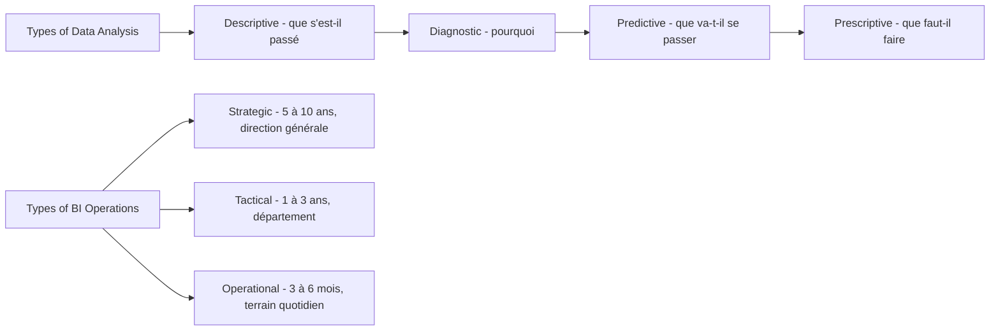

**À quoi ça sert.** Les quatre registres ne sont pas une échelle de maturité où il faudrait grimper : ce sont quatre questions différentes, et la BI d'entreprise passe l'essentiel de son temps sur les deux premières. Le descriptif bien fait — un chiffre juste, comparable, disponible à temps — vaut plus que du prescriptif bâclé. Les trois horizons servent, eux, à calibrer la fraîcheur et la granularité : un pilotage stratégique sur dix ans n'a pas besoin de données à la minute, un tableau de bord d'exploitation en a un besoin vital. Confondre les deux produit soit un entrepôt rafraîchi toutes les cinq minutes que personne ne regarde plus d'une fois par mois, soit un chiffre de la veille présenté à une équipe qui doit décider maintenant.

**Ce qu'il faut savoir**

- Descriptif — agrégations, comparaisons, séries. C'est 70 % du travail réel et la seule partie où l'exactitude est non négociable.
- Diagnostic — segmentation, forage, décomposition d'un écart. La technique centrale est l'analyse de contribution : décomposer une variation de marge en effet volume, effet prix et effet mix. Un modèle dimensionnel bien fait rend ce forage trivial ; un modèle plat le rend impossible.
- Prédictif et prescriptif — voir [[notions/apprentissage-supervise]] pour la mécanique. Depuis le poste de BI Analyst, la prévision qui sert vraiment est celle de séries temporelles sur l'activité (section 11), pas un modèle de classification. Le prescriptif, dans la plupart des entreprises, est une règle métier écrite par un humain et non un optimiseur.
- Les trois horizons se traduisent en trois décisions techniques — fréquence de rafraîchissement, profondeur d'historique conservée, et grain de la table de faits. Écris-les explicitement pour chaque tableau de bord ; ce sont elles qui déterminent le coût.
- L'opérationnel est le piège coûteux — dès qu'on descend sous l'heure, l'entrepôt classique n'est plus le bon outil et le besoin relève d'un flux ou d'une base transactionnelle en lecture. Vérifie que le besoin est réel avant de reconstruire l'architecture.

> [!tip] Ajout 2026
> Avant d'accepter une exigence de temps réel, demande la latence de la **décision**, pas celle de la donnée. Si la personne qui consulte le tableau de bord agit une fois par jour, un rafraîchissement horaire est déjà du luxe. On voit régulièrement des architectures en flux continu construites pour un usage dont le cycle de décision est hebdomadaire — le surcoût est d'un ordre de grandeur, la valeur ajoutée nulle.

> [!warning] Piège
> Vendre du prédictif sur un socle descriptif défaillant. Une direction qui n'arrive pas à s'accorder sur son chiffre d'affaires du mois dernier ne tirera rien d'une prévision à six mois — et la prévision sera de toute façon fausse, puisqu'elle sera entraînée sur l'historique incohérent. L'ordre n'est pas négociable : définitions, puis modèle, puis prévision.

---

## 4. Le socle d'entrée — sources, formats, bases, SQL

```mermaid
flowchart TD
  wd["What is Data et Analog vs Digital Data"] --> src["Data Sources"]
  src --> s1["Bases transactionnelles - ERP, CRM, applicatif métier"]
  src --> s2["Web, Mobile Apps - événements, journaux"]
  src --> s3["APIs et SaaS - facturation, publicité, support"]
  src --> s4["Cloud et IoT - capteurs, télémétrie"]
  src --> s5["Fichiers déposés à la main - le plus fragile"]:::ajout
  td["Types of data"] --> t1["Structuré - tables"]
  td --> t2["Semi-structuré - JSON, XML"]
  td --> t3["Non structuré - texte, image, son"]
  fm["Data Formats"] --> fm1["Échange - CSV, Excel, JSON, XML"]
  fm --> fm2["Analytique colonnaire - Parquet, Avro, ORC"]
  vt["Variables and Data Types"] --> v1["Categorical vs Numerical - catégoriel contre numérique"]
  vt --> v2["Discrete vs Continuous - discret contre continu"]
  db["Popular Databases"] --> db1["Transactionnel ligne - PostgreSQL, MySQL, SQLite, Oracle"]
  db --> db2["Analytique colonnaire - l'entrepôt, section 5"]
  sq["SQL Fundamentals"] --> sq1["Basic Queries et Advanced Queries"]
  sq --> sq2["Window Functions"]
  sq --> sq3["Performance et indexation"]
  classDef ajout fill:#e8f5e9,stroke:#2e7d32,stroke-width:1px,stroke-dasharray:4 3
```

**À quoi ça sert.** Cette étape ne sert pas à collectionner des formats, elle sert à savoir **ce qui va casser**. Chaque source a un mode de défaillance propre et prévisible : une base transactionnelle change de schéma quand l'applicatif est mis à jour, une API SaaS impose des quotas et réécrit l'historique, un export manuel disparaît dès que la personne qui le produit part en congé. Un BI Analyst qui connaît ces modes de défaillance conçoit un modèle qui les absorbe ; celui qui l'ignore découvre chaque panne en réunion.

La typologie catégoriel/numérique, discret/continu a un usage très concret ici, et c'est le seul que je retiens : elle préfigure la séparation **dimension contre mesure** du modèle dimensionnel. Une variable catégorielle devient un attribut de dimension, une variable numérique additive devient une mesure dans la table de faits. Les cas ambigus — un code postal, une note sur cinq, un identifiant numérique — sont exactement ceux qui finissent additionnés par erreur dans un tableau croisé.

La mécanique du langage, du fenêtrage et de l'optimisation est dans [[notions/sql]] ; la lecture et l'écriture de fichiers tabulaires dans [[notions/tableur]]. Ce qui est propre au BI Analyst, c'est que ses requêtes ne sont pas des réponses mais des **définitions** : une requête écrite une fois et exécutée dix mille fois par un outil de restitution, dont le plan d'exécution et le coût comptent autant que le résultat.

**Ce qu'il faut savoir**

- Sources — inventorie-les avec, pour chacune, le propriétaire applicatif, la fréquence de mise à disposition, le mode de rechargement (complet ou incrémental) et la question « cette source peut-elle réécrire le passé ». La dernière colonne est celle qui détermine si ton historique est stable.
- Extraction incrémentale — elle repose sur une colonne de dernière modification ou un journal de transactions. Si la source n'en a aucun, l'extraction sera complète et son coût plafonnera le volume traitable ; c'est une contrainte d'architecture, pas un détail technique.
- Structuré, semi-structuré, non structuré — les entrepôts modernes ingèrent le JSON et l'interrogent en place avec des fonctions dédiées. Ne l'aplatis pas systématiquement : un champ semi-structuré préservé tel quel permet de récupérer un attribut oublié sans rejouer l'ingestion.
- Formats — CSV et Excel pour l'échange avec des humains, JSON pour les APIs, **Parquet** pour tout ce qui est stocké en vue d'être analysé. Le format colonnaire compressé n'est pas un raffinement : il change le temps de lecture d'un ordre de grandeur et il porte son schéma, ce qui élimine toute une classe d'erreurs de typage.
- Bases relationnelles — MySQL, PostgreSQL, SQLite et Oracle sont des bases *transactionnelles*. Elles sont d'excellentes sources et de mauvais entrepôts : leur stockage en lignes les rend lentes sur les agrégations larges. PostgreSQL tient jusqu'à quelques dizaines de millions de lignes en analytique ; au-delà, c'est la section 5.
- Performance — l'optimisation utile en BI n'est pas l'astuce de requête, c'est la réduction du volume lu : partitionnement par date, colonnes projetées explicitement plutôt que `SELECT *`, agrégations pré-calculées. Lis le plan d'exécution avant de réécrire quoi que ce soit.

> [!tip] Ajout 2026
> La source la plus dangereuse ne figure pas dans la roadmap : le **fichier déposé à la main**. Un classeur mis chaque lundi sur un partage réseau finit toujours par être la clé d'un tableau de bord de direction, et il n'a ni schéma stable, ni propriétaire, ni historique. Traite-le comme une dette : ingère-le avec une validation de schéma stricte qui refuse le fichier plutôt que d'accepter une colonne renommée, et garde chaque version reçue. Le jour où le chiffre est contesté, c'est l'archive brute qui tranche.

> [!warning] Piège
> Aller chercher la donnée directement dans la base de production. Ça marche pendant trois mois, puis une requête d'agrégation dégrade l'applicatif en pleine journée, et surtout le modèle décisionnel se retrouve couplé au schéma applicatif : chaque évolution du produit casse un rapport. Le découplage par une couche d'ingestion n'est pas de la bureaucratie, c'est ce qui rend les deux systèmes modifiables indépendamment.

---

## 5. L'entrepôt et les architectures décisionnelles

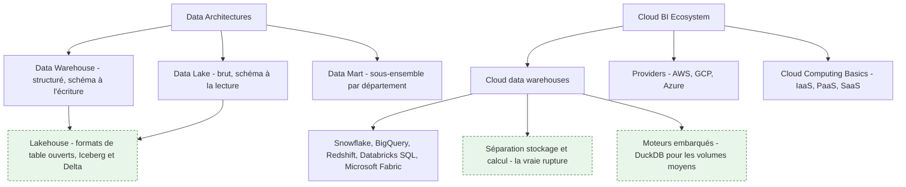

**À quoi ça sert.** L'entrepôt existe pour une raison précise : **découpler la lecture analytique de l'écriture transactionnelle**, et fixer un historique que personne ne peut réécrire par accident. Tout le reste — la performance, la modélisation, la gouvernance — en découle. Les définitions de l'entrepôt, du data mart et des schémas sont dans [[notions/entrepot-de-donnees]], celles du stockage brut et du lakehouse dans [[notions/data-lake]]. Ce qui est propre au BI Analyst, c'est le choix et ses conséquences quotidiennes.

Vu de ce poste, l'arbitrage entrepôt contre lac se joue sur **qui porte le coût du schéma**. L'entrepôt impose le schéma à l'écriture : l'ingestion est plus coûteuse à construire, mais tout consommateur en aval lit une table dont la structure et le sens sont garantis. Le lac impose le schéma à la lecture : l'ingestion est quasi gratuite, et chaque analyste réinterprète les fichiers à sa manière — ce qui reproduit exactement le problème que la BI est censée résoudre. Pour un usage décisionnel partagé, l'entrepôt gagne presque toujours ; le lac a sa place en amont, comme zone d'atterrissage brute et archive rejouable.

**Ce qu'il faut savoir**

- Architecture à zones — atterrissage brut immuable, couche intermédiaire nettoyée et typée, couche de présentation modélisée pour la restitution. Trois zones, trois responsabilités, et la règle qui les tient : on ne rejoue jamais l'ingestion depuis la source, on rejoue depuis l'atterrissage. C'est ce qui rend une correction de logique de transformation possible sans redemander les données.
- Data mart — un sous-ensemble orienté département, construit *depuis* les tables communes et jamais à côté d'elles. Un data mart alimenté par sa propre ingestion n'est pas un data mart, c'est un silo de plus.
- Séparation du stockage et du calcul — c'est la rupture réelle des entrepôts cloud, plus que l'élasticité. Elle permet de donner un moteur dédié à l'équipe finance sans qu'une de ses requêtes ralentisse le tableau de bord d'exploitation, et de dimensionner le calcul par usage. Elle rend aussi le coût variable, donc surveillable : voir le piège.
- Lakehouse et formats de table ouverts — Apache Iceberg et Delta Lake ajoutent aux fichiers Parquet ce qui manquait au lac : transactions, évolution de schéma, voyage dans le temps. Conséquence concrète pour la BI, la donnée reste dans le stockage objet et plusieurs moteurs l'interrogent sans copie, ce qui réduit les duplications à réconcilier.
- Volumes moyens — en dessous de quelques centaines de millions de lignes, un moteur embarqué comme DuckDB sur des fichiers Parquet fait le travail d'un entrepôt cloud pour un coût d'infrastructure proche de zéro. Beaucoup de projets BI d'entreprise moyenne n'ont jamais eu besoin d'autre chose.
- Cloud — les notions IaaS, PaaS, SaaS n'intéressent le BI Analyst que sur un point : qui administre quoi. Ce qui compte vraiment est le modèle de facturation de l'entrepôt retenu — au temps de calcul, à la donnée scannée, ou à la capacité réservée — parce qu'il dicte la façon d'écrire les requêtes.

> [!tip] Ajout 2026
> Deux évolutions ont un effet direct sur le travail quotidien. D'abord la **convergence sur les formats de table ouverts** : le débat entrepôt contre lac s'est largement déplacé vers « quel moteur interroge le même stockage », ce qui rend le choix de plateforme moins définitif qu'il ne l'était. Ensuite les **plateformes intégrées** — Microsoft Fabric réunit stockage, transformation et restitution avec Power BI lisant directement le stockage sans importation, ce qui supprime une copie et un décalage de fraîcheur. Le gain est réel ; la contrepartie est un enfermement plus fort, à peser avant de tout y migrer.

> [!warning] Piège
> Ne pas surveiller le coût dès le premier jour. Avec un entrepôt facturé à la donnée scannée, un tableau de bord auto-rafraîchi toutes les cinq minutes sur une table non partitionnée peut coûter plus cher que toute l'équipe qui le consulte. Instrumente la dépense par tableau de bord et par utilisateur avant d'ouvrir l'accès, pose des quotas, et sache pour chaque rapport ce qu'il coûte par mois. C'est le seul argument qui permet ensuite de supprimer les rapports morts.

---

## 6. La modélisation dimensionnelle

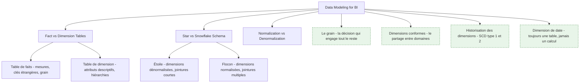

**À quoi ça sert.** Le modèle dimensionnel est le contrat entre la donnée et ceux qui la consultent. Sa mécanique — faits, dimensions, étoile, flocon, granularité — est dans [[notions/modelisation-dimensionnelle]]. Ce qui appartient au BI Analyst, c'est la conduite des quatre ou cinq décisions qui font qu'un modèle tient dix ans ou se réécrit tous les dix-huit mois.

Il faut d'abord comprendre pourquoi la normalisation, bonne pratique en transactionnel, est le mauvais réflexe ici. Une base transactionnelle normalise pour éviter les incohérences à l'écriture, avec beaucoup d'écritures et des lectures ciblées. Un entrepôt fait l'inverse : écriture unique et contrôlée, lectures massives et agrégeantes. La dénormalisation des dimensions n'est donc pas un compromis de performance, c'est le choix cohérent avec la charge — et elle a un bénéfice qu'on sous-estime, la **lisibilité** : un utilisateur qui voit une dimension « Client » avec quarante attributs plats sait s'en servir, alors qu'il abandonnera devant six tables normalisées à joindre lui-même.

**Ce qu'il faut savoir**

- Le grain d'abord — écris en une phrase ce que représente **une ligne** de ta table de faits : « une ligne de commande d'un produit par un client à une date ». Tout le reste du modèle en découle, et changer le grain plus tard signifie réécrire le modèle et tous les rapports qui en dépendent. Choisis toujours le grain le plus fin disponible : agréger ensuite est facile, désagréger est impossible.
- Mesures additives, semi-additives, non additives — un montant s'additionne sur toutes les dimensions ; un stock s'additionne entre produits mais pas dans le temps (on prend le dernier, pas la somme) ; un taux ou une moyenne ne s'additionne jamais. Stocke le numérateur et le dénominateur, calcule le ratio à la restitution. C'est l'erreur la plus fréquente et la plus difficile à détecter, parce que le total faux reste plausible.
- Dimensions conformes — une dimension « Produit » partagée à l'identique par les faits ventes, stock et retours permet de comparer les trois sur la même maille. Sans conformité, chaque domaine a son référentiel produit et aucune comparaison transverse n'est possible : c'est le symptôme le plus fiable d'un entrepôt qui a été construit rapport par rapport.
- Historisation des dimensions — si un client change de segment, veut-on que ses ventes passées soient reclassées (écrasement, dit type 1) ou restent attachées à l'ancien segment (nouvelle version datée, dit type 2) ? Les deux réponses sont légitimes selon l'usage, et la question doit être posée au métier, pas tranchée par défaut. Le type 2 coûte une clé technique et un peu de discipline ; ne pas l'avoir prévu coûte une réécriture.
- Dimension de date — toujours une table réelle, avec pour chaque jour son mois, son trimestre, son exercice fiscal, ses jours ouvrés, ses jours fériés et ses périodes comparables. Elle porte le calendrier de l'entreprise, qui n'est presque jamais le calendrier civil. C'est la table la plus rentable de tout l'entrepôt.
- Étoile contre flocon — l'étoile par défaut. Le flocon se justifie sur une hiérarchie profonde et réellement partagée, ou quand une dimension est très volumineuse. La plupart des flocons qu'on rencontre ne sont pas un choix, ce sont des tables transactionnelles remontées telles quelles.
- Faits sans mesure et clés dégénérées — un fait peut n'être qu'un événement (une visite, une connexion) : la mesure est alors le comptage de lignes. Un numéro de commande porté dans la table de faits sans dimension associée est une clé dégénérée, et c'est normal.

> [!tip] Ajout 2026
> Le modèle dimensionnel a été déclaré obsolète à chaque nouvelle génération d'outils, et il a survécu à toutes — y compris à la promesse « interroge directement les tables brutes, le moteur est assez rapide ». Le moteur l'est effectivement ; ce n'est pas le problème. Le modèle ne sert pas à accélérer les requêtes, il sert à **fixer le sens** : le grain, les mesures légitimes, les axes d'analyse valides. La BI conversationnelle (section 14) a rendu ce point plus visible encore, parce qu'un assistant lâché sur des tables brutes produit des agrégations syntaxiquement correctes et métier absurdes.

> [!warning] Piège
> La grande table plate unique. Elle marche merveilleusement pour le premier tableau de bord, puis on y ajoute un second sujet, et les mesures du premier se retrouvent dupliquées par les lignes du second : les totaux doublent. Le diagnostic est toujours le même — deux grains différents dans une seule table. Quand on le découvre, six rapports publient déjà des chiffres faux et personne ne sait depuis quand.

---

## 7. Transformer et orchestrer — ELT, dbt, ordonnancement

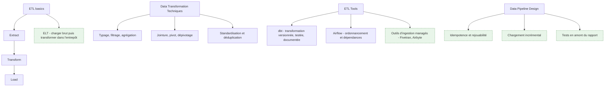

**À quoi ça sert.** C'est ici que le modèle de la section 6 devient du code exécuté chaque nuit. La mécanique de dbt — modèles, tests, documentation, matérialisations — est dans [[notions/transformation-dbt]] ; celle de l'ordonnancement, des DAG et de la reprise sur incident dans [[notions/orchestration-de-flux]]. Ce qui est propre au BI Analyst, c'est le déplacement que ces outils ont provoqué dans son métier : la transformation est passée d'un outil graphique administré par l'informatique à du **SQL dans un dépôt Git**, ce qui l'a mise à sa portée et lui a imposé des pratiques de développeur.

L'inversion ETL vers ELT est l'autre changement structurant. Dans l'ETL classique, la transformation se fait en route, dans un serveur dédié, et seule la donnée transformée arrive. Dans l'ELT, on charge brut dans l'entrepôt et on transforme avec son moteur. Les conséquences pratiques sont nettes : le brut reste disponible, donc une erreur de logique se corrige en rejouant une transformation au lieu de redemander les données ; la transformation s'écrit en SQL, donc l'analyste ne dépend plus d'un développeur ; et le coût de calcul devient visible sur la facture de l'entrepôt.

> [!info] Frontière avec le parcours Data Analyst
> Le nettoyage exploratoire, l'analyse ad hoc et l'examen d'un jeu de données inconnu relèvent de [[parcours/data-analyst]], qui les traite en propre. Ici, la transformation est **modélisée** : une règle de nettoyage n'est pas un geste dans un carnet, c'est un modèle versionné, testé, documenté, qui s'appliquera à tous les chargements suivants. La même opération — dédupliquer, imputer une valeur manquante, normaliser un libellé — change complètement de nature selon qu'elle est jouée une fois ou industrialisée.

**Ce qu'il faut savoir**

- Couches de transformation — une couche de mise en forme minimale par source (renommage, typage, rien d'autre), une couche intermédiaire pour la logique métier réutilisable, une couche de présentation qui expose faits et dimensions. Cette discipline de trois couches est ce qui empêche la même règle d'être réécrite dans quinze modèles.
- Idempotence — rejouer un traitement deux fois doit donner le même résultat. Concrètement : supprimer puis réinsérer la fenêtre traitée plutôt qu'ajouter, et faire dépendre le traitement d'une date de référence passée en paramètre plutôt que de la date du jour. Sans ça, aucune reprise sur incident n'est sûre.
- Chargement incrémental — indispensable dès que le volume dépasse ce qu'un rechargement complet peut absorber dans la fenêtre nocturne, mais il ouvre la porte aux trous silencieux quand une donnée arrive en retard. Prévois un rechargement complet périodique, ou une fenêtre de reprise glissante sur quelques jours.
- Tests dans le pipeline — unicité de la clé, absence de valeur nulle sur les colonnes structurantes, intégrité référentielle entre faits et dimensions, valeurs acceptées sur les colonnes codifiées. Un test qui échoue doit **arrêter la chaîne**, pas alerter : un rapport visiblement vide fait moins de dégâts qu'un rapport plausible et faux.
- Documentation et lignage générés — dbt produit le graphe des dépendances entre modèles depuis le code lui-même. C'est la seule documentation qui ne se périme pas, et c'est aussi ce qui permet de répondre à « si je change cette colonne, qu'est-ce qui casse » — voir section 9.
- Ordonnancement — Airflow et ses équivalents gèrent les dépendances, les reprises et les alertes. Pour une chaîne BI simple, le planificateur intégré à la plateforme de transformation suffit souvent ; l'orchestrateur dédié se justifie quand la chaîne croise d'autres systèmes.
- Ingestion managée — Fivetran, Airbyte et leurs concurrents couvrent les connecteurs SaaS standards. Écrire soi-même un connecteur vers une API de facturation est rarement un bon usage du temps d'un BI Analyst ; le maintenir l'est encore moins.
- Python et R en BI — [[notions/pandas]] et [[notions/r-et-tidyverse]] restent utiles pour ce que SQL fait mal : appeler une API, lire un format exotique, calculer une prévision. Dans la chaîne de transformation, préfère le SQL pour tout ce qu'il sait faire — il est testable, lisible par l'équipe métier et exécuté par l'entrepôt.

> [!tip] Ajout 2026
> Les pratiques qui ont le plus d'effet sur la fiabilité ne sont pas des outils, ce sont trois habitudes empruntées au développement logiciel. **Un environnement de développement séparé**, où chaque analyste construit ses modèles dans son propre jeu de schémas sans toucher la production. **La revue de code sur les modèles**, qui attrape les erreurs de grain avant qu'elles atteignent un rapport. **L'intégration continue qui rejoue les tests sur la branche**, ce qui transforme « j'espère que ça n'a rien cassé » en réponse vérifiable. Une équipe BI qui a ces trois choses ne ressemble plus du tout à une équipe BI qui ne les a pas.

> [!warning] Piège
> Laisser la logique métier dans l'outil de restitution. Une mesure calculée dans Power BI ou Tableau n'est ni testable, ni versionnée, ni réutilisable par un autre outil, et elle sera réécrite différemment dans le rapport suivant. La règle qui tient : tout ce qui est une **définition** remonte dans la transformation ou la couche sémantique ; l'outil de restitution ne fait que du dessin et de l'interaction.

---

## 8. La couche sémantique et les définitions partagées

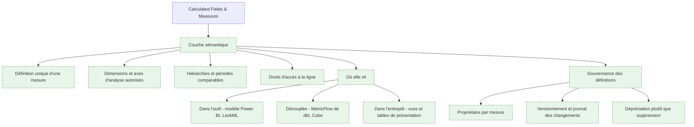

**À quoi ça sert.** C'est le vrai travail du métier, et l'amont ne lui consacre qu'un nœud — *Calculated Fields & Measures* — en le traitant comme une fonctionnalité d'outil. C'est bien plus que ça. La couche sémantique est l'endroit où « chiffre d'affaires », « client actif », « marge brute » et « délai de livraison » reçoivent **une** définition, exprimée en une seule fois, et à partir de laquelle tous les rapports sont construits. Sans elle, chaque rapport contient sa propre version du calcul, les versions divergent à mesure que les règles évoluent, et l'entreprise se retrouve avec trois chiffres d'affaires selon l'outil consulté.

Le symptôme se reconnaît immédiatement : une réunion où la direction commerciale et la direction financière affichent deux nombres différents pour la même chose, et où la demi-heure suivante est consacrée à comprendre pourquoi au lieu de décider. Ce qui se joue là n'est pas un bug, c'est l'absence de couche sémantique. Et la cause est presque toujours la même : les deux chiffres sont *tous les deux justes*, calculés sur deux définitions légitimes que personne n'a arbitrées.

Une couche sémantique porte quatre choses. Les **mesures**, avec leur formule et leur règle d'agrégation. Les **dimensions** par lesquelles on a le droit de les découper, ce qui interdit par construction les croisements absurdes. Les **hiérarchies et périodes comparables**, qui donnent un sens univoque à « le mois dernier » et « à la même période l'an dernier ». Et les **droits d'accès à la ligne**, qui font qu'un directeur régional ne voit que sa région sans qu'on ait à dupliquer le rapport.

**Ce qu'il faut savoir**

- Une mesure se définit par sa formule **et** sa règle d'agrégation. « Chiffre d'affaires » se somme, « nombre de clients distincts » ne se somme pas (le distinct ne s'additionne pas entre segments), « taux de marge » se recalcule à chaque niveau depuis ses deux composants. Une couche sémantique correcte sait faire ces trois choses différemment ; un champ calculé dans un rapport n'en sait faire qu'une.
- Le ratio de ratios est le test décisif — si la marge affichée sur le total national n'est pas la moyenne des marges régionales, ta couche calcule correctement. Si elle l'est, elle somme des pourcentages et tous tes agrégats sont faux. Vérifie-le dès le premier modèle.
- Trois emplacements possibles, trois compromis. **Dans l'outil de restitution** — le plus rapide à mettre en place, définitions inaccessibles aux autres outils et au SQL direct. **Découplée** — MetricFlow de dbt, Cube et leurs équivalents exposent les mesures à plusieurs consommateurs par une interface commune, au prix d'une brique de plus à opérer. **Dans l'entrepôt**, sous forme de vues et de tables de présentation — le plus universel, puisque tout ce qui parle SQL y a accès, mais incapable de porter les agrégations non additives et les périodes comparables sans démultiplier les vues. En pratique, une combinaison : les tables de présentation portent les mesures additives, la couche découplée ou l'outil portent le reste.
- Le dictionnaire des métriques (section 2) et la couche sémantique doivent être le même objet. Si la documentation vit dans un tableur et les définitions dans le code, elles divergeront en trois mois. Fais générer la documentation depuis les définitions.
- Chaque mesure a un propriétaire métier nommé. Pas une direction, une personne. C'est elle qui valide un changement de définition, et c'est aussi elle qu'on cite quand le chiffre est contesté.
- Changer une définition se fait comme un changement d'interface — annonce, date d'effet, période où l'ancienne et la nouvelle coexistent sous deux noms, journal du changement. Un chiffre historique qui bouge du jour au lendemain sans explication détruit plus de confiance que six mois de retard de livraison.
- Ne supprime pas, déprécie — marque la mesure comme obsolète, laisse-la fonctionner, mesure qui l'utilise encore, puis retire-la. La suppression brutale casse toujours un rapport dont tu ignorais l'existence.

> [!tip] Ajout 2026
> La couche sémantique est passée de raffinement à pièce maîtresse, pour une raison extérieure à la BI : elle est devenue l'**interface par laquelle les assistants interrogent les données**. Un modèle de langage branché sur les tables brutes doit devenir sa propre couche sémantique à chaque question, et il le fait mal (section 14) ; branché sur des mesures définies, il choisit parmi des calculs déjà justes. C'est le meilleur argument disponible pour financer ce travail, parce qu'il est enfin visible d'une direction : la même semaine d'effort qui sécurise les tableaux de bord conditionne l'usage des assistants. Le corollaire opérationnel est de traiter les définitions comme une interface publique, avec un contrat et un versionnement.

> [!warning] Piège
> Construire la couche sémantique comme un exercice d'exhaustivité. Modéliser deux cents mesures dont trente sont utilisées produit un objet que personne ne maîtrise et dont chaque évolution fait peur. Commence par les dix à quinze chiffres qui apparaissent réellement dans les instances de pilotage, verrouille-les complètement — définition, propriétaire, tests, documentation — et n'ajoute une mesure que quand un usage la demande. Le critère de réussite n'est pas le nombre de mesures, c'est le nombre de réunions qui ne discutent plus du chiffre.

---

## 9. Qualité, lignage et gouvernance — rendre un chiffre défendable

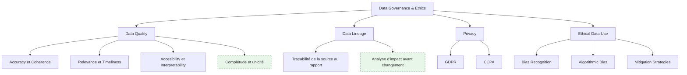

**À quoi ça sert.** Il faut sortir la gouvernance du registre de la conformité, où l'amont la range, pour la remettre là où elle sert : **c'est ce qui rend un chiffre défendable**. Un chiffre défendable est un chiffre dont on peut dire, en réunion et sans préparation, d'où il vient, ce qu'il inclut, quand il a été calculé, et ce qui se passerait s'il était faux. Les dimensions de la qualité sont dans [[notions/qualite-des-donnees]], la traçabilité et les catalogues dans [[notions/lignage-des-donnees]], les obligations européennes dans [[notions/rgpd]]. L'angle propre au BI Analyst est celui de la charge de la preuve.

Concrètement, ça se joue en deux moments. Quand un chiffre est contesté, il faut pouvoir remonter en quelques minutes jusqu'à la ligne source — c'est le lignage. Et quand un chiffre va être publié, il faut savoir qu'il est valide avant que quelqu'un le découvre faux — c'est la qualité instrumentée. Ces deux capacités ne s'improvisent pas le jour où on en a besoin : elles se construisent dans la chaîne de transformation (section 7).

**Ce qu'il faut savoir**

- Les six dimensions de la qualité, traduites en tests exécutables — exactitude (comparaison à une source de référence ou à un contrôle métier connu), complétude (aucune valeur manquante sur les colonnes structurantes), unicité (clé sans doublon), fraîcheur (dernière donnée à moins de N heures), validité (valeurs dans la liste autorisée), cohérence (les totaux se réconcilient entre deux tables). Une dimension de qualité qui n'est pas un test automatisé n'est pas gérée, elle est espérée.
- La réconciliation avec la source métier est le contrôle le plus rentable — comparer chaque nuit le chiffre d'affaires de l'entrepôt à celui du système de facturation, et alerter sur l'écart. Ça attrape les pannes d'ingestion, les doublons et les erreurs de grain d'un seul coup, et c'est le seul contrôle que le métier comprend immédiatement.
- Lignage en deux sens — descendant pour répondre à « ce chiffre vient d'où », montant pour répondre à « si je modifie cette colonne source, quels rapports cassent ». Le second est celui qui évite les incidents ; il exige que le lignage aille jusqu'aux rapports, pas seulement jusqu'aux tables. Beaucoup de catalogues s'arrêtent à la frontière de l'outil de restitution, et c'est précisément là que se trouve la surprise.
- Fraîcheur affichée — mets la date et l'heure du dernier rafraîchissement **sur** le tableau de bord, visible. Un chiffre périmé qui se présente comme à jour cause plus de dégâts qu'un chiffre absent, et c'est la correction la moins chère de toute cette section.
- RGPD vu du poste — trois points reviennent en BI. La **minimisation** : ton modèle n'a presque jamais besoin du nom, seulement d'un identifiant pseudonymisé et d'attributs de segmentation. La **durée de conservation** : l'entrepôt conserve par nature, ce qui entre en tension directe avec l'obligation d'effacement — il faut une politique de purge ou d'agrégation au-delà d'un seuil. Et le **droit d'accès et d'effacement**, qui suppose de savoir retrouver toutes les traces d'une personne, donc suppose le lignage. Le CCPA californien pose des exigences voisines sur le champ des entreprises concernées ; le mécanisme de réponse est le même.
- Biais et usage éthique — en BI, le biais n'arrive presque jamais par un algorithme, il arrive par le **périmètre**. Un tableau de bord de satisfaction construit sur les répondants à un questionnaire mesure la satisfaction de ceux qui répondent. Un indicateur de productivité par équipe devient un outil d'évaluation individuelle dès qu'il est diffusé, quelle que soit l'intention initiale. Documente le périmètre et les exclusions à côté du chiffre, et pose la question de l'usage avant de publier une mesure par personne.
- Accessibilité et interprétabilité sont des dimensions de qualité, pas du confort — une donnée juste que personne ne trouve ou dont personne ne comprend le libellé ne sert à rien. Un nom de colonne compréhensible par le métier fait plus pour la qualité perçue que trois tests supplémentaires.

> [!tip] Ajout 2026
> Deux pratiques valent mieux qu'un programme de gouvernance. **Le contrat de données avec les équipes sources** : une entente écrite, courte, où l'équipe applicative s'engage sur un schéma, une fraîcheur et un préavis en cas de changement. Ça transforme la rupture de schéma d'accident subi en engagement rompu, et c'est ce qui donne au BI Analyst un levier qu'il n'a pas autrement. **La détection d'anomalie sur les volumes et les distributions** : surveiller que le nombre de lignes chargées et la distribution des mesures principales restent dans leur plage habituelle attrape les pannes silencieuses que les tests de schéma laissent passer — la table est bien là, correctement typée, avec un tiers des lignes en moins.

> [!warning] Piège
> Faire de la gouvernance un projet documentaire. Un catalogue rempli à la main par une équipe dédiée est périmé avant d'être terminé, parce que rien ne force sa mise à jour. Ce qui tient dans le temps est ce qui est **généré depuis le code** — lignage, documentation, tests — et ce qui bloque la chaîne quand c'est faux. La question à se poser devant toute initiative de gouvernance : qu'est-ce qui se passe si personne ne la maintient ? Si la réponse est « rien ne casse, ça se périme », elle ne sera pas maintenue.

---

## 10. Restituer — plateformes et tableaux de bord

```mermaid
flowchart TD
  bp["BI Platforms"] --> cat["Trois familles"]:::ajout
  cat --> f1["Intégrées à un écosystème - Power BI, Microsoft Fabric"]
  cat --> f2["Exploration visuelle - Tableau, Qlik"]
  cat --> f3["Sémantique en code - Looker et LookML"]
  cat --> f4["Libres - Metabase, Superset"]
  bp --> xl["Excel - le poste de travail réel du métier"]
  vz["Visualization Fundamentals"] --> ch["Chart Categories"]
  ch --> c1["Comparaison - Barplot"]
  ch --> c2["Évolution - Lineplot"]
  ch --> c3["Distribution - Histogram"]
  ch --> c4["Relation - Scatterplot"]
  ch --> c5["Densité et géographie - Heatmap, Map"]
  vz --> bpr["Visualization Best Practices"]
  bpr --> b1["Color theory et Accessibility"]
  bpr --> b2["Design principles"]
  bpr --> b3["Misleading charts"]
  dd["Dashboard Design"] --> dd1["Mobile-responsiveness"]
  dd --> dd2["Un tableau de bord est un produit, pas un livrable"]:::ajout
  dd --> dd3["Cycle de vie et instrumentation de l'usage"]:::ajout
  pl["Programming Languages"] --> pl1["SQL puis Python ou R selon l'écosystème"]
  classDef ajout fill:#e8f5e9,stroke:#2e7d32,stroke-width:1px,stroke-dasharray:4 3
```

**À quoi ça sert.** La restitution est la seule partie du travail que l'organisation voit, ce qui la rend à la fois surévaluée et négligée : on juge le BI Analyst sur l'esthétique de ses tableaux de bord, et on ne finance jamais leur maintenance. La grammaire du graphique — quel type pour quelle question, lisibilité, erreurs classiques — est dans [[notions/visualisation-de-donnees]] ; ce qui distingue les plateformes dans [[notions/outils-decisionnels]] ; le tableur dans [[notions/tableur]].

Ce qui est propre au BI Analyst, c'est de traiter le tableau de bord comme un **produit** : il a des utilisateurs identifiés, une raison d'exister formulée en termes de décision, un propriétaire, un coût de fonctionnement, et une date de retrait. La plupart des organisations n'ont aucune de ces cinq choses, et c'est pourquoi elles finissent avec des centaines de rapports dont l'usage est inconnu. Le corollaire est que l'essentiel de la valeur ne vient pas du choix du graphique : il vient du fait que les quinze chiffres du tableau de bord proviennent tous de la couche sémantique (section 8) et non de quinze formules écrites dans l'outil.

Sur le choix de plateforme, quatre familles suffisent à s'orienter. Les **plateformes intégrées à un écosystème** — Power BI dans le monde Microsoft — gagnent par l'existant : licences déjà là, authentification en place, Excel de l'autre côté. Les outils d'**exploration visuelle** — Tableau, Qlik — restent supérieurs quand l'usage est de creuser librement plutôt que de suivre des indicateurs. Les outils à **sémantique en code** — Looker et son LookML — ont défendu le plus tôt et le plus loin l'idée que les définitions se versionnent, et c'est leur intérêt principal bien avant leurs graphiques. Les outils **libres** — Metabase pour la simplicité d'accès, Superset pour la couverture fonctionnelle — sont un choix sérieux quand le budget de licences est contraint ou que l'outil doit être embarqué. Le critère qui départage en pratique n'est presque jamais la richesse fonctionnelle : c'est le modèle de licence rapporté au nombre de consultants occasionnels, et l'existence d'un mode d'accès pour ceux qui ne se connecteront que trois fois par an.

**Ce qu'il faut savoir**

- Le choix du graphique se déduit de la question, pas du goût — comparer des catégories appelle des barres, suivre dans le temps appelle une courbe, montrer une distribution appelle un histogramme, chercher une relation appelle un nuage de points. Le camembert au-delà de trois parts et le second axe vertical sont les deux erreurs à éliminer par principe.
- Accessibilité — ne jamais faire porter l'information par la seule couleur, vérifier les palettes contre les daltonismes, garder un contraste suffisant. Ce n'est pas une contrainte marginale : autour de 8 % des hommes sont concernés par une déficience de perception des rouges et des verts, ce qui est beaucoup dans une audience de direction.
- Graphiques trompeurs — axe tronqué, échelles incohérentes entre deux graphiques côte à côte, périodes sélectionnées pour avantager une conclusion. Le BI Analyst en est à la fois le garde-fou et, sous pression, l'auteur : c'est souvent lui qu'on sollicite pour « mieux présenter » un chiffre décevant. Savoir dire non fait partie du métier.
- Conception du tableau de bord — trois à cinq chiffres en haut, le détail en dessous, un filtre par défaut qui correspond à l'usage dominant. Un tableau de bord qui exige six sélections avant d'afficher quelque chose ne sera pas utilisé. Et il n'y a pas de tableau de bord universel : sépare le suivi (peu de chiffres, souvent consultés) de l'exploration (beaucoup de dimensions, rarement consultée).
- Mobile — ne conçois une version mobile que si l'usage est réellement mobile, et alors conçois-la séparément. Un tableau de bord dense rétréci sur un téléphone est illisible, et le compromis responsive automatique donne le pire des deux.
- Droits d'accès à la ligne — définis-les dans la couche sémantique ou l'entrepôt, jamais en dupliquant le rapport par périmètre. Les rapports dupliqués divergent, et un droit d'accès qui vit dans une copie de rapport est un incident de confidentialité en attente.
- Mode d'accès aux données — importation (donnée copiée dans l'outil, rapide, décalée) ou requête directe (fraîche, dépendante de l'entrepôt et de son coût). Le choix se fait par tableau de bord selon la fraîcheur réellement exigée, pas une fois pour toute la plateforme.
- Excel ne disparaîtra pas et ce n'est pas un échec — la moitié des consultations finissent par un export, parce que le métier veut recalculer à sa façon. Autant l'organiser : expose un export propre et cadré plutôt que de le combattre. Ce qui doit être combattu, c'est le classeur qui devient une source de vérité parallèle.
- Langages — SQL est indispensable, Python ou R viennent ensuite selon l'écosystème de l'entreprise. Un BI Analyst n'a pas besoin de savoir écrire une application, il a besoin de savoir automatiser une récupération et industrialiser un calcul.

> [!tip] Ajout 2026
> Instrumente l'usage dès la mise en service — qui ouvre quoi, combien de fois, et quel est le coût de calcul associé. Toutes les plateformes majeures l'exposent, presque personne ne l'exploite. C'est ce qui permet la seule conversation qui fasse baisser la dette de reporting : arriver avec la liste des rapports non consultés depuis six mois et leur coût mensuel, et demander l'autorisation de les retirer. Sans ces chiffres, la demande de suppression se heurte toujours à « mais j'en ai peut-être besoin ».

> [!warning] Piège
> Empiler les tableaux de bord sans jamais en retirer. Chaque nouveau rapport ajoute une surface à maintenir, une chance de divergence avec la couche sémantique, et une occasion d'afficher un chiffre différent de celui du voisin. Fixe la règle dès le départ : tout nouveau tableau de bord a un propriétaire nommé et une date de revue, et un rapport sans usage à sa revue est déprécié puis supprimé. Une équipe BI se juge autant à ce qu'elle a retiré qu'à ce qu'elle a produit.

---

## 11. Les analyses récurrentes — temps, cohortes, expérimentation

```mermaid
flowchart TD
  ds["Descriptive Statistics"] --> ct["Central Tendency - Mean, Median, Mode"]
  ds --> dp["Dispersion - Range, Variance, STD, IQR"]
  ds --> ds2["Distribution, Skewness, Kurtosis"]
  is["Inferential Statistics"] --> ps["Population & Sample"]
  is --> ht["Hypothesis Testing - p-value, Confidence Intervals, Types of Errors"]
  is --> stt["Statistical tests"]
  ca["Correlation Analysis"] --> cc["Correlation vs Causation"]
  ra["Regression Analysis"] --> lr["Linear Regression et Beyond Linear Regression"]
  ts["Time Series Analysis"] --> t1["Trends"]
  ts --> t2["Seasonality"]
  ts --> t3["Forecasting"]
  co["Cohort Analysis"]
  ab["A/B Testing"]
  ml["Basic Machine Learning"] --> m1["Supervised Learning"]
  ml --> m2["Unsupervised Learning"]
  ml --> m3["Reinforcement Learning"]
  ts --> md["Modéliser l'analyse plutôt que la recalculer"]:::ajout
  co --> md
  classDef ajout fill:#e8f5e9,stroke:#2e7d32,stroke-width:1px,stroke-dasharray:4 3
```

**À quoi ça sert.** Le contenu statistique de cette étape est mutualisé et ne se réexplique pas ici : [[notions/statistiques-descriptives]] pour les mesures de position et de dispersion, [[notions/tests-hypotheses]] pour l'inférence, les p-values, les intervalles de confiance et les deux types d'erreur, [[notions/analyse-correlation]] pour la corrélation et sa confusion avec la causalité, [[notions/regression-lineaire]] pour la régression, [[notions/ab-testing]] pour le protocole d'expérimentation, et [[notions/apprentissage-supervise]], [[notions/apprentissage-non-supervise]] et [[notions/apprentissage-par-renforcement]] pour les trois familles d'apprentissage automatique que l'amont mentionne.

Ce qui appartient au BI Analyst, c'est un déplacement : là où un analyste calcule une analyse, lui la **modélise pour qu'elle se recalcule seule**. Une analyse de cohorte produite une fois dans un carnet est une réponse ; la même analyse adossée à une définition de cohorte dans la couche sémantique est un indicateur que le métier suivra tous les mois sans le redemander. C'est la différence entre répondre et outiller, et elle passe par trois objets concrets : la dimension de date (section 6), les définitions de cohorte et de fenêtre d'observation, et les mesures de variation inscrites dans la couche sémantique.

**Ce qu'il faut savoir**

- Séries temporelles — trois composantes à séparer : la tendance de fond, la saisonnalité récurrente, et le résidu. L'essentiel des « alertes » d'un tableau de bord sont de la saisonnalité mal interprétée. Un indicateur d'exploitation se compare à la même période de l'année précédente, pas au mois précédent ; cette règle seule élimine une grande partie des faux signaux.
- Effets de calendrier — le nombre de jours ouvrés, la position des jours fériés et le décalage des semaines d'une année sur l'autre expliquent souvent la variation qu'on attribue à une action commerciale. Ils sont portés par la dimension de date, ce qui est la raison pour laquelle elle mérite une vraie table.
- Prévision — la référence à battre est toujours la prévision naïve (« la même valeur que la même période l'an dernier », ou la dernière valeur connue). Publie l'erreur de ta prévision contre cette référence ; beaucoup de modèles sophistiqués ne la battent pas, et le savoir évite de porter une dette de maintenance pour rien.
- Analyse de cohorte — regrouper les utilisateurs par période d'entrée et suivre leur comportement dans le temps. C'est le seul moyen de distinguer une amélioration réelle d'un effet de composition : un taux de rétention global qui monte parce que le recrutement a ralenti n'est pas une amélioration. La définition de la cohorte (quel événement fait entrer ? quelle fenêtre d'observation ?) est une définition métier, donc elle a un propriétaire.
- Expérimentation — le BI Analyst est rarement celui qui conçoit le test, souvent celui qui produit la mesure sur laquelle il sera tranché. Ce qui compte de son côté : la métrique de décision est définie **avant** le début du test, une seule métrique primaire, et pas de relecture quotidienne des résultats avec arrêt dès que l'écart est favorable.
- Apprentissage automatique en BI — l'usage réaliste est étroit et ce n'est pas une faiblesse : segmentation de clientèle par regroupement, détection d'anomalie sur des séries, scoring simple d'attrition. Dès que le modèle doit être réentraîné, surveillé et expliqué, ce n'est plus de la BI et il faut passer la main — voir [[04 - Roadmap — Machine Learning]] et [[08 - Roadmap — MLOps]]. L'apprentissage par renforcement, que l'amont liste, n'a aucun usage courant en BI.
- Une moyenne publiée sans dispersion est une information incomplète — le délai de livraison moyen de trois jours cache mal 20 % de livraisons à dix jours, et ce sont elles qui produisent les réclamations. Sur toute distribution asymétrique, affiche la médiane et un quantile haut plutôt que la moyenne seule.

> [!tip] Ajout 2026
> Les « informations automatiques » proposées par les plateformes BI — détection de pic, explication d'écart, alerte sur anomalie — sont utiles pour attirer l'attention et mauvaises pour conclure. Elles remontent des corrélations sur les dimensions disponibles, sans aucune notion de causalité ni du fait qu'une dimension est un effet plutôt qu'une cause. Traite-les comme un signal à instruire, jamais comme une explication à diffuser telle quelle — et surtout jamais comme une conclusion à transmettre à une direction.

> [!warning] Piège
> Publier une variation sans indiquer si elle sort du bruit habituel. « Les ventes ont baissé de 4 % » ne veut rien dire tant qu'on ne sait pas que la variation hebdomadaire courante est de plus ou moins 6 %. Un tableau de bord qui affiche des flèches vertes et rouges sur des variations non significatives fabrique de la réaction là où il n'y a rien à décider, et finit par être ignoré — y compris le jour où la variation compte vraiment.

---

## 12. Les domaines d'application

```mermaid
flowchart TD
  fi["Finance"] --> fi1["Financial Performance et Risk Analytics"]
  fi --> fi2["Sales Performance"]
  fi --> fi3["Compliance Reporting"]
  fi --> fi4["Fraud Detection"]
  re["Retail & E-commerce"] --> re1["Inventory Optimization"]
  re --> re2["Marketing Campaigns"]
  re --> re3["CLV - valeur vie client"]
  re --> re4["Supply Chain Analytics"]
  he["Healthcare"] --> he1["Patient management"]
  he --> he2["Hospital Efficiency"]
  he --> he3["Compliance Reporting et Public Health"]
  ma["Manufacturing"] --> ma1["Production Efficiency"]
  ma --> ma2["Quality Control"]
  ma --> ma3["Predictive Maintenance"]
  ma --> ma4["Supply chain optimization"]
```

**À quoi ça sert.** L'amont consacre une vingtaine de nœuds à décrire ces usages un par un, et c'est la partie la moins transférable de la roadmap : la définition du taux de rotation des stocks s'apprend en trois jours dans l'entreprise concernée. Ce qui vaut d'être retenu, c'est que chaque domaine impose des **contraintes de modélisation différentes**, et ce sont elles qu'un BI Analyst doit savoir reconnaître en arrivant sur un nouveau secteur.

**Ce qu'il faut savoir**

- Finance — la contrainte dominante est l'**immuabilité du passé**. Une période comptable close ne bouge plus, et un chiffre publié doit pouvoir être reproduit à l'identique dans deux ans. Conséquence de modélisation : historisation stricte des dimensions (type 2), calendrier fiscal dans la dimension de date, et traçabilité jusqu'à la pièce comptable. Le reporting réglementaire ajoute une exigence d'auditabilité qui interdit les recalculs silencieux.
- Commerce et e-commerce — la contrainte est la **multiplicité des grains** et des fenêtres d'attribution. Commande, ligne de commande, expédition, retour et paiement sont cinq faits à des grains différents qu'il ne faut surtout pas fusionner. La valeur vie client et l'attribution de campagne reposent sur des conventions de fenêtre (combien de jours après le clic ?) qui sont des décisions métier à documenter, pas des paramètres techniques.
- Santé — la contrainte est la **sensibilité des données**, qui déplace tout le reste. La donnée de santé est une catégorie particulière au sens du RGPD : pseudonymisation dès l'ingestion, cloisonnement des accès par service, et agrégation minimale avant diffusion — un indicateur sur un effectif de trois patients réidentifie. Les indicateurs d'efficience hospitalière sont par ailleurs très sensibles au codage des séjours, ce qui en fait un cas d'école de dépendance à la qualité de la saisie.
- Industrie — la contrainte est le **volume et la fréquence** de la télémétrie. Un capteur à la seconde ne se stocke pas comme une commande : agrégation à l'ingestion, conservation dégressive (fine sur quelques semaines, agrégée ensuite), et découplage entre la surveillance temps réel, qui relève d'un autre outillage, et l'analyse décisionnelle. La maintenance prédictive est un projet d'apprentissage automatique, pas un tableau de bord ; le rôle du BI Analyst y est de fournir l'historique propre et de restituer les résultats.
- Le transverse qui revient partout — le reporting de conformité apparaît dans trois des quatre domaines, et il a toujours la même exigence : reproductibilité et piste d'audit. Si tu construis un indicateur destiné à un régulateur, la question « peut-on reproduire ce chiffre dans deux ans depuis les données brutes archivées » se pose avant toute autre.
- La détection de fraude est un cas à part — elle exige de la fraîcheur et un retour d'information sur les cas confirmés, ce qui en fait un système opérationnel plutôt qu'un rapport. La BI y contribue par le suivi des taux et des faux positifs, pas par la détection elle-même.

> [!tip] Ajout 2026
> Sur un domaine nouveau, le raccourci le plus efficace n'est pas la lecture sectorielle : c'est de demander à voir les **cinq rapports que la direction regarde déjà**, même s'ils sont faits à la main dans un tableur. Ils contiennent les définitions réellement en usage, le calendrier qui compte, les segmentations admises et les seuils. Reconstruire ces cinq rapports à l'identique avant d'en proposer de nouveaux est aussi la façon la plus rapide d'établir la confiance — et le moment où l'on découvre les définitions contradictoires qu'il faudra arbitrer.

> [!warning] Piège
> Importer le modèle d'un secteur dans un autre. Les gabarits d'entrepôt sectoriels vendus comme accélérateurs imposent un grain et des dimensions conçus pour une autre organisation, et le temps passé à les tordre dépasse celui qu'aurait coûté un modèle conçu sur place. Ce qui se transfère d'un secteur à l'autre, ce sont les **patrons** — grain fin, dimensions conformes, dimension de date, historisation — pas les schémas.

---

## 13. Communiquer, arbitrer, faire adopter

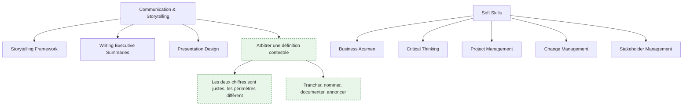

**À quoi ça sert.** Un modèle juste que personne n'utilise ne vaut rien, et un chiffre juste qu'on n'arrive pas à défendre est remplacé par celui d'un tableur. La gestion des intérêts divergents est dans [[notions/gestion-parties-prenantes]], la résistance au changement et l'adoption dans [[notions/conduite-du-changement]]. Ce qui est propre au BI Analyst, c'est une situation qui revient tous les mois et qu'aucune formation ne prépare : **arbitrer un désaccord sur un chiffre**.

Le scénario est toujours le même. Deux services affichent deux nombres différents pour la même chose. Le réflexe est de chercher l'erreur, et il est faux : dans la grande majorité des cas les deux calculs sont corrects et portent sur deux périmètres différents — l'un inclut les avoirs, l'autre non ; l'un date à la commande, l'autre à la facturation. Le travail n'est donc pas de corriger mais de **faire reconnaître** que ce sont deux mesures distinctes, de leur donner deux noms distincts, de désigner celle qui sert au pilotage, et de le consigner. Tant que les deux mesures portent le même nom, le désaccord reviendra.

**Ce qu'il faut savoir**

- Structure de restitution — la conclusion d'abord, puis l'ordre de grandeur, puis la décision proposée, puis la méthode. L'ordre inverse, celui du raisonnement, perd un comité de direction en trois minutes. Un résumé exécutif tient sur une page et énonce quatre choses : le constat, son ampleur chiffrée, l'action recommandée, le bénéfice attendu.
- Présenter un chiffre, c'est présenter son périmètre — annonce systématiquement ce que le chiffre inclut, exclut, et à quelle date il a été calculé. C'est ce qui désarme par avance la contestation, et c'est ce qui distingue un chiffre d'un argument.
- Dire l'incertitude sans se décrédibiliser — « la baisse est de 4 %, dans une plage de variation habituelle de 6 %, donc il est trop tôt pour conclure » est une phrase professionnelle. « Les ventes baissent » quand ce n'est pas établi coûte la confiance dès que le mois suivant remonte.
- Compréhension du métier — c'est la compétence qui sépare un exécutant d'un interlocuteur. Savoir comment l'entreprise gagne de l'argent permet de proposer l'indicateur qui n'a pas été demandé, et de refuser celui qui ne changera aucune décision.
- Conduite du changement — remplacer un tableur de direction par un tableau de bord, c'est retirer à quelqu'un le contrôle de son chiffre. La résistance est rationnelle et il faut la traiter comme telle : faire coexister les deux pendant un ou deux cycles, montrer que les écarts sont expliqués, et ne basculer qu'après. Basculer d'autorité produit un tableur clandestin.
- Gestion de projet — en BI, le mode qui marche est incrémental : un domaine, un modèle, deux ou trois tableaux de bord livrés et utilisés, puis le domaine suivant. Le projet d'entrepôt d'entreprise en dix-huit mois avant la première restitution est le format le plus fiable pour perdre son sponsor en route.
- Esprit critique — la question à se poser devant tout chiffre surprenant est « par quel bug pourrais-je obtenir ce résultat ». Neuf fois sur dix, la découverte spectaculaire est une jointure qui duplique ou un filtre manquant. Vérifier avant de diffuser est peu coûteux ; se rétracter ne l'est pas.

> [!tip] Ajout 2026
> Tiens un **journal des décisions de définition** dans le dépôt : une entrée par arbitrage, avec la date, les deux positions, ce qui a été tranché et par qui. Ça prend cinq minutes par décision et ça règle par avance la réouverture du débat six mois plus tard, quand les personnes ont changé et que personne ne se souvient pourquoi « client actif » compte quatre-vingt-dix jours et pas trente. C'est aussi le document le plus utile à transmettre lors d'une prise de poste.

> [!warning] Piège
> Accepter d'arbitrer seul une définition qui a un enjeu politique. Si le choix entre deux définitions du chiffre d'affaires avantage une direction, le BI Analyst qui tranche techniquement sera désavoué à la première réunion tendue. Son rôle est d'instruire — expliciter les deux périmètres, chiffrer l'écart, montrer les conséquences de chaque option — et de faire prendre la décision au bon niveau, puis de la documenter. Instruire est une position solide, décider à la place du métier ne l'est pas.

---

## 14. BI conversationnelle et couche sémantique (hors roadmap)

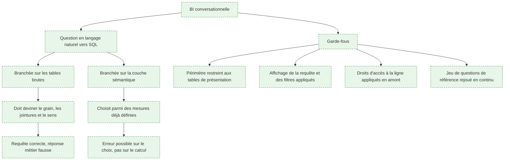

**À quoi ça sert.** L'amont n'en dit rien, et c'est pourtant l'évolution qui a le plus changé les attentes autour du poste. Toutes les grandes plateformes proposent désormais d'interroger les données en langage naturel — Copilot dans Power BI, Pulse chez Tableau, Cortex Analyst chez Snowflake, Genie côté Databricks, Sage chez ThoughtSpot. La promesse est de supprimer l'intermédiaire entre la question et le chiffre. Ce qu'elle produit réellement dépend entièrement de ce sur quoi on la branche, et c'est la raison pour laquelle cette section est dans ce parcours et pas ailleurs.

Un assistant branché sur des tables brutes doit reconstruire, à chaque question, tout le travail de la section 6 et de la section 8 : trouver les bonnes tables, deviner le grain, choisir les jointures, décider si une colonne est une mesure ou un attribut, et savoir qu'un taux ne s'additionne pas. Il produit alors une requête syntaxiquement valide, un résultat plausible, et une erreur métier indétectable par celui qui a posé la question. Branché sur une couche sémantique, le même assistant a un problème beaucoup plus petit : choisir parmi des mesures et des dimensions déjà définies, avec des règles d'agrégation déjà correctes. Il peut encore se tromper de mesure ; il ne peut plus se tromper de calcul.

Ce qui rend le sujet important pour le métier, c'est que ce constat inverse la valeur perçue du travail de modélisation. Pendant vingt ans, la couche sémantique a été un investissement difficile à justifier devant une direction. Elle est devenue la condition pour que l'outil que la direction a déjà acheté fonctionne.

**Ce qu'il faut savoir**

- Les résultats obtenus sur les jeux d'évaluation publics de génération de SQL ne se transposent pas aux schémas d'entreprise réels : ceux-ci ont des centaines de tables, des noms de colonnes hérités et opaques, des règles d'exclusion non écrites et plusieurs tables candidates pour la même notion. C'est le schéma, pas le modèle de langage, qui est le facteur limitant.
- La documentation des colonnes est devenue du code fonctionnel — descriptions, valeurs admises, exemples de requêtes, mentions explicites de ce qu'il ne faut pas utiliser. Ce qui n'était qu'une bonne pratique conditionne maintenant directement la qualité des réponses.
- Restreins le périmètre interrogeable aux tables de présentation et aux mesures publiées. Ouvrir tout l'entrepôt à un assistant est la garantie qu'il trouvera la table intermédiaire abandonnée de l'an dernier.
- Rends la requête visible — affiche le SQL généré, les filtres appliqués et la période retenue à côté de la réponse. Un utilisateur qui voit « du 1er au 31 août, hors avoirs » peut détecter l'erreur de cadrage ; un utilisateur qui voit un nombre seul ne peut rien vérifier.
- Les droits d'accès s'appliquent en amont, jamais par instruction dans le prompt. Une restriction confiée à la consigne textuelle d'un assistant n'est pas une restriction.
- Constitue un jeu de questions de référence — trente à cinquante questions métier avec leur réponse attendue, rejouées à chaque évolution du modèle ou de l'outil. C'est le même réflexe que les tests de la section 7 appliqué à l'interface conversationnelle, et c'est la seule façon de savoir qu'une mise à jour n'a rien dégradé.
- Le besoin ne disparaît pas, il se déplace — moins de rapports à produire à la demande, plus de définitions à tenir, à documenter et à arbitrer. C'est un déplacement vers le cœur du métier, pas une réduction.

> [!tip] Ajout 2026
> L'usage qui marche le mieux aujourd'hui n'est pas la question ouverte, c'est l'**exploration guidée** : l'assistant propose des questions qu'il sait traiter, sur un périmètre restreint, avec la requête affichée. Moins spectaculaire en démonstration, nettement plus fiable en production. Et il existe un bénéfice indirect à surveiller : les questions posées à l'assistant constituent le meilleur inventaire disponible de ce que le métier cherche à savoir et que le modèle ne couvre pas. Journalise-les, elles valent mieux que n'importe quel recueil de besoins.

> [!warning] Piège
> Laisser un assistant conversationnel devenir la source des chiffres diffusés à l'extérieur du service, ou reproduits dans une présentation. Le résultat n'est pas reproductible : la même question reformulée peut produire un périmètre différent, et rien n'en garde la trace. Tout chiffre destiné à être publié, cité ou comparé dans le temps doit venir d'une mesure définie et d'un rapport identifié. L'assistant sert à explorer et à cadrer une question ; il ne fait pas foi.

---

## 15. Se professionnaliser

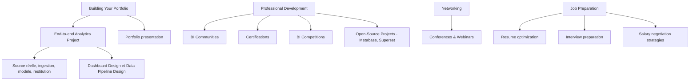

**À quoi ça sert.** Cette partie de la roadmap est générique et interchangeable avec n'importe quel métier de la data, à une exception près qui mérite d'être dite : le portfolio d'un BI Analyst ne se démontre pas comme celui d'un Data Analyst. Un carnet d'analyse bien présenté montre une capacité à répondre ; ce métier-ci doit montrer une capacité à **construire un socle réutilisable**, ce qui est plus difficile à mettre en vitrine et beaucoup plus discriminant à l'entretien.

**Ce qu'il faut savoir**

- Le projet de bout en bout qui vaut quelque chose — une source réellement pénible (une API avec quotas, un jeu de fichiers au schéma instable), une ingestion incrémentale, un modèle dimensionnel avec sa dimension de date et une dimension historisée, des tests qui bloquent la chaîne, et deux ou trois tableaux de bord adossés à des mesures définies une seule fois. Un seul projet de cette qualité vaut dix tableaux de bord sur des données propres téléchargées telles quelles.
- Ce qui se montre — le dépôt, le graphe de dépendances des modèles, le dictionnaire des métriques, et un exemple de test qui a attrapé une vraie erreur. Un recruteur compétent regardera ça avant les captures d'écran.
- Documente une décision de modélisation et son alternative — « j'ai choisi ce grain plutôt que celui-là, voilà ce que ça permet et ce que ça coûte ». C'est exactement la question qui sera posée à l'entretien technique, et c'est ce que presque aucun candidat ne sait faire.
- Certifications — elles servent au filtrage des candidatures, rarement à la compétence. Celle qui a le meilleur rendement est celle de la plateforme utilisée par les entreprises que tu vises, et rien d'autre.
- Projets libres — contribuer à Metabase ou Superset, ou simplement les déployer et les opérer, apprend plus sur le fonctionnement d'un outil décisionnel que n'importe quelle formation : on y voit comment sont gérés le cache, les droits et la couche sémantique.
- Communautés — les forums Power BI, la communauté Tableau et la Data Visualization Society sont les endroits où se règlent les problèmes concrets d'outil. Les sujets de modélisation, eux, se discutent surtout dans les communautés autour de dbt et de l'analytics engineering.
- Entretien — attends-toi à du SQL avec fenêtrage, à un exercice de modélisation sur énoncé métier, et à une mise en situation de désaccord sur un chiffre. Les deux derniers sont ceux qui départagent.
- Négociation — le poste est souvent positionné plus bas que sa contribution réelle, parce que son livrable est invisible quand il fonctionne. Arrive avec des éléments de comparaison de marché et des exemples chiffrés de ce que ton travail a supprimé — rapports retirés, heures de retraitement manuel économisées, incidents évités.

> [!tip] Ajout 2026
> Le projet de démonstration le plus convaincant, et le moins coûteux à monter, tient entièrement en local : des fichiers Parquet, DuckDB comme moteur, dbt pour la transformation, un outil libre pour la restitution. Aucun compte cloud, aucune facture, et exactement les mêmes pratiques qu'en entreprise — dépôt, tests, environnements, documentation générée. C'est aussi la stack la plus utile à maîtriser en mission, pour prototyper un modèle avant de le porter sur l'entrepôt du client.

> [!warning] Piège
> Construire son portfolio sur des jeux de données déjà propres. Ils ne permettent de démontrer aucune des compétences du métier : pas de schéma qui change, pas de doublon, pas de définition ambiguë, pas d'historisation à décider. Prends une source médiocre et montre ce que tu en as fait — c'est le seul terrain où le travail se voit.

---

## Parcours conseillé

| Ordre | Étape | Effort | À viser |
|---|---|---|---|
| 1 | SQL analytique jusqu'au fenêtrage | ~3 semaines | Écrire une requête d'agrégation multi-niveaux et lire son plan d'exécution |
| 2 | Comprendre une fonction métier de bout en bout | ~1 semaine | Savoir poser les quatre questions qui désambiguïsent « chiffre d'affaires » |
| 3 | Dictionnaire des métriques sur un domaine réel | ~3 jours | Dix métriques avec formule, grain, source et propriétaire |
| 4 | Modélisation dimensionnelle | ~3 semaines | Un modèle en étoile avec grain énoncé, dimension de date et une dimension historisée |
| 5 | Transformation versionnée avec dbt | ~2 semaines | Trois couches de modèles, tests bloquants, documentation générée |
| 6 | Entrepôt et arbitrage d'architecture | ~1 semaine | Justifier entrepôt contre lac contre moteur embarqué sur un cas chiffré |
| 7 | Couche sémantique | ~2 semaines | Quinze mesures définies une fois, dont un ratio correct à tous les niveaux |
| 8 | Qualité et lignage instrumentés | ~1 semaine | Réconciliation nocturne avec la source métier et alerte sur écart |
| 9 | Un outil décisionnel en profondeur | ~3 semaines | Droits d'accès à la ligne, modes de rafraîchissement, instrumentation de l'usage |
| 10 | Restitution et arbitrage devant le métier | continu | Tenir une réunion où deux services n'ont pas le même chiffre |
| 11 | Séries temporelles et cohortes modélisées | ~2 semaines | Une cohorte définie une fois, suivie sans intervention |
| 12 | Gouvernance, RGPD, éthique de publication | ~1 semaine | Politique de purge, pseudonymisation, seuil d'agrégation minimale |
| 13 | BI conversationnelle sur périmètre restreint | ~1 semaine | Jeu de trente questions de référence rejoué à chaque évolution |

---

## Liens dans le coffre

- [[parcours/data-analyst]] — l'autre versant du métier : exploration, nettoyage, analyse ad hoc et réponse à une question ponctuelle. Ce parcours-ci construit le socle, celui-là s'en sert.
- [[03 - Roadmap — Data Engineer]] — l'amont de la chaîne : ingestion, pipelines, plateforme, formats de table ouverts. À lire pour savoir où s'arrête la responsabilité du BI Analyst.
- [[02 - Roadmap — AI and Data Scientist]] — le versant modélisation statistique et apprentissage, pour les sujets que la BI doit savoir passer à quelqu'un d'autre.
- [[04 - Roadmap — Machine Learning]] — ce qu'implique réellement un modèle prédictif, quand une demande de « prévision » dépasse la série temporelle.
- [[08 - Roadmap — MLOps]] — le cycle de vie d'un modèle en production, pour comprendre pourquoi maintenir une prévision coûte plus cher que la construire.
- [[05 - Roadmap — AI Engineer]] — utile pour la section 14 : ce qu'on peut attendre d'un modèle de langage, et ce que coûte un jeu d'évaluation sérieux.
- [[00 - Index — Roadmaps]] — la porte d'entrée du corpus.

## Pour aller plus loin

**Modélisation et entrepôt**

- « The Data Warehouse Toolkit », Ralph Kimball et Margy Ross — la référence du domaine, toujours la meilleure sur le grain, les dimensions conformes et l'historisation. Les chapitres sectoriels se lisent comme un catalogue de patrons.
- « Fundamentals of Data Engineering », Joe Reis et Matt Housley — pour situer le travail du BI Analyst dans la chaîne complète et comprendre les arbitrages de la plateforme.
- [Star Schema vs Snowflake Schema](https://www.thoughtspot.com/data-trends/data-modeling/star-schema-vs-snowflake-schema) et [Fact Table vs Dimension Table](https://www.simplilearn.com/fact-table-vs-dimension-table-article) — deux mises au point courtes et correctes, suffisantes pour démarrer.
- [Normalization vs Denormalization](https://codilime.com/blog/normalization-vs-denormalization-in-databases/) — pourquoi le bon réflexe transactionnel est le mauvais réflexe décisionnel.
- [What is a Data Warehouse?](https://cloud.google.com/learn/what-is-a-data-warehouse) — la présentation la plus sobre du concept, sans argumentaire produit.

**Transformation et outillage**

- [Documentation dbt](https://docs.getdbt.com/docs/build/documentation) et [What is dbt](https://www.getdbt.com/product/what-is-dbt) — à lire comme un catalogue de pratiques (tests, matérialisations, documentation générée) autant que comme une documentation d'outil.
- [Documentation Airflow](https://airflow.apache.org/docs) — pour les notions de DAG, de dépendance et de reprise, même si l'outil retenu est un autre.
- [SQL Window Functions](https://mode.com/sql-tutorial/sql-window-functions) et [Performance Tuning SQL Queries](https://mode.com/sql-tutorial/sql-performance-tuning) — les deux meilleures pages courtes sur les deux sujets SQL qui comptent vraiment en BI.

**Restitution**

- « Storytelling with Data », Cole Nussbaumer Knaflic — la référence pratique sur la restitution à un public non technique.
- « Show Me the Numbers », Stephen Few — sur les tableaux et les tableaux de bord, plus rigoureux que la plupart des guides d'éditeurs.
- [Fundamentals of Data Visualization](https://clauswilke.com/dataviz/introduction.html), Claus Wilke — libre et en ligne, la partie sur les couleurs et les échelles est la plus utile.
- [The Data Visualisation Catalogue](https://datavizcatalogue.com/) — pour choisir un type de graphique en partant de la question posée.
- [Visual Best Practices](https://help.tableau.com/current/blueprint/en-us/bp_visual_best_practices.htm) — indépendant de l'outil malgré la source.
- [10 Guidelines for DataViz Accessibility](https://www.highcharts.com/blog/tutorials/10-guidelines-for-dataviz-accessibility/) — la check-list à passer avant publication.
- [How To Spot Misleading Charts](https://www.tableau.com/blog/how-spot-misleading-charts-check-axes) — utile dans les deux sens : détecter, et ne pas produire.

**Qualité, gouvernance, éthique**

- [What Is Data Quality?](https://www.ibm.com/think/topics/data-quality) et [What Is Data Lineage?](https://www.ibm.com/think/topics/data-lineage) — les définitions de référence, à compléter par [The Ultimate Guide To Data Lineage](http://montecarlodata.com/blog-data-lineage/) pour la pratique.
- [Texte du RGPD](https://gdpr-info.eu/) — la source, à consulter plutôt que les résumés commerciaux.
- [5 Principles of Data Ethics for Business](https://online.hbs.edu/blog/post/data-ethics) — court et exploitable, notamment sur la question du périmètre.

**Analyse**

- [Engineering Statistics Handbook, section séries temporelles](https://www.itl.nist.gov/div898/handbook/pmc/section4/pmc4.htm) — le NIST, rigoureux et gratuit, sur la décomposition tendance-saisonnalité.
- [A Refresher on A/B Testing](https://hbr.org/2017/06/a-refresher-on-ab-testing) — le rappel de protocole à relire avant tout test.
- [Correlation vs. Causation](https://www.scribbr.com/methodology/correlation-vs-causation/) — à garder sous la main pour les réunions.
- [Understanding Cohort Analysis](https://hevodata.com/learn/understanding-cohort-analysis-a-guide/) — la mécanique et les pièges de composition.

**Outils libres et communautés**

- [Metabase](https://github.com/metabase/metabase) et [Superset](https://github.com/apache/superset) — les deux plateformes libres sérieuses ; les déployer soi-même est le meilleur cours sur le fonctionnement interne d'un outil décisionnel.
- [Data Visualization Society](https://www.datavisualizationsociety.org/), [communauté Tableau](https://community.tableau.com/s/), [forums Power BI](https://community.fabric.microsoft.com/t5/Power-BI-forums/ct-p/powerbi) — pour les problèmes concrets d'outil.
- [BI Analyst Interview Questions](https://365datascience.com/career-advice/job-interview-tips/bi-analyst-interview-questions/) et [15 Rules for Negotiating a Job Offer](https://hbr.org/2014/04/15-rules-for-negotiating-a-job-offer) — pour la préparation d'entretien et la négociation.
