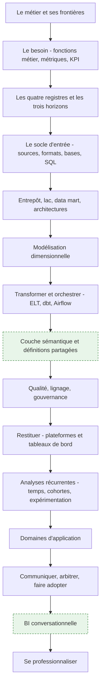
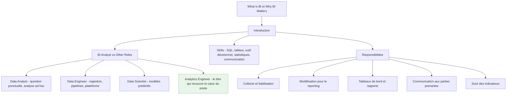
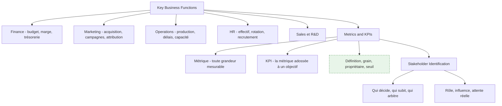
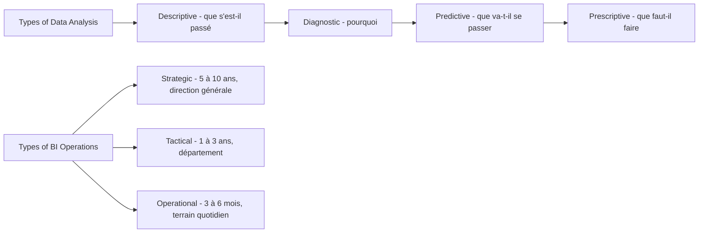
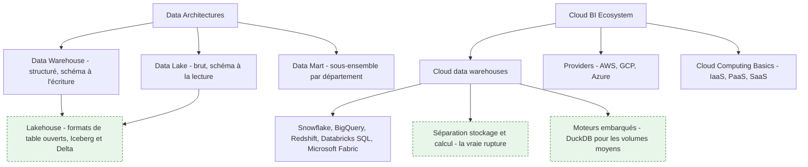
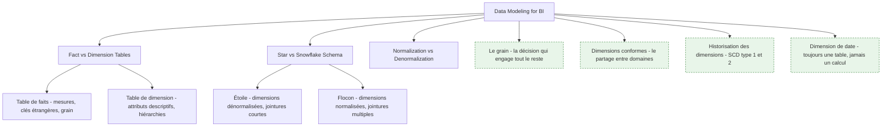
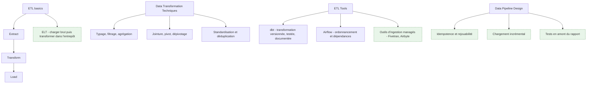
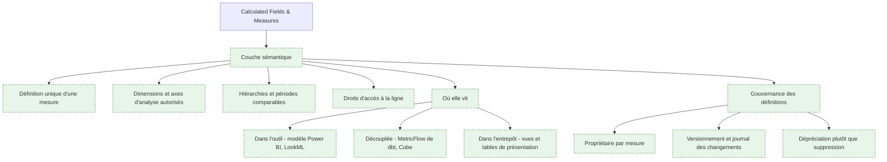
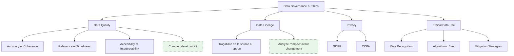

# Parcours — BI Analyst

> [!abstract] Le parcours de celui qui **construit l'infrastructure décisionnelle** dont les autres se serviront : l'entrepôt, le modèle dimensionnel, la couche sémantique, les définitions partagées, la qualité et le lignage. Pour qui veut que le chiffre affiché en comité de direction soit le même dans tous les services, et sache dire d'où il vient.
> Si la question est ponctuelle — « pourquoi les ventes ont chuté en juin ? » — ce n'est pas ce parcours, c'est [[parcours/data-analyst]].

**Source** : roadmap.sh/bi-analyst, dernière modification amont le 4 septembre 2026, capturée le 16 septembre 2026 · **Rédigée** le 16 septembre 2026
Les éléments en vert dans les schémas et les encadrés « Ajout 2026 » ne figurent pas dans la roadmap d'origine.

> [!info] Ce que cette note ne réexplique pas
> Les notions transverses — SQL, tableur, statistiques, visualisation, entrepôt, dbt — sont écrites une seule fois sous `notions/` et appelées par lien. Cette note dit ce qu'elles veulent dire **depuis le poste d'un BI Analyst**, et développe en propre ce qui lui appartient : l'entrepôt comme choix d'architecture, la modélisation dimensionnelle en pratique, la couche sémantique, la gouvernance.

---

## En un coup d'œil

L'amont énumère 200 nœuds et beaucoup de produits interchangeables. Cette note traite les **catégories** et cite les produits comme exemples : savoir arbitrer entre un entrepôt et un lac vaut mieux que connaître par cœur la liste des bases relationnelles.

---

## 1. Le métier et ses frontières

**À quoi ça sert.** La BI répond à « que s'est-il passé, et est-ce que ça va dans le bon sens ». Ce n'est pas la partie prestigieuse de la data, c'est celle qui décide des budgets. Le BI Analyst est le seul rôle dont le livrable est *un accord sur les chiffres* : un modèle, des définitions, des tableaux de bord que plusieurs services acceptent comme référence commune. Un Data Analyst produit une réponse, un BI Analyst produit un socle qui produira des réponses sans lui.

La frontière avec le [[03 - Roadmap — Data Engineer]] est celle de l'objet manipulé. Le data engineer garantit que la donnée **arrive**, fraîche, complète et à l'heure ; il raisonne en pipelines, en SLA et en plateforme. Le BI Analyst garantit qu'elle **veut dire quelque chose** ; il raisonne en grain, en dimension conforme et en définition métier. Les deux se rencontrent sur les tables de l'entrepôt : le data engineer les livre brutes et propres, le BI Analyst les transforme en modèle interrogeable. Dans une petite structure la même personne fait les deux ; dans une grande, confondre les deux produit soit des pipelines impeccables que personne ne sait interroger, soit un modèle élégant posé sur une ingestion qui casse chaque nuit.

**Ce qu'il faut savoir**

- BI Analyst contre Data Analyst — la question « combien » demande un modèle partagé, la question « pourquoi » demande une exploration. Le premier travail se mesure en réutilisation, le second en délai de réponse.
- BI Analyst contre Data Scientist — le second prédit et accepte une incertitude quantifiée ; le premier restitue le réalisé et n'a pas droit à l'approximation. Un écart de 2 % sur un chiffre d'affaires publié est un incident, pas un intervalle de confiance.
- Compétences réelles du poste — [[notions/sql]] à un niveau avancé (fenêtrage, CTE, plans d'exécution), un [[notions/outils-decisionnels]] maîtrisé en profondeur plutôt que trois survolés, le [[notions/tableur]] qu'on n'évite pas, assez de [[notions/statistiques-descriptives]] pour ne pas publier une moyenne trompeuse, et la capacité à tenir une réunion où deux directions n'ont pas le même chiffre.
- Responsabilités — l'amont en liste cinq. La sixième, absente et pourtant la plus lourde : **arbitrer une définition**. Décider que « client actif » veut dire ceci et pas cela, et le faire tenir.
- Renvois amont — la roadmap délègue à `roadmap.sh/sql`, `roadmap.sh/power-bi`, `roadmap.sh/python-data-analysis`, `roadmap.sh/r-programming` et `roadmap.sh/data-analyst`. C'est un aveu utile : le socle technique du BI Analyst est emprunté, sa valeur propre est ailleurs.

> [!tip] Ajout 2026
> Le titre qui décrit le mieux le cœur du poste n'est pas dans la roadmap : **analytics engineer**. C'est le BI Analyst qui a pris les outils du développeur — dépôt Git, revue de code, tests, documentation générée, environnements séparés — pour construire le modèle de l'entrepôt. Les offres l'appellent indifféremment BI Analyst, BI Developer, Analytics Engineer ou Data Analyst senior ; lis le périmètre, pas l'intitulé. Un indice fiable : si la fiche de poste mentionne un dépôt et une couche de transformation versionnée, c'est ce métier-là.

> [!warning] Piège
> Se laisser réduire au guichet de rapports. Le BI Analyst qui accepte toutes les demandes ponctuelles n'a jamais le temps de construire le modèle qui les rendrait inutiles, et se retrouve au bout de deux ans à maintenir quatre cents rapports dont il ne sait plus lesquels sont lus. La sortie de cette impasse est politique, pas technique : rendre visible le coût de chaque demande ad hoc et le comparer au coût du modèle qui l'absorberait.

---

## 2. Le besoin avant la donnée — fonctions métier, métriques, KPI

**À quoi ça sert.** Tout le reste du parcours est de la mécanique ; cette étape décide si la mécanique sert à quelque chose. Comprendre les fonctions de l'entreprise n'est pas de la culture générale : c'est ce qui permet d'entendre « je veux le chiffre d'affaires » et de demander *hors taxes ou TTC, à la commande ou à la facturation, net des avoirs ou brut, à la date de signature ou de livraison*. Les quatre réponses définissent quatre métriques différentes, et les quatre existent quelque part dans l'entreprise. Le travail d'un BI Analyst commence par transformer une demande en spécification — voir [[notions/cadrage-besoin]], qui décrit le recueil et la reformulation ; ce qui est propre à la BI, c'est que la spécification porte sur une **définition de mesure**, pas sur une fonctionnalité.

**Ce qu'il faut savoir**

- Métrique contre KPI — le trafic d'un site est une métrique, le taux de conversion adossé à un objectif trimestriel est un KPI. La différence n'est pas dans le calcul, elle est dans le fait qu'un KPI a un propriétaire et une cible. Une organisation avec quarante KPI n'en a aucun.
- Une définition de métrique complète tient en cinq lignes — le libellé métier, la formule, le grain (par jour ? par client ? par commande ?), la source de vérité, et le nom de la personne qui tranche en cas de désaccord. Sans la cinquième ligne, les quatre premières seront rediscutées tous les six mois.
- Les fonctions métier ont chacune leur maille et leur calendrier — la finance travaille en périodes comptables closes et refuse qu'un chiffre passé bouge ; le marketing travaille en fenêtres d'attribution glissantes et accepte que le chiffre d'hier soit révisé demain. Ces deux exigences sont contradictoires et doivent être modélisées séparément, pas moyennées.
- Parties prenantes — voir [[notions/gestion-parties-prenantes]]. En BI, la ligne de fracture est presque toujours la même : celui qui pilote veut une définition stable, celui qui est évalué veut la définition qui l'avantage. L'arbitrage se prépare avant la réunion, pas pendant.
- Le sponsor n'est pas l'utilisateur — celui qui finance le projet regarde trois chiffres par mois, celui qui l'utilise en regarde trente par jour. Concevoir pour le premier donne un tableau de bord que personne n'ouvre.

> [!tip] Ajout 2026
> Écris le **dictionnaire des métriques avant le premier modèle**, dans le dépôt, en Markdown, une métrique par entrée avec ses cinq lignes. Ça coûte deux jours et ça supprime la moitié des désaccords ultérieurs, parce que le désaccord devient un diff sur un fichier au lieu d'une discussion de couloir. C'est aussi ce fichier qui alimentera plus tard la couche sémantique (section 8) et, s'il existe, l'assistant conversationnel (section 14) : un dictionnaire de métriques est la seule documentation qui se convertit directement en code.

> [!warning] Piège
> Accepter la demande telle qu'elle est formulée. « Il me faut un tableau de bord des ventes » n'est pas un besoin, c'est une solution supposée. La question à poser est « quelle décision prendras-tu différemment selon ce que tu y verras ». Si la réponse est « aucune », le tableau de bord sera consulté trois fois puis abandonné — et il faudra quand même le maintenir.

---

## 3. Les quatre registres et les trois horizons de la BI

**À quoi ça sert.** Les quatre registres ne sont pas une échelle de maturité où il faudrait grimper : ce sont quatre questions différentes, et la BI d'entreprise passe l'essentiel de son temps sur les deux premières. Le descriptif bien fait — un chiffre juste, comparable, disponible à temps — vaut plus que du prescriptif bâclé. Les trois horizons servent, eux, à calibrer la fraîcheur et la granularité : un pilotage stratégique sur dix ans n'a pas besoin de données à la minute, un tableau de bord d'exploitation en a un besoin vital. Confondre les deux produit soit un entrepôt rafraîchi toutes les cinq minutes que personne ne regarde plus d'une fois par mois, soit un chiffre de la veille présenté à une équipe qui doit décider maintenant.

**Ce qu'il faut savoir**

- Descriptif — agrégations, comparaisons, séries. C'est 70 % du travail réel et la seule partie où l'exactitude est non négociable.
- Diagnostic — segmentation, forage, décomposition d'un écart. La technique centrale est l'analyse de contribution : décomposer une variation de marge en effet volume, effet prix et effet mix. Un modèle dimensionnel bien fait rend ce forage trivial ; un modèle plat le rend impossible.
- Prédictif et prescriptif — voir [[notions/apprentissage-supervise]] pour la mécanique. Depuis le poste de BI Analyst, la prévision qui sert vraiment est celle de séries temporelles sur l'activité (section 11), pas un modèle de classification. Le prescriptif, dans la plupart des entreprises, est une règle métier écrite par un humain et non un optimiseur.
- Les trois horizons se traduisent en trois décisions techniques — fréquence de rafraîchissement, profondeur d'historique conservée, et grain de la table de faits. Écris-les explicitement pour chaque tableau de bord ; ce sont elles qui déterminent le coût.
- L'opérationnel est le piège coûteux — dès qu'on descend sous l'heure, l'entrepôt classique n'est plus le bon outil et le besoin relève d'un flux ou d'une base transactionnelle en lecture. Vérifie que le besoin est réel avant de reconstruire l'architecture.

> [!tip] Ajout 2026
> Avant d'accepter une exigence de temps réel, demande la latence de la **décision**, pas celle de la donnée. Si la personne qui consulte le tableau de bord agit une fois par jour, un rafraîchissement horaire est déjà du luxe. On voit régulièrement des architectures en flux continu construites pour un usage dont le cycle de décision est hebdomadaire — le surcoût est d'un ordre de grandeur, la valeur ajoutée nulle.

> [!warning] Piège
> Vendre du prédictif sur un socle descriptif défaillant. Une direction qui n'arrive pas à s'accorder sur son chiffre d'affaires du mois dernier ne tirera rien d'une prévision à six mois — et la prévision sera de toute façon fausse, puisqu'elle sera entraînée sur l'historique incohérent. L'ordre n'est pas négociable : définitions, puis modèle, puis prévision.

---

## 4. Le socle d'entrée — sources, formats, bases, SQL

```mermaid
flowchart TD
  wd["What is Data et Analog vs Digital"] --> src["Data Sources"]
  src --> s1["Bases transactionnelles - ERP, CRM, applicatif métier"]
  src --> s2["Web, Mobile Apps - événements, journaux"]
  src --> s3["APIs et SaaS - facturation, publicité, support"]
  src --> s4["Cloud et IoT - capteurs, télémétrie"]
  src --> s5["Fichiers déposés à la main - le plus fragile"]:::ajout
  td["Types of data"] --> t1["Structuré - tables"]
  td --> t2["Semi-structuré - JSON, XML"]
  td --> t3["Non structuré - texte, image, son"]
  fm["Data Formats"] --> fm1["Échange - CSV, Excel, JSON, XML"]
  fm --> fm2["Analytique colonnaire - Parquet, Avro, ORC"]
  vt["Variables and Data Types"] --> v1["Catégoriel contre numérique"]
  vt --> v2["Discret contre continu"]
  db["Popular Databases"] --> db1["Transactionnel ligne - PostgreSQL, MySQL, SQLite, Oracle"]
  db --> db2["Analytique colonnaire - l'entrepôt, section 5"]
  sq["SQL Fundamentals"] --> sq1["Basic et Advanced Queries"]
  sq --> sq2["Window Functions"]
  sq --> sq3["Performance et indexation"]
  classDef ajout fill:#e8f5e9,stroke:#2e7d32,stroke-width:1px,stroke-dasharray:4 3
```

**À quoi ça sert.** Cette étape ne sert pas à collectionner des formats, elle sert à savoir **ce qui va casser**. Chaque source a un mode de défaillance propre et prévisible : une base transactionnelle change de schéma quand l'applicatif est mis à jour, une API SaaS impose des quotas et réécrit l'historique, un export manuel disparaît dès que la personne qui le produit part en congé. Un BI Analyst qui connaît ces modes de défaillance conçoit un modèle qui les absorbe ; celui qui l'ignore découvre chaque panne en réunion.

La typologie catégoriel/numérique, discret/continu a un usage très concret ici, et c'est le seul que je retiens : elle préfigure la séparation **dimension contre mesure** du modèle dimensionnel. Une variable catégorielle devient un attribut de dimension, une variable numérique additive devient une mesure dans la table de faits. Les cas ambigus — un code postal, une note sur cinq, un identifiant numérique — sont exactement ceux qui finissent additionnés par erreur dans un tableau croisé.

La mécanique du langage, du fenêtrage et de l'optimisation est dans [[notions/sql]] ; la lecture et l'écriture de fichiers tabulaires dans [[notions/tableur]]. Ce qui est propre au BI Analyst, c'est que ses requêtes ne sont pas des réponses mais des **définitions** : une requête écrite une fois et exécutée dix mille fois par un outil de restitution, dont le plan d'exécution et le coût comptent autant que le résultat.

**Ce qu'il faut savoir**

- Sources — inventorie-les avec, pour chacune, le propriétaire applicatif, la fréquence de mise à disposition, le mode de rechargement (complet ou incrémental) et la question « cette source peut-elle réécrire le passé ». La dernière colonne est celle qui détermine si ton historique est stable.
- Extraction incrémentale — elle repose sur une colonne de dernière modification ou un journal de transactions. Si la source n'en a aucun, l'extraction sera complète et son coût plafonnera le volume traitable ; c'est une contrainte d'architecture, pas un détail technique.
- Structuré, semi-structuré, non structuré — les entrepôts modernes ingèrent le JSON et l'interrogent en place avec des fonctions dédiées. Ne l'aplatis pas systématiquement : un champ semi-structuré préservé tel quel permet de récupérer un attribut oublié sans rejouer l'ingestion.
- Formats — CSV et Excel pour l'échange avec des humains, JSON pour les APIs, **Parquet** pour tout ce qui est stocké en vue d'être analysé. Le format colonnaire compressé n'est pas un raffinement : il change le temps de lecture d'un ordre de grandeur et il porte son schéma, ce qui élimine toute une classe d'erreurs de typage.
- Bases relationnelles — MySQL, PostgreSQL, SQLite et Oracle sont des bases *transactionnelles*. Elles sont d'excellentes sources et de mauvais entrepôts : leur stockage en lignes les rend lentes sur les agrégations larges. PostgreSQL tient jusqu'à quelques dizaines de millions de lignes en analytique ; au-delà, c'est la section 5.
- Performance — l'optimisation utile en BI n'est pas l'astuce de requête, c'est la réduction du volume lu : partitionnement par date, colonnes projetées explicitement plutôt que `SELECT *`, agrégations pré-calculées. Lis le plan d'exécution avant de réécrire quoi que ce soit.

> [!tip] Ajout 2026
> La source la plus dangereuse ne figure pas dans la roadmap : le **fichier déposé à la main**. Un classeur mis chaque lundi sur un partage réseau finit toujours par être la clé d'un tableau de bord de direction, et il n'a ni schéma stable, ni propriétaire, ni historique. Traite-le comme une dette : ingère-le avec une validation de schéma stricte qui refuse le fichier plutôt que d'accepter une colonne renommée, et garde chaque version reçue. Le jour où le chiffre est contesté, c'est l'archive brute qui tranche.

> [!warning] Piège
> Aller chercher la donnée directement dans la base de production. Ça marche pendant trois mois, puis une requête d'agrégation dégrade l'applicatif en pleine journée, et surtout le modèle décisionnel se retrouve couplé au schéma applicatif : chaque évolution du produit casse un rapport. Le découplage par une couche d'ingestion n'est pas de la bureaucratie, c'est ce qui rend les deux systèmes modifiables indépendamment.

---

## 5. L'entrepôt et les architectures décisionnelles

**À quoi ça sert.** L'entrepôt existe pour une raison précise : **découpler la lecture analytique de l'écriture transactionnelle**, et fixer un historique que personne ne peut réécrire par accident. Tout le reste — la performance, la modélisation, la gouvernance — en découle. Les définitions de l'entrepôt, du data mart et des schémas sont dans [[notions/entrepot-de-donnees]], celles du stockage brut et du lakehouse dans [[notions/data-lake]]. Ce qui est propre au BI Analyst, c'est le choix et ses conséquences quotidiennes.

Vu de ce poste, l'arbitrage entrepôt contre lac se joue sur **qui porte le coût du schéma**. L'entrepôt impose le schéma à l'écriture : l'ingestion est plus coûteuse à construire, mais tout consommateur en aval lit une table dont la structure et le sens sont garantis. Le lac impose le schéma à la lecture : l'ingestion est quasi gratuite, et chaque analyste réinterprète les fichiers à sa manière — ce qui reproduit exactement le problème que la BI est censée résoudre. Pour un usage décisionnel partagé, l'entrepôt gagne presque toujours ; le lac a sa place en amont, comme zone d'atterrissage brute et archive rejouable.

**Ce qu'il faut savoir**

- Architecture à zones — atterrissage brut immuable, couche intermédiaire nettoyée et typée, couche de présentation modélisée pour la restitution. Trois zones, trois responsabilités, et la règle qui les tient : on ne rejoue jamais l'ingestion depuis la source, on rejoue depuis l'atterrissage. C'est ce qui rend une correction de logique de transformation possible sans redemander les données.
- Data mart — un sous-ensemble orienté département, construit *depuis* les tables communes et jamais à côté d'elles. Un data mart alimenté par sa propre ingestion n'est pas un data mart, c'est un silo de plus.
- Séparation du stockage et du calcul — c'est la rupture réelle des entrepôts cloud, plus que l'élasticité. Elle permet de donner un moteur dédié à l'équipe finance sans qu'une de ses requêtes ralentisse le tableau de bord d'exploitation, et de dimensionner le calcul par usage. Elle rend aussi le coût variable, donc surveillable : voir le piège.
- Lakehouse et formats de table ouverts — Apache Iceberg et Delta Lake ajoutent aux fichiers Parquet ce qui manquait au lac : transactions, évolution de schéma, voyage dans le temps. Conséquence concrète pour la BI, la donnée reste dans le stockage objet et plusieurs moteurs l'interrogent sans copie, ce qui réduit les duplications à réconcilier.
- Volumes moyens — en dessous de quelques centaines de millions de lignes, un moteur embarqué comme DuckDB sur des fichiers Parquet fait le travail d'un entrepôt cloud pour un coût d'infrastructure proche de zéro. Beaucoup de projets BI d'entreprise moyenne n'ont jamais eu besoin d'autre chose.
- Cloud — les notions IaaS, PaaS, SaaS n'intéressent le BI Analyst que sur un point : qui administre quoi. Ce qui compte vraiment est le modèle de facturation de l'entrepôt retenu — au temps de calcul, à la donnée scannée, ou à la capacité réservée — parce qu'il dicte la façon d'écrire les requêtes.

> [!tip] Ajout 2026
> Deux évolutions ont un effet direct sur le travail quotidien. D'abord la **convergence sur les formats de table ouverts** : le débat entrepôt contre lac s'est largement déplacé vers « quel moteur interroge le même stockage », ce qui rend le choix de plateforme moins définitif qu'il ne l'était. Ensuite les **plateformes intégrées** — Microsoft Fabric réunit stockage, transformation et restitution avec Power BI lisant directement le stockage sans importation, ce qui supprime une copie et un décalage de fraîcheur. Le gain est réel ; la contrepartie est un enfermement plus fort, à peser avant de tout y migrer.

> [!warning] Piège
> Ne pas surveiller le coût dès le premier jour. Avec un entrepôt facturé à la donnée scannée, un tableau de bord auto-rafraîchi toutes les cinq minutes sur une table non partitionnée peut coûter plus cher que toute l'équipe qui le consulte. Instrumente la dépense par tableau de bord et par utilisateur avant d'ouvrir l'accès, pose des quotas, et sache pour chaque rapport ce qu'il coûte par mois. C'est le seul argument qui permet ensuite de supprimer les rapports morts.

---

## 6. La modélisation dimensionnelle

**À quoi ça sert.** Le modèle dimensionnel est le contrat entre la donnée et ceux qui la consultent. Sa mécanique — faits, dimensions, étoile, flocon, granularité — est dans [[notions/modelisation-dimensionnelle]]. Ce qui appartient au BI Analyst, c'est la conduite des quatre ou cinq décisions qui font qu'un modèle tient dix ans ou se réécrit tous les dix-huit mois.

Il faut d'abord comprendre pourquoi la normalisation, bonne pratique en transactionnel, est le mauvais réflexe ici. Une base transactionnelle normalise pour éviter les incohérences à l'écriture, avec beaucoup d'écritures et des lectures ciblées. Un entrepôt fait l'inverse : écriture unique et contrôlée, lectures massives et agrégeantes. La dénormalisation des dimensions n'est donc pas un compromis de performance, c'est le choix cohérent avec la charge — et elle a un bénéfice qu'on sous-estime, la **lisibilité** : un utilisateur qui voit une dimension « Client » avec quarante attributs plats sait s'en servir, alors qu'il abandonnera devant six tables normalisées à joindre lui-même.

**Ce qu'il faut savoir**

- Le grain d'abord — écris en une phrase ce que représente **une ligne** de ta table de faits : « une ligne de commande d'un produit par un client à une date ». Tout le reste du modèle en découle, et changer le grain plus tard signifie réécrire le modèle et tous les rapports qui en dépendent. Choisis toujours le grain le plus fin disponible : agréger ensuite est facile, désagréger est impossible.
- Mesures additives, semi-additives, non additives — un montant s'additionne sur toutes les dimensions ; un stock s'additionne entre produits mais pas dans le temps (on prend le dernier, pas la somme) ; un taux ou une moyenne ne s'additionne jamais. Stocke le numérateur et le dénominateur, calcule le ratio à la restitution. C'est l'erreur la plus fréquente et la plus difficile à détecter, parce que le total faux reste plausible.
- Dimensions conformes — une dimension « Produit » partagée à l'identique par les faits ventes, stock et retours permet de comparer les trois sur la même maille. Sans conformité, chaque domaine a son référentiel produit et aucune comparaison transverse n'est possible : c'est le symptôme le plus fiable d'un entrepôt qui a été construit rapport par rapport.
- Historisation des dimensions — si un client change de segment, veut-on que ses ventes passées soient reclassées (écrasement, dit type 1) ou restent attachées à l'ancien segment (nouvelle version datée, dit type 2) ? Les deux réponses sont légitimes selon l'usage, et la question doit être posée au métier, pas tranchée par défaut. Le type 2 coûte une clé technique et un peu de discipline ; ne pas l'avoir prévu coûte une réécriture.
- Dimension de date — toujours une table réelle, avec pour chaque jour son mois, son trimestre, son exercice fiscal, ses jours ouvrés, ses jours fériés et ses périodes comparables. Elle porte le calendrier de l'entreprise, qui n'est presque jamais le calendrier civil. C'est la table la plus rentable de tout l'entrepôt.
- Étoile contre flocon — l'étoile par défaut. Le flocon se justifie sur une hiérarchie profonde et réellement partagée, ou quand une dimension est très volumineuse. La plupart des flocons qu'on rencontre ne sont pas un choix, ce sont des tables transactionnelles remontées telles quelles.
- Faits sans mesure et clés dégénérées — un fait peut n'être qu'un événement (une visite, une connexion) : la mesure est alors le comptage de lignes. Un numéro de commande porté dans la table de faits sans dimension associée est une clé dégénérée, et c'est normal.

> [!tip] Ajout 2026
> Le modèle dimensionnel a été déclaré obsolète à chaque nouvelle génération d'outils, et il a survécu à toutes — y compris à la promesse « interroge directement les tables brutes, le moteur est assez rapide ». Le moteur l'est effectivement ; ce n'est pas le problème. Le modèle ne sert pas à accélérer les requêtes, il sert à **fixer le sens** : le grain, les mesures légitimes, les axes d'analyse valides. La BI conversationnelle (section 14) a rendu ce point plus visible encore, parce qu'un assistant lâché sur des tables brutes produit des agrégations syntaxiquement correctes et métier absurdes.

> [!warning] Piège
> La grande table plate unique. Elle marche merveilleusement pour le premier tableau de bord, puis on y ajoute un second sujet, et les mesures du premier se retrouvent dupliquées par les lignes du second : les totaux doublent. Le diagnostic est toujours le même — deux grains différents dans une seule table. Quand on le découvre, six rapports publient déjà des chiffres faux et personne ne sait depuis quand.

---

## 7. Transformer et orchestrer — ELT, dbt, ordonnancement

**À quoi ça sert.** C'est ici que le modèle de la section 6 devient du code exécuté chaque nuit. La mécanique de dbt — modèles, tests, documentation, matérialisations — est dans [[notions/transformation-dbt]] ; celle de l'ordonnancement, des DAG et de la reprise sur incident dans [[notions/orchestration-de-flux]]. Ce qui est propre au BI Analyst, c'est le déplacement que ces outils ont provoqué dans son métier : la transformation est passée d'un outil graphique administré par l'informatique à du **SQL dans un dépôt Git**, ce qui l'a mise à sa portée et lui a imposé des pratiques de développeur.

L'inversion ETL vers ELT est l'autre changement structurant. Dans l'ETL classique, la transformation se fait en route, dans un serveur dédié, et seule la donnée transformée arrive. Dans l'ELT, on charge brut dans l'entrepôt et on transforme avec son moteur. Les conséquences pratiques sont nettes : le brut reste disponible, donc une erreur de logique se corrige en rejouant une transformation au lieu de redemander les données ; la transformation s'écrit en SQL, donc l'analyste ne dépend plus d'un développeur ; et le coût de calcul devient visible sur la facture de l'entrepôt.

> [!info] Frontière avec le parcours Data Analyst
> Le nettoyage exploratoire, l'analyse ad hoc et l'examen d'un jeu de données inconnu relèvent de [[parcours/data-analyst]], qui les traite en propre. Ici, la transformation est **modélisée** : une règle de nettoyage n'est pas un geste dans un carnet, c'est un modèle versionné, testé, documenté, qui s'appliquera à tous les chargements suivants. La même opération — dédupliquer, imputer une valeur manquante, normaliser un libellé — change complètement de nature selon qu'elle est jouée une fois ou industrialisée.

**Ce qu'il faut savoir**

- Couches de transformation — une couche de mise en forme minimale par source (renommage, typage, rien d'autre), une couche intermédiaire pour la logique métier réutilisable, une couche de présentation qui expose faits et dimensions. Cette discipline de trois couches est ce qui empêche la même règle d'être réécrite dans quinze modèles.
- Idempotence — rejouer un traitement deux fois doit donner le même résultat. Concrètement : supprimer puis réinsérer la fenêtre traitée plutôt qu'ajouter, et faire dépendre le traitement d'une date de référence passée en paramètre plutôt que de la date du jour. Sans ça, aucune reprise sur incident n'est sûre.
- Chargement incrémental — indispensable dès que le volume dépasse ce qu'un rechargement complet peut absorber dans la fenêtre nocturne, mais il ouvre la porte aux trous silencieux quand une donnée arrive en retard. Prévois un rechargement complet périodique, ou une fenêtre de reprise glissante sur quelques jours.
- Tests dans le pipeline — unicité de la clé, absence de valeur nulle sur les colonnes structurantes, intégrité référentielle entre faits et dimensions, valeurs acceptées sur les colonnes codifiées. Un test qui échoue doit **arrêter la chaîne**, pas alerter : un rapport visiblement vide fait moins de dégâts qu'un rapport plausible et faux.
- Documentation et lignage générés — dbt produit le graphe des dépendances entre modèles depuis le code lui-même. C'est la seule documentation qui ne se périme pas, et c'est aussi ce qui permet de répondre à « si je change cette colonne, qu'est-ce qui casse » — voir section 9.
- Ordonnancement — Airflow et ses équivalents gèrent les dépendances, les reprises et les alertes. Pour une chaîne BI simple, le planificateur intégré à la plateforme de transformation suffit souvent ; l'orchestrateur dédié se justifie quand la chaîne croise d'autres systèmes.
- Ingestion managée — Fivetran, Airbyte et leurs concurrents couvrent les connecteurs SaaS standards. Écrire soi-même un connecteur vers une API de facturation est rarement un bon usage du temps d'un BI Analyst ; le maintenir l'est encore moins.
- Python et R en BI — [[notions/pandas]] et [[notions/r-et-tidyverse]] restent utiles pour ce que SQL fait mal : appeler une API, lire un format exotique, calculer une prévision. Dans la chaîne de transformation, préfère le SQL pour tout ce qu'il sait faire — il est testable, lisible par l'équipe métier et exécuté par l'entrepôt.

> [!tip] Ajout 2026
> Les pratiques qui ont le plus d'effet sur la fiabilité ne sont pas des outils, ce sont trois habitudes empruntées au développement logiciel. **Un environnement de développement séparé**, où chaque analyste construit ses modèles dans son propre jeu de schémas sans toucher la production. **La revue de code sur les modèles**, qui attrape les erreurs de grain avant qu'elles atteignent un rapport. **L'intégration continue qui rejoue les tests sur la branche**, ce qui transforme « j'espère que ça n'a rien cassé » en réponse vérifiable. Une équipe BI qui a ces trois choses ne ressemble plus du tout à une équipe BI qui ne les a pas.

> [!warning] Piège
> Laisser la logique métier dans l'outil de restitution. Une mesure calculée dans Power BI ou Tableau n'est ni testable, ni versionnée, ni réutilisable par un autre outil, et elle sera réécrite différemment dans le rapport suivant. La règle qui tient : tout ce qui est une **définition** remonte dans la transformation ou la couche sémantique ; l'outil de restitution ne fait que du dessin et de l'interaction.

---

## 8. La couche sémantique et les définitions partagées

**À quoi ça sert.** C'est le vrai travail du métier, et l'amont ne lui consacre qu'un nœud — *Calculated Fields & Measures* — en le traitant comme une fonctionnalité d'outil. C'est bien plus que ça. La couche sémantique est l'endroit où « chiffre d'affaires », « client actif », « marge brute » et « délai de livraison » reçoivent **une** définition, exprimée en une seule fois, et à partir de laquelle tous les rapports sont construits. Sans elle, chaque rapport contient sa propre version du calcul, les versions divergent à mesure que les règles évoluent, et l'entreprise se retrouve avec trois chiffres d'affaires selon l'outil consulté.

Le symptôme se reconnaît immédiatement : une réunion où la direction commerciale et la direction financière affichent deux nombres différents pour la même chose, et où la demi-heure suivante est consacrée à comprendre pourquoi au lieu de décider. Ce qui se joue là n'est pas un bug, c'est l'absence de couche sémantique. Et la cause est presque toujours la même : les deux chiffres sont *tous les deux justes*, calculés sur deux définitions légitimes que personne n'a arbitrées.

Une couche sémantique porte quatre choses. Les **mesures**, avec leur formule et leur règle d'agrégation. Les **dimensions** par lesquelles on a le droit de les découper, ce qui interdit par construction les croisements absurdes. Les **hiérarchies et périodes comparables**, qui donnent un sens univoque à « le mois dernier » et « à la même période l'an dernier ». Et les **droits d'accès à la ligne**, qui font qu'un directeur régional ne voit que sa région sans qu'on ait à dupliquer le rapport.

**Ce qu'il faut savoir**

- Une mesure se définit par sa formule **et** sa règle d'agrégation. « Chiffre d'affaires » se somme, « nombre de clients distincts » ne se somme pas (le distinct ne s'additionne pas entre segments), « taux de marge » se recalcule à chaque niveau depuis ses deux composants. Une couche sémantique correcte sait faire ces trois choses différemment ; un champ calculé dans un rapport n'en sait faire qu'une.
- Le ratio de ratios est le test décisif — si la marge affichée sur le total national n'est pas la moyenne des marges régionales, ta couche calcule correctement. Si elle l'est, elle somme des pourcentages et tous tes agrégats sont faux. Vérifie-le dès le premier modèle.
- Trois emplacements possibles, trois compromis. **Dans l'outil de restitution** — le plus rapide à mettre en place, définitions inaccessibles aux autres outils et au SQL direct. **Découplée** — MetricFlow de dbt, Cube et leurs équivalents exposent les mesures à plusieurs consommateurs par une interface commune, au prix d'une brique de plus à opérer. **Dans l'entrepôt**, sous forme de vues et de tables de présentation — le plus universel, puisque tout ce qui parle SQL y a accès, mais incapable de porter les agrégations non additives et les périodes comparables sans démultiplier les vues. En pratique, une combinaison : les tables de présentation portent les mesures additives, la couche découplée ou l'outil portent le reste.
- Le dictionnaire des métriques (section 2) et la couche sémantique doivent être le même objet. Si la documentation vit dans un tableur et les définitions dans le code, elles divergeront en trois mois. Fais générer la documentation depuis les définitions.
- Chaque mesure a un propriétaire métier nommé. Pas une direction, une personne. C'est elle qui valide un changement de définition, et c'est aussi elle qu'on cite quand le chiffre est contesté.
- Changer une définition se fait comme un changement d'interface — annonce, date d'effet, période où l'ancienne et la nouvelle coexistent sous deux noms, journal du changement. Un chiffre historique qui bouge du jour au lendemain sans explication détruit plus de confiance que six mois de retard de livraison.
- Ne supprime pas, déprécie — marque la mesure comme obsolète, laisse-la fonctionner, mesure qui l'utilise encore, puis retire-la. La suppression brutale casse toujours un rapport dont tu ignorais l'existence.

> [!tip] Ajout 2026
> La couche sémantique est passée de raffinement à pièce maîtresse, pour une raison extérieure à la BI : elle est devenue l'**interface par laquelle les assistants interrogent les données**. Un modèle de langage branché sur les tables brutes doit devenir sa propre couche sémantique à chaque question, et il le fait mal (section 14) ; branché sur des mesures définies, il choisit parmi des calculs déjà justes. C'est le meilleur argument disponible pour financer ce travail, parce qu'il est enfin visible d'une direction : la même semaine d'effort qui sécurise les tableaux de bord conditionne l'usage des assistants. Le corollaire opérationnel est de traiter les définitions comme une interface publique, avec un contrat et un versionnement.

> [!warning] Piège
> Construire la couche sémantique comme un exercice d'exhaustivité. Modéliser deux cents mesures dont trente sont utilisées produit un objet que personne ne maîtrise et dont chaque évolution fait peur. Commence par les dix à quinze chiffres qui apparaissent réellement dans les instances de pilotage, verrouille-les complètement — définition, propriétaire, tests, documentation — et n'ajoute une mesure que quand un usage la demande. Le critère de réussite n'est pas le nombre de mesures, c'est le nombre de réunions qui ne discutent plus du chiffre.

---

## 9. Qualité, lignage et gouvernance — rendre un chiffre défendable

**À quoi ça sert.** Il faut sortir la gouvernance du registre de la conformité, où l'amont la range, pour la remettre là où elle sert : **c'est ce qui rend un chiffre défendable**. Un chiffre défendable est un chiffre dont on peut dire, en réunion et sans préparation, d'où il vient, ce qu'il inclut, quand il a été calculé, et ce qui se passerait s'il était faux. Les dimensions de la qualité sont dans [[notions/qualite-des-donnees]], la traçabilité et les catalogues dans [[notions/lignage-des-donnees]], les obligations européennes dans [[notions/rgpd]]. L'angle propre au BI Analyst est celui de la charge de la preuve.

Concrètement, ça se joue en deux moments. Quand un chiffre est contesté, il faut pouvoir remonter en quelques minutes jusqu'à la ligne source — c'est le lignage. Et quand un chiffre va être publié, il faut savoir qu'il est valide avant que quelqu'un le découvre faux — c'est la qualité instrumentée. Ces deux capacités ne s'improvisent pas le jour où on en a besoin : elles se construisent dans la chaîne de transformation (section 7).

**Ce qu'il faut savoir**

- Les six dimensions de la qualité, traduites en tests exécutables — exactitude (comparaison à une source de référence ou à un contrôle métier connu), complétude (aucune valeur manquante sur les colonnes structurantes), unicité (clé sans doublon), fraîcheur (dernière donnée à moins de N heures), validité (valeurs dans la liste autorisée), cohérence (les totaux se réconcilient entre deux tables). Une dimension de qualité qui n'est pas un test automatisé n'est pas gérée, elle est espérée.
- La réconciliation avec la source métier est le contrôle le plus rentable — comparer chaque nuit le chiffre d'affaires de l'entrepôt à celui du système de facturation, et alerter sur l'écart. Ça attrape les pannes d'ingestion, les doublons et les erreurs de grain d'un seul coup, et c'est le seul contrôle que le métier comprend immédiatement.
- Lignage en deux sens — descendant pour répondre à « ce chiffre vient d'où », montant pour répondre à « si je modifie cette colonne source, quels rapports cassent ». Le second est celui qui évite les incidents ; il exige que le lignage aille jusqu'aux rapports, pas seulement jusqu'aux tables. Beaucoup de catalogues s'arrêtent à la frontière de l'outil de restitution, et c'est précisément là que se trouve la surprise.
- Fraîcheur affichée — mets la date et l'heure du dernier rafraîchissement **sur** le tableau de bord, visible. Un chiffre périmé qui se présente comme à jour cause plus de dégâts qu'un chiffre absent, et c'est la correction la moins chère de toute cette section.
- RGPD vu du poste — trois points reviennent en BI. La **minimisation** : ton modèle n'a presque jamais besoin du nom, seulement d'un identifiant pseudonymisé et d'attributs de segmentation. La **durée de conservation** : l'entrepôt conserve par nature, ce qui entre en tension directe avec l'obligation d'effacement — il faut une politique de purge ou d'agrégation au-delà d'un seuil. Et le **droit d'accès et d'effacement**, qui suppose de savoir retrouver toutes les traces d'une personne, donc suppose le lignage. Le CCPA californien pose des exigences voisines sur le champ des entreprises concernées ; le mécanisme de réponse est le même.
- Biais et usage éthique — en BI, le biais n'arrive presque jamais par un algorithme, il arrive par le **périmètre**. Un tableau de bord de satisfaction construit sur les répondants à un questionnaire mesure la satisfaction de ceux qui répondent. Un indicateur de productivité par équipe devient un outil d'évaluation individuelle dès qu'il est diffusé, quelle que soit l'intention initiale. Documente le périmètre et les exclusions à côté du chiffre, et pose la question de l'usage avant de publier une mesure par personne.
- Accessibilité et interprétabilité sont des dimensions de qualité, pas du confort — une donnée juste que personne ne trouve ou dont personne ne comprend le libellé ne sert à rien. Un nom de colonne compréhensible par le métier fait plus pour la qualité perçue que trois tests supplémentaires.

> [!tip] Ajout 2026
> Deux pratiques valent mieux qu'un programme de gouvernance. **Le contrat de données avec les équipes sources** : une entente écrite, courte, où l'équipe applicative s'engage sur un schéma, une fraîcheur et un préavis en cas de changement. Ça transforme la rupture de schéma d'accident subi en engagement rompu, et c'est ce qui donne au BI Analyst un levier qu'il n'a pas autrement. **La détection d'anomalie sur les volumes et les distributions** : surveiller que le nombre de lignes chargées et la distribution des mesures principales restent dans leur plage habituelle attrape les pannes silencieuses que les tests de schéma laissent passer — la table est bien là, correctement typée, avec un tiers des lignes en moins.

> [!warning] Piège
> Faire de la gouvernance un projet documentaire. Un catalogue rempli à la main par une équipe dédiée est périmé avant d'être terminé, parce que rien ne force sa mise à jour. Ce qui tient dans le temps est ce qui est **généré depuis le code** — lignage, documentation, tests — et ce qui bloque la chaîne quand c'est faux. La question à se poser devant toute initiative de gouvernance : qu'est-ce qui se passe si personne ne la maintient ? Si la réponse est « rien ne casse, ça se périme », elle ne sera pas maintenue.

---
