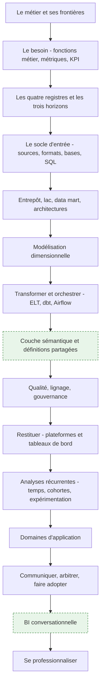
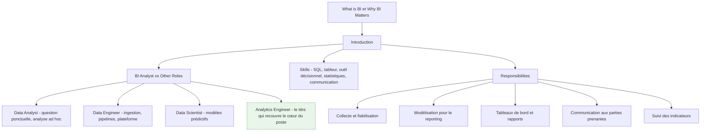
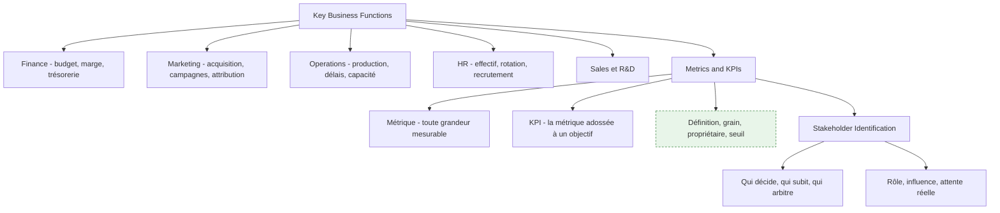
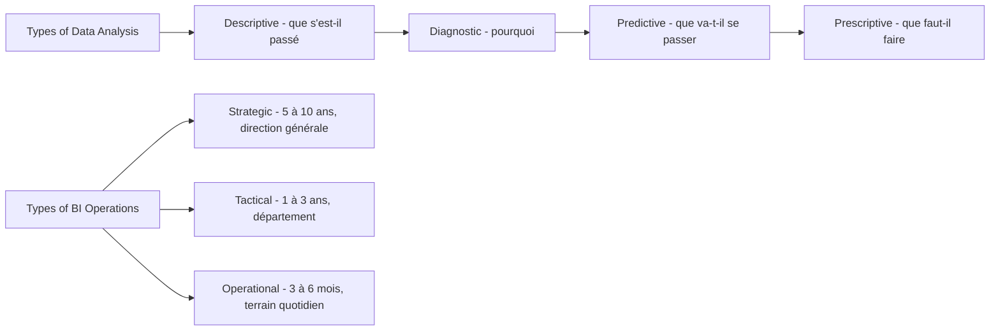

# Parcours — BI Analyst

> [!abstract] Le parcours de celui qui **construit l'infrastructure décisionnelle** dont les autres se serviront : l'entrepôt, le modèle dimensionnel, la couche sémantique, les définitions partagées, la qualité et le lignage. Pour qui veut que le chiffre affiché en comité de direction soit le même dans tous les services, et sache dire d'où il vient.
> Si la question est ponctuelle — « pourquoi les ventes ont chuté en juin ? » — ce n'est pas ce parcours, c'est [[parcours/data-analyst]].

**Source** : roadmap.sh/bi-analyst, dernière modification amont le 4 septembre 2026, capturée le 16 septembre 2026 · **Rédigée** le 16 septembre 2026
Les éléments en vert dans les schémas et les encadrés « Ajout 2026 » ne figurent pas dans la roadmap d'origine.

> [!info] Ce que cette note ne réexplique pas
> Les notions transverses — SQL, tableur, statistiques, visualisation, entrepôt, dbt — sont écrites une seule fois sous `notions/` et appelées par lien. Cette note dit ce qu'elles veulent dire **depuis le poste d'un BI Analyst**, et développe en propre ce qui lui appartient : l'entrepôt comme choix d'architecture, la modélisation dimensionnelle en pratique, la couche sémantique, la gouvernance.

---

## En un coup d'œil

L'amont énumère 200 nœuds et beaucoup de produits interchangeables. Cette note traite les **catégories** et cite les produits comme exemples : savoir arbitrer entre un entrepôt et un lac vaut mieux que connaître par cœur la liste des bases relationnelles.

---

## 1. Le métier et ses frontières

**À quoi ça sert.** La BI répond à « que s'est-il passé, et est-ce que ça va dans le bon sens ». Ce n'est pas la partie prestigieuse de la data, c'est celle qui décide des budgets. Le BI Analyst est le seul rôle dont le livrable est *un accord sur les chiffres* : un modèle, des définitions, des tableaux de bord que plusieurs services acceptent comme référence commune. Un Data Analyst produit une réponse, un BI Analyst produit un socle qui produira des réponses sans lui.

La frontière avec le [[03 - Roadmap — Data Engineer]] est celle de l'objet manipulé. Le data engineer garantit que la donnée **arrive**, fraîche, complète et à l'heure ; il raisonne en pipelines, en SLA et en plateforme. Le BI Analyst garantit qu'elle **veut dire quelque chose** ; il raisonne en grain, en dimension conforme et en définition métier. Les deux se rencontrent sur les tables de l'entrepôt : le data engineer les livre brutes et propres, le BI Analyst les transforme en modèle interrogeable. Dans une petite structure la même personne fait les deux ; dans une grande, confondre les deux produit soit des pipelines impeccables que personne ne sait interroger, soit un modèle élégant posé sur une ingestion qui casse chaque nuit.

**Ce qu'il faut savoir**

- BI Analyst contre Data Analyst — la question « combien » demande un modèle partagé, la question « pourquoi » demande une exploration. Le premier travail se mesure en réutilisation, le second en délai de réponse.
- BI Analyst contre Data Scientist — le second prédit et accepte une incertitude quantifiée ; le premier restitue le réalisé et n'a pas droit à l'approximation. Un écart de 2 % sur un chiffre d'affaires publié est un incident, pas un intervalle de confiance.
- Compétences réelles du poste — [[notions/sql]] à un niveau avancé (fenêtrage, CTE, plans d'exécution), un [[notions/outils-decisionnels]] maîtrisé en profondeur plutôt que trois survolés, le [[notions/tableur]] qu'on n'évite pas, assez de [[notions/statistiques-descriptives]] pour ne pas publier une moyenne trompeuse, et la capacité à tenir une réunion où deux directions n'ont pas le même chiffre.
- Responsabilités — l'amont en liste cinq. La sixième, absente et pourtant la plus lourde : **arbitrer une définition**. Décider que « client actif » veut dire ceci et pas cela, et le faire tenir.
- Renvois amont — la roadmap délègue à `roadmap.sh/sql`, `roadmap.sh/power-bi`, `roadmap.sh/python-data-analysis`, `roadmap.sh/r-programming` et `roadmap.sh/data-analyst`. C'est un aveu utile : le socle technique du BI Analyst est emprunté, sa valeur propre est ailleurs.

> [!tip] Ajout 2026
> Le titre qui décrit le mieux le cœur du poste n'est pas dans la roadmap : **analytics engineer**. C'est le BI Analyst qui a pris les outils du développeur — dépôt Git, revue de code, tests, documentation générée, environnements séparés — pour construire le modèle de l'entrepôt. Les offres l'appellent indifféremment BI Analyst, BI Developer, Analytics Engineer ou Data Analyst senior ; lis le périmètre, pas l'intitulé. Un indice fiable : si la fiche de poste mentionne un dépôt et une couche de transformation versionnée, c'est ce métier-là.

> [!warning] Piège
> Se laisser réduire au guichet de rapports. Le BI Analyst qui accepte toutes les demandes ponctuelles n'a jamais le temps de construire le modèle qui les rendrait inutiles, et se retrouve au bout de deux ans à maintenir quatre cents rapports dont il ne sait plus lesquels sont lus. La sortie de cette impasse est politique, pas technique : rendre visible le coût de chaque demande ad hoc et le comparer au coût du modèle qui l'absorberait.

---

## 2. Le besoin avant la donnée — fonctions métier, métriques, KPI

**À quoi ça sert.** Tout le reste du parcours est de la mécanique ; cette étape décide si la mécanique sert à quelque chose. Comprendre les fonctions de l'entreprise n'est pas de la culture générale : c'est ce qui permet d'entendre « je veux le chiffre d'affaires » et de demander *hors taxes ou TTC, à la commande ou à la facturation, net des avoirs ou brut, à la date de signature ou de livraison*. Les quatre réponses définissent quatre métriques différentes, et les quatre existent quelque part dans l'entreprise. Le travail d'un BI Analyst commence par transformer une demande en spécification — voir [[notions/cadrage-besoin]], qui décrit le recueil et la reformulation ; ce qui est propre à la BI, c'est que la spécification porte sur une **définition de mesure**, pas sur une fonctionnalité.

**Ce qu'il faut savoir**

- Métrique contre KPI — le trafic d'un site est une métrique, le taux de conversion adossé à un objectif trimestriel est un KPI. La différence n'est pas dans le calcul, elle est dans le fait qu'un KPI a un propriétaire et une cible. Une organisation avec quarante KPI n'en a aucun.
- Une définition de métrique complète tient en cinq lignes — le libellé métier, la formule, le grain (par jour ? par client ? par commande ?), la source de vérité, et le nom de la personne qui tranche en cas de désaccord. Sans la cinquième ligne, les quatre premières seront rediscutées tous les six mois.
- Les fonctions métier ont chacune leur maille et leur calendrier — la finance travaille en périodes comptables closes et refuse qu'un chiffre passé bouge ; le marketing travaille en fenêtres d'attribution glissantes et accepte que le chiffre d'hier soit révisé demain. Ces deux exigences sont contradictoires et doivent être modélisées séparément, pas moyennées.
- Parties prenantes — voir [[notions/gestion-parties-prenantes]]. En BI, la ligne de fracture est presque toujours la même : celui qui pilote veut une définition stable, celui qui est évalué veut la définition qui l'avantage. L'arbitrage se prépare avant la réunion, pas pendant.
- Le sponsor n'est pas l'utilisateur — celui qui finance le projet regarde trois chiffres par mois, celui qui l'utilise en regarde trente par jour. Concevoir pour le premier donne un tableau de bord que personne n'ouvre.

> [!tip] Ajout 2026
> Écris le **dictionnaire des métriques avant le premier modèle**, dans le dépôt, en Markdown, une métrique par entrée avec ses cinq lignes. Ça coûte deux jours et ça supprime la moitié des désaccords ultérieurs, parce que le désaccord devient un diff sur un fichier au lieu d'une discussion de couloir. C'est aussi ce fichier qui alimentera plus tard la couche sémantique (section 8) et, s'il existe, l'assistant conversationnel (section 14) : un dictionnaire de métriques est la seule documentation qui se convertit directement en code.

> [!warning] Piège
> Accepter la demande telle qu'elle est formulée. « Il me faut un tableau de bord des ventes » n'est pas un besoin, c'est une solution supposée. La question à poser est « quelle décision prendras-tu différemment selon ce que tu y verras ». Si la réponse est « aucune », le tableau de bord sera consulté trois fois puis abandonné — et il faudra quand même le maintenir.

---

## 3. Les quatre registres et les trois horizons de la BI

**À quoi ça sert.** Les quatre registres ne sont pas une échelle de maturité où il faudrait grimper : ce sont quatre questions différentes, et la BI d'entreprise passe l'essentiel de son temps sur les deux premières. Le descriptif bien fait — un chiffre juste, comparable, disponible à temps — vaut plus que du prescriptif bâclé. Les trois horizons servent, eux, à calibrer la fraîcheur et la granularité : un pilotage stratégique sur dix ans n'a pas besoin de données à la minute, un tableau de bord d'exploitation en a un besoin vital. Confondre les deux produit soit un entrepôt rafraîchi toutes les cinq minutes que personne ne regarde plus d'une fois par mois, soit un chiffre de la veille présenté à une équipe qui doit décider maintenant.

**Ce qu'il faut savoir**

- Descriptif — agrégations, comparaisons, séries. C'est 70 % du travail réel et la seule partie où l'exactitude est non négociable.
- Diagnostic — segmentation, forage, décomposition d'un écart. La technique centrale est l'analyse de contribution : décomposer une variation de marge en effet volume, effet prix et effet mix. Un modèle dimensionnel bien fait rend ce forage trivial ; un modèle plat le rend impossible.
- Prédictif et prescriptif — voir [[notions/apprentissage-supervise]] pour la mécanique. Depuis le poste de BI Analyst, la prévision qui sert vraiment est celle de séries temporelles sur l'activité (section 11), pas un modèle de classification. Le prescriptif, dans la plupart des entreprises, est une règle métier écrite par un humain et non un optimiseur.
- Les trois horizons se traduisent en trois décisions techniques — fréquence de rafraîchissement, profondeur d'historique conservée, et grain de la table de faits. Écris-les explicitement pour chaque tableau de bord ; ce sont elles qui déterminent le coût.
- L'opérationnel est le piège coûteux — dès qu'on descend sous l'heure, l'entrepôt classique n'est plus le bon outil et le besoin relève d'un flux ou d'une base transactionnelle en lecture. Vérifie que le besoin est réel avant de reconstruire l'architecture.

> [!tip] Ajout 2026
> Avant d'accepter une exigence de temps réel, demande la latence de la **décision**, pas celle de la donnée. Si la personne qui consulte le tableau de bord agit une fois par jour, un rafraîchissement horaire est déjà du luxe. On voit régulièrement des architectures en flux continu construites pour un usage dont le cycle de décision est hebdomadaire — le surcoût est d'un ordre de grandeur, la valeur ajoutée nulle.

> [!warning] Piège
> Vendre du prédictif sur un socle descriptif défaillant. Une direction qui n'arrive pas à s'accorder sur son chiffre d'affaires du mois dernier ne tirera rien d'une prévision à six mois — et la prévision sera de toute façon fausse, puisqu'elle sera entraînée sur l'historique incohérent. L'ordre n'est pas négociable : définitions, puis modèle, puis prévision.

---
