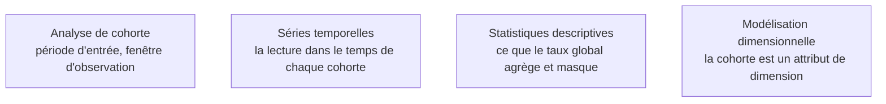

Niveau attendu : **autonomie**. Une cohorte définie une fois dans la couche sémantique et suivie sans intervention est un objet qu'on conçoit, pas un calcul qu'on refait.

Regrouper les utilisateurs par période d'entrée et suivre leur comportement dans le temps. C'est le seul moyen de distinguer une amélioration réelle d'un effet de composition : un taux de rétention global qui monte parce que le recrutement a ralenti n'est pas une amélioration.

## Ce qu'il faut savoir faire

- Traiter la définition de la cohorte comme une définition métier, avec un propriétaire. Quel événement fait entrer — la première commande, l'inscription, la première connexion ? Quelle fenêtre d'observation ? Les réponses changent complètement le résultat.
- Inscrire l'appartenance à la cohorte comme un **attribut de dimension**, calculé une fois à l'entrée. Une cohorte recalculée à chaque consultation coûte cher et bouge sans qu'on sache pourquoi.
- Lire une cohorte par ligne, jamais en agrégé. C'est la juxtaposition des courbes par période d'entrée qui révèle l'effet de composition ; la courbe globale le dissimule par construction.
- Vérifier la taille de chaque cohorte avant d'interpréter sa courbe. Une cohorte de quarante personnes produit des variations spectaculaires qui ne veulent rien dire, et elles sont toujours celles qu'on commente.
- Aligner les cohortes sur la même origine relative — mois 0, mois 1, mois 2 — plutôt que sur le calendrier. C'est la seule présentation qui permette de comparer une cohorte de janvier à une cohorte de septembre.
- Modéliser l'analyse pour qu'elle se recalcule seule. Une cohorte produite une fois dans un carnet est une réponse ; la même cohorte adossée à une définition dans la couche sémantique est un indicateur que le métier suivra tous les mois sans le redemander.

## Les notions mobilisées

- [[notions/analyse-de-cohorte]] — la mécanique du regroupement et de la fenêtre d'observation, et l'effet de composition.
- [[notions/series-temporelles]] — chaque cohorte est une série, avec sa tendance et son bruit propres.
- [[notions/statistiques-descriptives]] — le taux global est une moyenne pondérée, et la pondération est ce qui bouge.
- [[notions/modelisation-dimensionnelle]] — la cohorte se porte dans une dimension, ce qui la rend historisable et testable.

> [!warning] Piège
> Commenter une amélioration du taux global sans regarder la composition. Un ralentissement du recrutement fait mécaniquement monter la rétention moyenne, puisque les cohortes récentes — les moins fidèles — pèsent moins. La conclusion « notre produit retient mieux » est alors exactement l'inverse de ce qui se passe.

## Pour apprendre

- [Population vs. Sample — Scribbr](https://www.scribbr.com/methodology/population-vs-sample/) — le raisonnement sur les populations comparées, préalable à toute cohorte.
- [Engineering Statistics Handbook — NIST](https://www.itl.nist.gov/div898/handbook/) — sur les agrégats, les pondérations et ce qu'ils masquent.
- [Fundamentals of Data Visualization](https://clauswilke.com/dataviz/introduction.html) — la représentation de familles de courbes, qui est l'enjeu de lecture ici.
