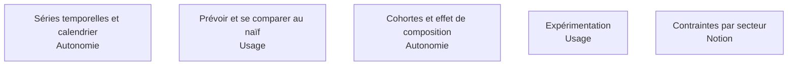

Là où un analyste calcule une analyse, le BI Analyst la **modélise pour qu'elle se recalcule seule**. C'est la différence entre répondre et outiller, et elle passe par la dimension de date, les définitions de cohorte, et des mesures de variation inscrites dans la couche sémantique.

## Les cinq sujets

**Porte de sortie** : une cohorte définie une seule fois et suivie sans intervention, et une variation publiée avec sa plage de bruit habituelle.

## Ma progression

- [ ] [[parcours/bi-analyst/analyses-recurrentes/series-temporelles-et-calendrier|Séries temporelles et calendrier]] — tendance, saisonnalité, jours ouvrés, faux signaux
- [ ] [[parcours/bi-analyst/analyses-recurrentes/prevoir-et-se-comparer-au-naif|Prévoir et se comparer au naïf]] — publier l'erreur contre la référence, toujours
- [ ] [[parcours/bi-analyst/analyses-recurrentes/cohortes-et-effet-de-composition|Cohortes et effet de composition]] — une rétention qui monte parce que le recrutement a ralenti
- [ ] [[parcours/bi-analyst/analyses-recurrentes/experimentation-et-metrique-de-decision|Expérimentation]] — une métrique primaire, définie avant, et pas de relecture quotidienne
- [ ] [[parcours/bi-analyst/analyses-recurrentes/les-contraintes-par-secteur|Contraintes par secteur]] — les patrons se transfèrent, les schémas non
