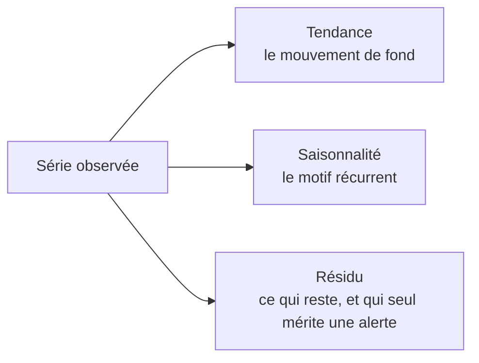

Niveau attendu : **autonomie**. Séparer tendance, saisonnalité et résidu sert ici à outiller la lecture pour les autres ; c'est le Data Analyst qui fait référence sur la lecture elle-même.

Trois composantes à séparer : la tendance de fond, la saisonnalité récurrente, et le résidu. L'essentiel des « alertes » d'un tableau de bord sont de la saisonnalité mal interprétée.

## Ce qu'il faut savoir faire

- Comparer un indicateur d'exploitation à la même période de l'année précédente, pas au mois précédent. Cette règle seule élimine une grande partie des faux signaux d'un tableau de bord.
- Isoler les effets de calendrier avant de conclure : nombre de jours ouvrés, position des jours fériés, décalage des semaines d'une année sur l'autre. Ils expliquent souvent la variation qu'on attribue à une action commerciale.
- Porter ces effets dans la dimension de date plutôt que dans chaque rapport. C'est la raison pour laquelle cette dimension mérite une vraie table, et c'est ce qui rend l'analyse reproductible.
- Publier la plage de variation habituelle à côté de chaque variation. « Les ventes ont baissé de 4 % » ne veut rien dire tant qu'on ne sait pas que la variation hebdomadaire courante est de plus ou moins 6 %.
- Modéliser la mesure de variation dans la couche sémantique plutôt que de la recalculer. Écart à la période comparable, écart au budget, écart à la moyenne mobile : trois définitions, écrites une fois.
- Traiter les « informations automatiques » des plateformes comme un signal à instruire, jamais comme une explication. Elles remontent des corrélations sur les dimensions disponibles, sans aucune notion de causalité ni du fait qu'une dimension est un effet plutôt qu'une cause.

## Les notions mobilisées

- [[notions/series-temporelles]] — tendance, saisonnalité, résidu et effets de calendrier ; ici, leur mise en tableau de bord.
- [[notions/statistiques-descriptives]] — la dispersion, sans laquelle aucune variation n'est interprétable.
- [[notions/analyse-correlation]] — la confusion corrélation/causalité, que les explications automatiques reproduisent à grande échelle.
- [[notions/visualisation-de-donnees]] — une série se lit sur une courbe à axe non tronqué, et les erreurs de lecture viennent souvent de là.

> [!warning] Piège
> Traiter chaque variation comme un événement. Un tableau de bord qui signale toutes les variations perd toute valeur d'alerte en trois mois : les utilisateurs apprennent à ignorer les indicateurs, y compris le jour où l'un d'eux sort réellement du bruit.

## Pour apprendre

- [Engineering Statistics Handbook, séries temporelles — NIST](https://www.itl.nist.gov/div898/handbook/pmc/section4/pmc4.htm) — rigoureux et gratuit sur la décomposition tendance-saisonnalité.
- [Correlation vs. Causation — Scribbr](https://www.scribbr.com/methodology/correlation-vs-causation/) — le rappel à garder sous la main avant d'expliquer une variation.
- [Fundamentals of Data Visualization](https://clauswilke.com/dataviz/introduction.html) — la partie sur les échelles temporelles et leurs pièges de lecture.
