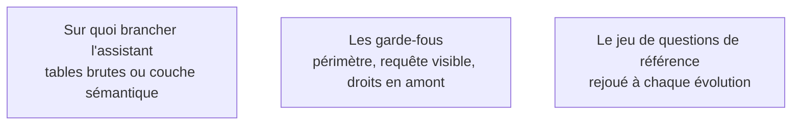

Toutes les grandes plateformes proposent désormais d'interroger les données en langage naturel. Ce que la promesse produit réellement dépend entièrement de ce sur quoi on la branche — et c'est pour cette raison que le sujet appartient à ce parcours.

## Les trois sujets

**Porte de sortie** : un assistant restreint aux tables de présentation, dont la requête est affichée, et trente questions de référence rejouées à chaque évolution du modèle.

## Ma progression

- [ ] [[parcours/bi-analyst/bi-conversationnelle/sur-quoi-brancher-l-assistant|Sur quoi brancher l'assistant]] — requête correcte et réponse métier fausse, ou l'inverse
- [ ] [[parcours/bi-analyst/bi-conversationnelle/les-garde-fous|Les garde-fous]] — restreindre, rendre visible, appliquer les droits en amont
- [ ] [[parcours/bi-analyst/bi-conversationnelle/le-jeu-de-questions-de-reference|Le jeu de questions de référence]] — les tests de la chaîne, appliqués à l'interface
