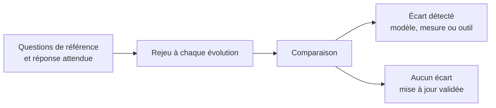

Trente à cinquante questions métier avec leur réponse attendue, rejouées à chaque évolution du modèle ou de l'outil. C'est le réflexe des tests de la chaîne de transformation, appliqué à l'interface conversationnelle — et la seule façon de savoir qu'une mise à jour n'a rien dégradé.

## Ce qu'il faut savoir faire

- Constituer le jeu à partir des questions réellement posées, pas de questions inventées. Le journal des questions de l'assistant et les demandes ad hoc reçues par l'équipe en fournissent bien plus que nécessaire.
- Y faire figurer la réponse attendue **et** la mesure attendue. Une réponse juste obtenue par la mauvaise mesure est un faux positif qui masquera une régression au prochain changement de modèle.
- Couvrir délibérément les cas difficiles : ratios, comptages distincts, périodes comparables, questions ambiguës. Ce sont eux qui distinguent une couche sémantique correcte d'une couche approximative.
- Rejouer le jeu à chaque évolution du modèle, de la couche ou de la version de l'outil — les trois changent indépendamment, et l'assistant ne prévient pas quand l'un d'eux a modifié son comportement.
- Mesurer et publier le taux de réussite dans le temps. C'est le seul indicateur qui permette de répondre à « peut-on faire confiance à cet outil » autrement que par une impression.
- Traiter chaque échec comme un signalement sur le modèle avant de le traiter comme un défaut de l'assistant. Une question à laquelle il répond mal désigne le plus souvent une mesure manquante ou mal documentée.

## Les notions mobilisées

- [[notions/evaluation-llm]] — la constitution d'un jeu d'évaluation et sa relecture ; ici, appliqué à des questions métier.
- [[notions/tests-logiciels]] — le même réflexe de non-régression, avec la même exigence de rejeu automatique.
- [[notions/cout-et-latence-inference]] — rejouer cinquante questions a un coût qu'il faut connaître avant d'en faire un rituel.
- [[notions/integration-continue]] — le rejeu s'attache au déploiement de la couche, pas à la bonne volonté de l'équipe.

> [!tip] La constitution la moins coûteuse
> Reprendre les trente dernières demandes ad hoc reçues par l'équipe, avec la réponse qui avait été donnée. Le jeu est écrit en une demi-journée, il porte de vraies formulations métier, et il documente au passage ce que l'organisation demande réellement.

## Pour apprendre

- [OWASP GenAI Security Project](https://genai.owasp.org/) — les catégories d'évaluation à couvrir au-delà de l'exactitude.
- [NIST AI Risk Management Framework](https://www.nist.gov/itl/ai-risk-management-framework) — le cadre qui situe l'évaluation continue dans la gestion du risque.
- [Documentation GitHub Actions](https://docs.github.com/en/actions) — de quoi rejouer le jeu automatiquement à chaque changement de la couche.
