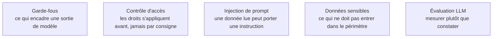

Niveau attendu : **usage**. Rien n'est ici à inventer ni à arbitrer : la liste est connue, elle s'applique, et le manquement se voit tout de suite.

Trois mesures suffisent à rendre un assistant utilisable en production, et aucune n'est optionnelle : restreindre le périmètre, rendre la requête visible, appliquer les droits en amont.

## Ce qu'il faut savoir faire

- Restreindre le périmètre interrogeable aux tables de présentation et aux mesures publiées. Ouvrir tout l'entrepôt à un assistant est la garantie qu'il trouvera la table intermédiaire abandonnée de l'an dernier.
- Afficher le SQL généré, les filtres appliqués et la période retenue à côté de la réponse. Un utilisateur qui voit « du 1er au 31 août, hors avoirs » peut détecter l'erreur de cadrage ; un utilisateur qui voit un nombre seul ne peut rien vérifier.
- Appliquer les droits d'accès **en amont**, dans la couche ou dans l'entrepôt, jamais par instruction dans le prompt. Une restriction confiée à la consigne textuelle d'un assistant n'est pas une restriction.
- Traiter tout contenu lu par l'assistant — description de colonne, commentaire, libellé de donnée — comme une entrée potentiellement hostile. Un texte stocké en base peut porter une instruction, et il sera lu avec la même confiance que la documentation.
- Préférer l'**exploration guidée** à la question ouverte : l'assistant propose des questions qu'il sait traiter, sur un périmètre restreint, avec la requête affichée. Moins spectaculaire en démonstration, nettement plus fiable en production.
- Journaliser les questions posées. Elles constituent le meilleur inventaire disponible de ce que le métier cherche à savoir et que le modèle ne couvre pas — meilleur que n'importe quel recueil de besoins.

## Les notions mobilisées

- [[notions/garde-fous]] — le cadre général des contrôles autour d'un système à base de modèle de langage.
- [[notions/controle-d-acces]] — les droits à la ligne, qui ne peuvent vivre que dans la couche ou l'entrepôt.
- [[notions/injection-de-prompt]] — le contenu lu depuis les données peut porter des instructions ; c'est la forme indirecte.
- [[notions/donnees-sensibles]] — définir ce qui ne doit jamais entrer dans le périmètre interrogeable, avant l'ouverture.
- [[notions/evaluation-llm]] — la mesure de ce que l'assistant produit, sans laquelle aucun des garde-fous n'est vérifié.

> [!warning] Piège
> Laisser un assistant devenir la source des chiffres diffusés hors du service ou repris dans une présentation. Le résultat n'est pas reproductible : la même question reformulée peut produire un périmètre différent, et rien n'en garde la trace. Tout chiffre destiné à être publié, cité ou comparé dans le temps doit venir d'une mesure définie et d'un rapport identifié.

## Pour apprendre

- [OWASP GenAI Security Project](https://genai.owasp.org/) — le catalogue des risques et des parades sur les systèmes à base de modèles de langage.
- [NIST AI Risk Management Framework](https://www.nist.gov/itl/ai-risk-management-framework) — le cadre de gestion du risque, utile pour cadrer une ouverture d'accès.
- [Texte du RGPD](https://gdpr-info.eu/) — ce que l'ouverture d'un assistant sur des données personnelles implique.
