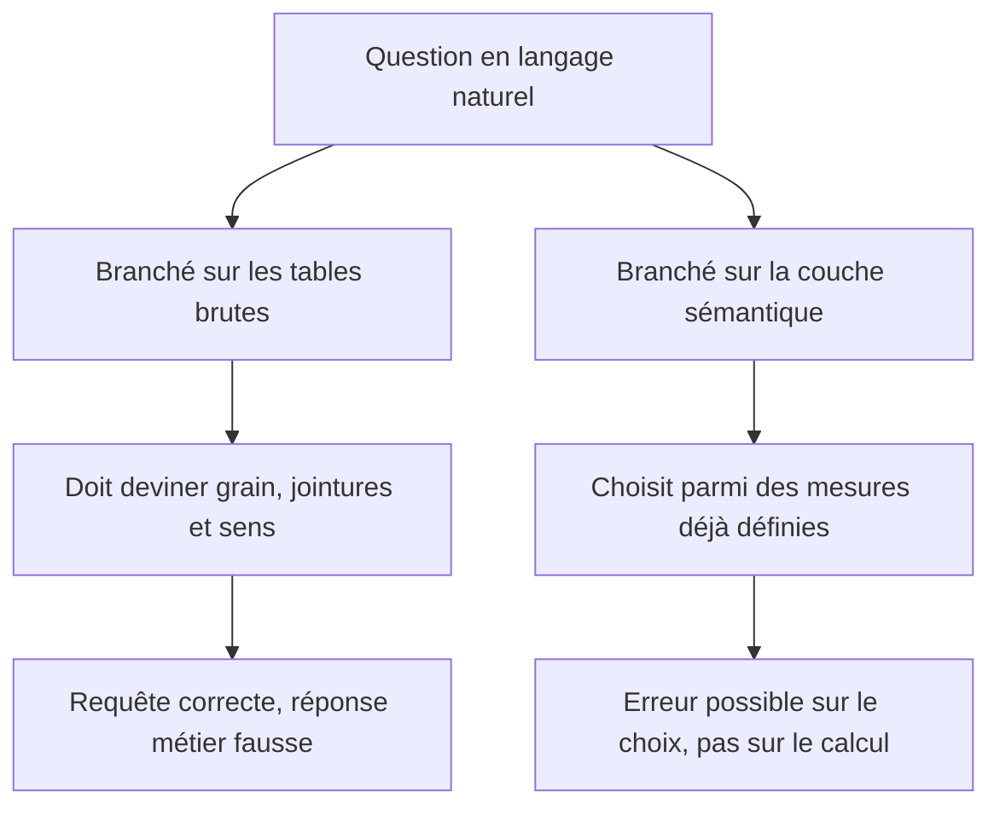

Un assistant branché sur des tables brutes doit reconstruire, à chaque question, tout le travail de modélisation et de définition : trouver les bonnes tables, deviner le grain, choisir les jointures, décider si une colonne est une mesure ou un attribut, et savoir qu'un taux ne s'additionne pas.

## Ce qu'il faut savoir faire

- Reconnaître la nature de l'erreur produite par chaque branchement. Sur les tables brutes, l'assistant produit une requête syntaxiquement valide, un résultat plausible et une erreur métier indétectable par celui qui a posé la question. Sur une couche sémantique, il peut encore se tromper de mesure ; il ne peut plus se tromper de calcul.
- Savoir que le facteur limitant est le **schéma**, pas le modèle de langage. Les résultats obtenus sur les jeux d'évaluation publics de génération de SQL ne se transposent pas aux schémas d'entreprise réels : centaines de tables, noms hérités et opaques, règles d'exclusion non écrites, plusieurs tables candidates pour la même notion.
- Traiter la documentation des colonnes comme du code fonctionnel — descriptions, valeurs admises, exemples de requêtes, mention explicite de ce qu'il ne faut pas utiliser. Ce qui n'était qu'une bonne pratique conditionne maintenant directement la qualité des réponses.
- Se servir de cette réalité comme argument de financement. La couche sémantique est devenue la condition pour que l'outil que la direction a déjà acheté fonctionne : c'est la première fois que ce travail est visible d'une direction.
- Anticiper le déplacement du besoin plutôt que sa disparition : moins de rapports à produire à la demande, plus de définitions à tenir, à documenter et à arbitrer. C'est un déplacement vers le cœur du métier, pas une réduction.
- Évaluer un outil sur son comportement face à une question ambiguë, pas face à une question simple. La bonne réponse est de demander une précision ou de nommer la mesure retenue, pas de choisir en silence.

## Les notions mobilisées

- [[notions/agents-llm]] — ce qu'un assistant fait réellement entre la question et la requête, et où il peut dévier.
- [[notions/ingenierie-de-prompt]] — la description des colonnes et des mesures est devenue du contexte fourni au modèle.
- [[notions/rag]] — la récupération de schéma et de documentation, mécanique sous-jacente de la plupart de ces assistants.
- [[notions/sql]] — la requête générée doit rester lisible et vérifiable par un humain, sinon rien n'est contrôlable.
- [[notions/choix-de-modele]] — le modèle compte moins que le schéma, ce qui change l'ordre des arbitrages.

> [!tip] Ce que ce constat a changé
> Pendant vingt ans, la couche sémantique a été un investissement difficile à justifier devant une direction. La même semaine d'effort qui sécurise les tableaux de bord conditionne désormais l'usage des assistants : c'est le meilleur argument disponible, et il faut s'en servir.

## Pour apprendre

- [What is dbt](https://www.getdbt.com/product/what-is-dbt) — les définitions versionnées, socle sur lequel un assistant peut s'appuyer.
- [Documentation dbt](https://docs.getdbt.com/docs/build/documentation) — la description des colonnes, devenue une entrée fonctionnelle du système.
- [OWASP GenAI Security Project](https://genai.owasp.org/) — les risques propres aux systèmes à base de modèles de langage, avant d'en ouvrir un sur ses données.
