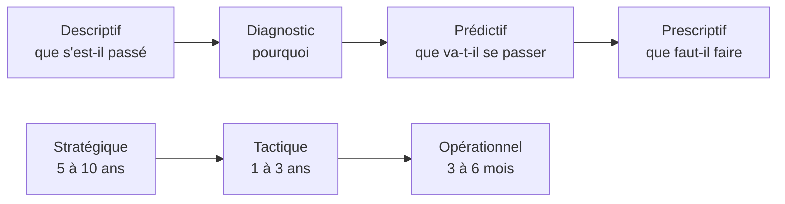

Quatre registres — descriptif, diagnostic, prédictif, prescriptif — qui ne sont pas une échelle de maturité mais quatre questions différentes ; et trois horizons — stratégique, tactique, opérationnel — qui calibrent la fraîcheur et la granularité.

## Ce qu'il faut savoir faire

- Reconnaître que le descriptif est 70 % du travail réel, et la seule partie où l'exactitude n'est pas négociable. Un chiffre juste, comparable et disponible à temps vaut plus que du prescriptif bâclé.
- Maîtriser la technique centrale du diagnostic : l'analyse de contribution, qui décompose une variation de marge en effet volume, effet prix et effet mix. Un modèle dimensionnel bien fait rend ce forage trivial ; un modèle plat le rend impossible.
- Traduire chaque horizon en trois décisions techniques explicites — fréquence de rafraîchissement, profondeur d'historique conservée, grain de la table de faits. Ce sont elles qui déterminent le coût, et elles s'écrivent par tableau de bord.
- Demander la latence de la **décision**, pas celle de la donnée, avant d'accepter une exigence de temps réel. Si la personne agit une fois par jour, un rafraîchissement horaire est déjà du luxe ; l'écart de coût entre les deux architectures est d'un ordre de grandeur.
- Savoir que sous l'heure, l'entrepôt classique n'est plus le bon outil : le besoin relève d'un flux ou d'une base transactionnelle en lecture. Vérifier que le besoin est réel avant de reconstruire l'architecture.
- Situer le prescriptif honnêtement : dans la plupart des entreprises, c'est une règle métier écrite par un humain, pas un optimiseur. Le dire évite de vendre un projet qui n'existe pas.

## Les notions mobilisées

- [[notions/apprentissage-supervise]] — la mécanique du registre prédictif, dont la BI n'utilise qu'une part étroite et bien identifiée.
- [[notions/series-temporelles]] — la prévision qui sert vraiment depuis ce poste porte sur l'activité, pas sur une classification.
- [[notions/apprentissage-non-supervise]] — la segmentation par regroupement, seul usage courant du non supervisé en BI.
- [[notions/apprentissage-par-renforcement]] — cité par l'amont, sans usage courant en BI ; le savoir évite d'y consacrer du temps.
- [[notions/roi-des-projets-ia]] — l'horizon choisi détermine le coût, donc le rendement réel du tableau de bord.

> [!warning] Piège
> Vendre du prédictif sur un socle descriptif défaillant. Une direction qui n'arrive pas à s'accorder sur son chiffre d'affaires du mois dernier ne tirera rien d'une prévision à six mois — et la prévision sera fausse de toute façon, puisqu'elle aura été entraînée sur l'historique incohérent. L'ordre n'est pas négociable : définitions, puis modèle, puis prévision.

## Pour apprendre

- [Engineering Statistics Handbook — NIST](https://www.itl.nist.gov/div898/handbook/) — rigoureux et gratuit ; la partie descriptive est celle qui sert tous les jours en BI.
- [Correlation vs. Causation — Scribbr](https://www.scribbr.com/methodology/correlation-vs-causation/) — à garder sous la main pour le registre diagnostic et ses raccourcis.
- [Machine Learning Crash Course — Google](https://developers.google.com/machine-learning/crash-course/classification) — pour situer ce que le registre prédictif exige réellement, avant de le promettre.
