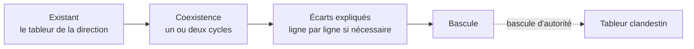

Remplacer un tableur de direction par un tableau de bord, c'est retirer à quelqu'un le contrôle de son chiffre. La résistance est rationnelle et il faut la traiter comme telle.

## Ce qu'il faut savoir faire

- Faire coexister l'ancien et le nouveau pendant un ou deux cycles de pilotage, montrer que les écarts sont expliqués, et ne basculer qu'après. Basculer d'autorité produit un tableur clandestin, pas une adoption.
- Expliquer chaque écart plutôt que d'affirmer que le nouveau chiffre est le bon. Un écart expliqué crée la confiance ; un écart écarté la détruit, même quand le nouveau calcul est juste.
- Travailler en mode incrémental : un domaine, un modèle, deux ou trois tableaux de bord livrés et utilisés, puis le domaine suivant. Le projet d'entrepôt d'entreprise en dix-huit mois avant la première restitution est le format le plus fiable pour perdre son sponsor en route.
- Identifier la personne qui maintient le tableur existant et en faire un allié plutôt qu'un obstacle. Elle connaît les règles non écrites, elle est la mieux placée pour valider le nouveau modèle, et elle est la seule dont l'opposition serait fatale.
- Livrer d'abord ce qui existe déjà, à l'identique, avant de proposer mieux. Reconstruire les cinq rapports que la direction regarde déjà est la façon la plus rapide d'établir la confiance — et le moment où l'on découvre les définitions contradictoires qu'il faudra arbitrer.
- Accepter que l'export vers le tableur continue. Ce qui doit disparaître, c'est le classeur qui fait autorité, pas l'usage du tableur comme outil de travail.

## Les notions mobilisées

- [[notions/conduite-du-changement]] — la mécanique de l'adoption, appliquée ici au retrait d'un outil de pilotage personnel.
- [[notions/gestion-parties-prenantes]] — identifier qui perd quelque chose au changement, avant de l'annoncer.
- [[notions/tableur]] — l'objet qu'on remplace, et qu'il faut comprendre avant de prétendre faire mieux.
- [[notions/transfert-de-competences]] — un tableau de bord adopté suppose que quelqu'un sache l'expliquer sans son auteur.

> [!warning] Piège
> Traiter la résistance comme de l'irrationalité ou de la mauvaise volonté. Celui qui maintient le tableur y a mis des règles que personne n'a documentées, et il sait que le nouveau modèle ne les porte pas toutes. Sa résistance est une information sur ce qui manque, et la traiter comme telle raccourcit le projet.

## Pour apprendre

- [Stakeholder Management Guide](https://simplystakeholders.com/resources/guides/stakeholder-management/) — la préparation du changement par la cartographie des intérêts.
- [Project Management Triangle — Asana](https://asana.com/resources/project-management-triangle) — les arbitrages de projet à poser quand le mode incrémental est contesté.
- [Roadmap Technical Writer](https://roadmap.sh/technical-writer) — écrire la note qui accompagne une bascule, et qui sera relue.
