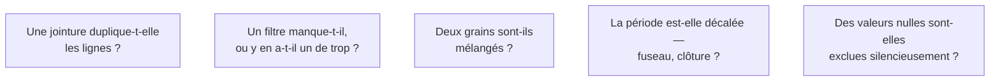

Niveau attendu : **référence**. « Par quel bug pourrais-je obtenir ce résultat » est le réflexe que l'organisation vient chercher chez lui, et qu'elle n'a nulle part ailleurs.

La question à se poser devant tout chiffre surprenant est « par quel bug pourrais-je obtenir ce résultat ». Neuf fois sur dix, la découverte spectaculaire est une jointure qui duplique ou un filtre manquant.

## Ce qu'il faut savoir faire

- Vérifier avant de diffuser, systématiquement. La vérification est peu coûteuse ; la rétractation ne l'est pas, et elle se paie sur tous les chiffres suivants.
- Passer la liste des cinq causes ordinaires avant d'envisager une explication métier : jointure dupliquante, filtre manquant, grains mélangés, décalage de période ou de fuseau, nuls exclus silencieusement par une agrégation.
- Recouper avec un ordre de grandeur connu. Si le chiffre implique que l'entreprise a vendu plus d'unités qu'elle n'en a produites, la question n'est plus de savoir si c'est un bug mais lequel.
- Reproduire le calcul par un chemin différent avant d'annoncer un résultat important. Deux méthodes qui convergent valent mieux qu'une méthode élégante.
- Se méfier particulièrement des résultats qui arrangent. Un chiffre qui confirme l'hypothèse de celui qui a commandé l'analyse reçoit moins de vérification, et c'est exactement l'inverse de ce qu'il faudrait.
- Distinguer « je ne sais pas expliquer cette variation » de « cette variation est fausse ». Les deux se disent, et la première est une réponse acceptable si elle s'accompagne de ce qui a déjà été écarté.

## Les notions mobilisées

- [[notions/qualite-des-donnees]] — les causes ordinaires d'un chiffre faux sont exactement les dimensions de qualité non testées.
- [[notions/analyse-correlation]] — une relation surprenante est plus souvent un artefact de périmètre qu'un effet réel.
- [[notions/tests-hypotheses]] — savoir dire si un écart sort du bruit, plutôt que de le commenter.
- [[notions/sql]] — la jointure dupliquante se lit dans le plan et se prouve par un comptage, pas par l'intuition.

> [!tip] Le contrôle à dix secondes
> Compter les lignes avant et après chaque jointure. Si le nombre augmente là où il ne devrait pas, la cause du chiffre surprenant est trouvée, et il n'y a pas d'explication métier à chercher. C'est le contrôle le plus rentable de tout le métier.

## Pour apprendre

- [Correlation vs. Causation — Scribbr](https://www.scribbr.com/methodology/correlation-vs-causation/) — le rappel à faire avant d'attribuer une cause à un écart.
- [Type I and Type II Errors — Scribbr](https://www.scribbr.com/statistics/type-i-and-type-ii-errors/) — ce qu'on risque en concluant trop vite dans un sens ou dans l'autre.
- [What Is Data Quality? — IBM](https://www.ibm.com/think/topics/data-quality) — les dimensions dont l'absence produit la plupart des chiffres faux.
