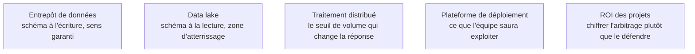

Niveau attendu : **autonomie**. Justifier sur un cas chiffré qui porte le coût du schéma est exactement un compromis qu'on arbitre et qu'on défend, sans être celui qui exploite la plateforme.

Vu de ce poste, l'arbitrage se joue sur une seule question : **qui porte le coût du schéma**. L'entrepôt l'impose à l'écriture — l'ingestion coûte plus cher à construire, mais tout consommateur en aval lit une table dont la structure et le sens sont garantis. Le lac l'impose à la lecture — l'ingestion est quasi gratuite, et chaque analyste réinterprète les fichiers à sa manière, ce qui reproduit exactement le problème que la BI est censée résoudre.

## Ce qu'il faut savoir faire

- Trancher en faveur de l'entrepôt pour tout usage décisionnel partagé. Le lac garde sa place en amont, comme zone d'atterrissage brute et archive rejouable — pas comme surface d'interrogation du métier.
- Reconnaître les volumes moyens. En dessous de quelques centaines de millions de lignes, un moteur embarqué comme DuckDB sur des fichiers Parquet fait le travail d'un entrepôt cloud pour un coût d'infrastructure proche de zéro. Beaucoup de projets d'entreprise moyenne n'ont jamais eu besoin d'autre chose.
- Construire le data mart **depuis** les tables communes, jamais à côté d'elles. Un data mart alimenté par sa propre ingestion n'est pas un data mart, c'est un silo de plus.
- Peser l'enfermement des plateformes intégrées. Réunir stockage, transformation et restitution supprime une copie et un décalage de fraîcheur ; la contrepartie est qu'on ne migre plus une brique sans migrer l'ensemble.
- Choisir en fonction de ce que l'équipe saura exploiter après le départ du projet, pas en fonction de la meilleure option sur le papier. Une brique de plus est une brique de plus à sauvegarder et à superviser.
- Réduire les notions IaaS, PaaS, SaaS à la seule question qui compte ici : qui administre quoi, et qui est appelé à trois heures du matin.

## Les notions mobilisées

- [[notions/entrepot-de-donnees]] — les définitions de l'entrepôt, du data mart et des schémas ; ici seul l'arbitrage est traité.
- [[notions/data-lake]] — le stockage brut et le lakehouse, dont l'usage BI se limite à l'amont de la chaîne.
- [[notions/traitement-distribue]] — le seuil à partir duquel la question devient une question de moteur, et pas avant.
- [[notions/plateforme-de-deploiement]] — ce que l'équipe d'exploitation devra tenir une fois le projet terminé.
- [[notions/roi-des-projets-ia]] — l'arbitrage se défend avec deux chiffres, pas avec une préférence technique.

> [!tip] Le test qui départage
> Écrire le volume réel de la plus grosse table de faits envisagée, et le nombre de personnes qui interrogeront simultanément. Deux nombres suffisent à éliminer la moitié des options, et ils évitent la conversation de principe sur les mérites comparés des plateformes.

## Pour apprendre

- [What is a Data Warehouse? — Google Cloud](https://cloud.google.com/learn/what-is-a-data-warehouse) — le concept présenté sans argumentaire commercial.
- [Snowflake in 20 minutes](https://docs.snowflake.com/en/user-guide/tutorials/snowflake-in-20minutes) — un entrepôt cloud éprouvé de bout en bout, séparation stockage/calcul comprise.
- [Introduction à BigQuery](https://docs.cloud.google.com/bigquery/docs/introduction) — l'autre modèle de facturation, à la donnée scannée, et ce qu'il implique.
- [Documentation DuckDB](https://duckdb.org/docs/) — l'option embarquée, à essayer avant de conclure qu'il faut un entrepôt.
