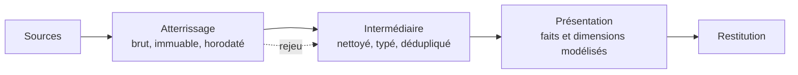

Trois zones, trois responsabilités, et une règle qui les tient : on ne rejoue jamais l'ingestion depuis la source, on rejoue depuis l'atterrissage. C'est ce qui rend une correction de logique possible sans redemander les données.

## Ce qu'il faut savoir faire

- Garder l'atterrissage strictement immuable : on y écrit, on n'y corrige jamais. Une correction appliquée au brut détruit la seule référence qui permette de reconstituer un chiffre contesté.
- Limiter la zone intermédiaire à ce qui est réutilisable — typage, normalisation des libellés, déduplication, règles métier partagées. Ce qui ne sert qu'à un rapport n'a rien à y faire.
- N'exposer au métier et aux outils de restitution que la couche de présentation. Une table intermédiaire accessible finit toujours par alimenter un rapport, et ce rapport se met à diverger silencieusement.
- Conserver l'atterrissage assez longtemps pour couvrir la durée pendant laquelle un chiffre peut être contesté — en pratique, au moins un exercice comptable complet.
- Nommer les zones dans le schéma physique plutôt que par convention orale. Un préfixe de schéma rend la règle visible dans chaque requête et dans chaque graphe de dépendances.
- Faire porter les droits d'accès par la zone : lecture large sur la présentation, restreinte sur l'intermédiaire, réservée à l'ingestion sur l'atterrissage.

## Les notions mobilisées

- [[notions/entrepot-de-donnees]] — les zones sont une organisation logique de l'entrepôt, pas des produits différents.
- [[notions/data-lake]] — l'atterrissage se matérialise souvent en stockage objet, ce qui en fait le point de contact des deux mondes.
- [[notions/lignage-des-donnees]] — les trois zones donnent au lignage sa lisibilité : on voit où une règle est appliquée.
- [[notions/controle-d-acces]] — la zone est la maille naturelle des droits, et la seule qui reste juste quand le modèle grossit.

> [!warning] Piège
> Laisser un rapport se brancher sur la zone intermédiaire « en attendant ». Le provisoire devient définitif, la table intermédiaire acquiert des consommateurs qu'on ignore, et il devient impossible de la modifier sans casser quelque chose. Si un besoin n'est pas servi par la présentation, la réponse est un modèle de présentation de plus, pas un raccourci.

## Pour apprendre

- [Documentation dbt](https://docs.getdbt.com/docs/build/documentation) — la traduction des trois zones en couches de modèles versionnés.
- [What is a Data Warehouse? — Google Cloud](https://cloud.google.com/learn/what-is-a-data-warehouse) — le cadre dans lequel les zones prennent place.
- [Delta Lake — Databricks](https://docs.databricks.com/aws/en/delta) — ce que devient une zone d'atterrissage quand elle devient transactionnelle.
