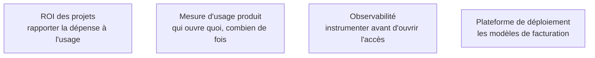

Niveau attendu : **autonomie**. Instrumenter le coût avant d'ouvrir l'accès est une décision qu'on prend seul et qu'on défend alors que personne ne l'a demandée.

Avec un entrepôt facturé à la donnée scannée, un tableau de bord auto-rafraîchi toutes les cinq minutes sur une table non partitionnée peut coûter plus cher que toute l'équipe qui le consulte. Le coût est la seule dimension de l'architecture qui devienne visible d'une direction — donc le seul levier pour retirer ce qui ne sert plus.

## Ce qu'il faut savoir faire

- Instrumenter la dépense **par tableau de bord et par utilisateur avant** d'ouvrir l'accès, pas après la première facture surprenante. Rétrofitter cette mesure sur un parc existant est possible mais coûte un trimestre.
- Poser des quotas par moteur et par usage dès la mise en service. Un quota atteint produit une alerte ; son absence produit une facture qu'il faut expliquer en comité.
- Savoir pour chaque rapport ce qu'il coûte par mois. C'est le seul argument qui permet ensuite de supprimer les rapports morts, parce qu'il transforme « j'en ai peut-être besoin » en arbitrage chiffré.
- Rapprocher le coût de la fréquence réellement exigée. Diviser par quatre le rafraîchissement d'un tableau de bord consulté une fois par jour divise la facture d'autant, sans qu'aucun utilisateur ne s'en aperçoive.
- Traiter le partitionnement par date comme une mesure d'économie et non de performance. Sur une facturation à la donnée scannée, c'est souvent le changement d'une ligne qui divise le coût par dix.
- Distinguer le coût de calcul du coût de stockage. Le second est presque toujours négligeable, ce qui est un argument pour conserver l'atterrissage brut plutôt que de le purger.

## Les notions mobilisées

- [[notions/roi-des-projets-ia]] — la dépense rapportée à la décision qu'elle permet, seule façon de défendre ou d'arrêter un rapport.
- [[notions/mesure-d-usage-produit]] — l'instrumentation de la consultation, qui manque dans presque toutes les organisations.
- [[notions/observabilite]] — le même réflexe que côté logiciel, appliqué à une dépense au lieu d'une latence.
- [[notions/plateforme-de-deploiement]] — le modèle de facturation retenu dicte l'écriture des requêtes autant que l'architecture.

> [!warning] Piège
> Découvrir le coût au moment du renouvellement du contrat. À ce stade, la dépense est répartie sur des centaines de rapports dont personne ne connaît l'usage, et la seule décision possible est un plafond global qui dégrade tout le monde en même temps. La mesure par objet, mise en place au premier jour, coûte une journée de travail.

## Pour apprendre

- [Introduction à BigQuery](https://docs.cloud.google.com/bigquery/docs/introduction) — la facturation à la donnée scannée expliquée par le fournisseur qui l'a imposée.
- [Snowflake in 20 minutes](https://docs.snowflake.com/en/user-guide/tutorials/snowflake-in-20minutes) — l'autre modèle, au temps de calcul et par entrepôt virtuel.
- [Documentation Grafana](https://grafana.com/docs/) — de quoi construire le tableau de bord de la dépense elle-même, hors de l'outil décisionnel.
