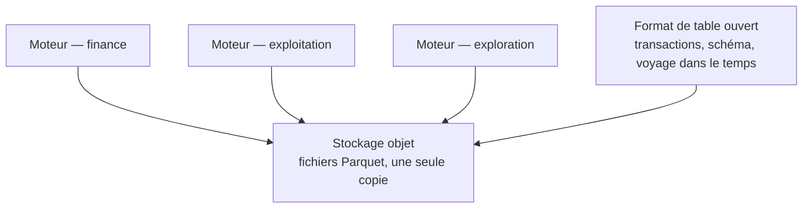

La rupture réelle des entrepôts cloud n'est pas l'élasticité, c'est la **séparation du stockage et du calcul**. Elle permet de donner un moteur dédié à l'équipe finance sans qu'une de ses requêtes ralentisse le tableau de bord d'exploitation, et de dimensionner le calcul par usage.

## Ce qu'il faut savoir faire

- Dimensionner le calcul par usage plutôt que globalement, et isoler les charges qui ne doivent pas se gêner. C'est l'intérêt concret de la séparation, bien avant l'élasticité annoncée.
- Situer ce que les formats de table ouverts — Apache Iceberg, Delta Lake — ajoutent aux fichiers Parquet : transactions, évolution de schéma, voyage dans le temps. Le lac cesse d'être un dépôt de fichiers pour devenir interrogeable de façon fiable.
- En tirer la conséquence qui compte pour la BI : la donnée reste dans le stockage objet et plusieurs moteurs l'interrogent sans copie, ce qui réduit les duplications à réconcilier — la première cause de chiffres divergents.
- Savoir que le débat entrepôt contre lac s'est largement déplacé vers « quel moteur interroge le même stockage », ce qui rend le choix de plateforme moins définitif qu'il ne l'était et permet de le reporter.
- Utiliser le voyage dans le temps pour ce qu'il sert vraiment : reproduire un chiffre publié il y a trois mois, et diagnostiquer une divergence sans restaurer une sauvegarde.
- Vérifier, avant de compter sur l'interopérabilité annoncée, quels moteurs écrivent réellement le format et lesquels se contentent de le lire. L'écart entre les deux est la source de mauvaise surprise la plus fréquente.

## Les notions mobilisées

- [[notions/data-lake]] — le lakehouse, c'est-à-dire le lac auquel on a ajouté les garanties qui lui manquaient.
- [[notions/entrepot-de-donnees]] — ce que l'entrepôt conserve en propre une fois le stockage mutualisé.
- [[notions/traitement-distribue]] — les formats colonnes et les moteurs, et le seuil où la distribution devient utile.
- [[notions/plateforme-de-deploiement]] — plusieurs moteurs sur un même stockage, c'est plusieurs choses à exploiter.

> [!tip] Ce que ça change pour un BI Analyst
> La possibilité de prototyper un modèle en local sur les mêmes fichiers que la production. Un moteur embarqué lit le même Parquet que l'entrepôt : le modèle se met au point sans consommer de crédits, puis se porte tel quel. C'est la boucle de développement la plus rapide disponible aujourd'hui.

## Pour apprendre

- [Delta Lake — Databricks](https://docs.databricks.com/aws/en/delta) — transactions, évolution de schéma et voyage dans le temps, documentés par l'implémentation de référence.
- [Apache Parquet](https://parquet.apache.org/) — la couche en dessous, qu'il faut comprendre avant les formats de table.
- [Documentation Spark](https://spark.apache.org/documentation.html) — le moteur distribué historique, utile pour situer ce que les autres ont simplifié.
- [Introduction à BigQuery](https://docs.cloud.google.com/bigquery/docs/introduction) — la séparation stockage/calcul poussée jusqu'à son modèle de facturation.
