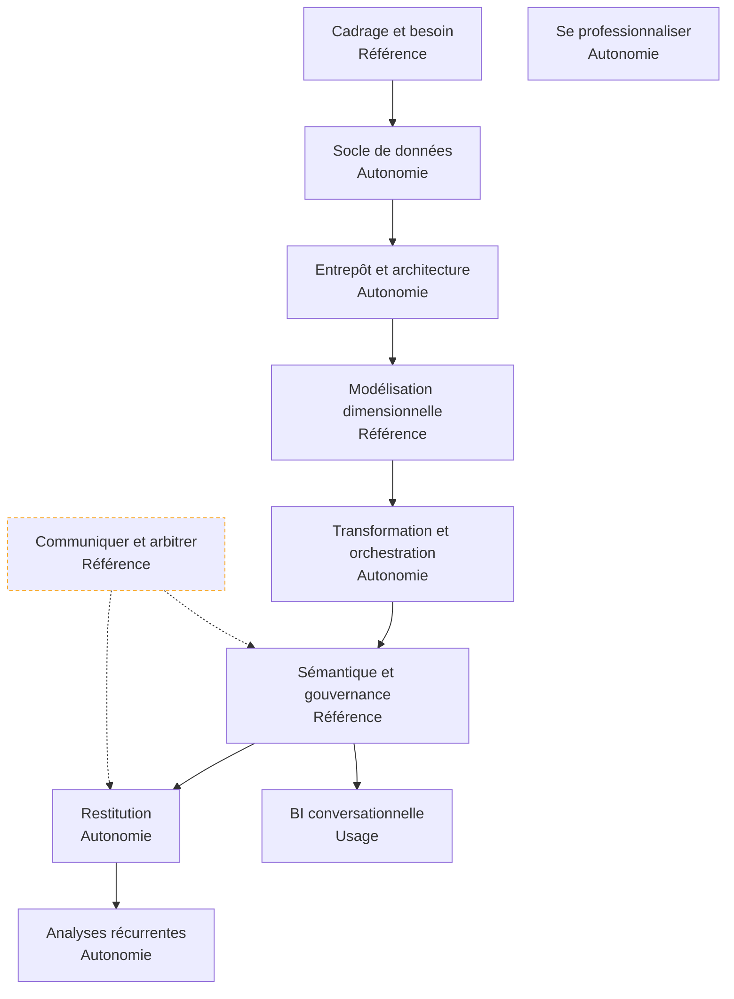

Celui qui construit l'infrastructure décisionnelle dont les autres se serviront — l'entrepôt, le modèle, les définitions partagées — pour que le chiffre affiché en comité de direction soit le même dans tous les services, et qu'on sache dire d'où il vient.

## La roadmap

Chaque case mène à sa page et porte le niveau attendu chez un profil confirmé — de **notion** (reconnaître le sujet, savoir qui appeler) à **usage** (s'en servir sur un chemin balisé), **autonomie** (concevoir, déboguer, arbitrer et défendre l'arbitrage) et **référence** (faire autorité dans la salle). Cochez les étapes acquises en bas de page pour suivre votre progression.

## Ma progression

- [ ] [[parcours/bi-analyst/cadrage-et-besoin/index|Cadrage et besoin]] — transformer une demande en définition de mesure, avant toute donnée
- [ ] [[parcours/bi-analyst/socle-de-donnees/index|Socle de données]] — les sources, leurs modes de défaillance, le SQL de production
- [ ] [[parcours/bi-analyst/entrepot-et-architecture/index|Entrepôt et architecture]] — entrepôt, lac, moteur embarqué, zones et coût
- [ ] [[parcours/bi-analyst/modelisation-dimensionnelle/index|Modélisation dimensionnelle]] — grain, additivité, dimensions conformes, historisation
- [ ] [[parcours/bi-analyst/transformation-et-orchestration/index|Transformation et orchestration]] — ELT, couches de modèles, idempotence, tests bloquants
- [ ] [[parcours/bi-analyst/semantique-et-gouvernance/index|Sémantique et gouvernance]] — la mesure définie une fois, la qualité instrumentée, le lignage
- [ ] [[parcours/bi-analyst/restitution/index|Restitution]] — plateformes, conception, droits d'accès, usage mesuré
- [ ] [[parcours/bi-analyst/bi-conversationnelle/index|BI conversationnelle]] — brancher un assistant sans lui faire dire n'importe quoi
- [ ] [[parcours/bi-analyst/analyses-recurrentes/index|Analyses récurrentes]] — séries, cohortes, expérimentation, contraintes de secteur
- [ ] [[parcours/bi-analyst/communiquer-et-arbitrer/index|Communiquer et arbitrer]] — la réunion où deux services n'ont pas le même chiffre
- [ ] [[parcours/bi-analyst/se-professionnaliser|Se professionnaliser]] — un portfolio qui montre un socle, pas un graphique
