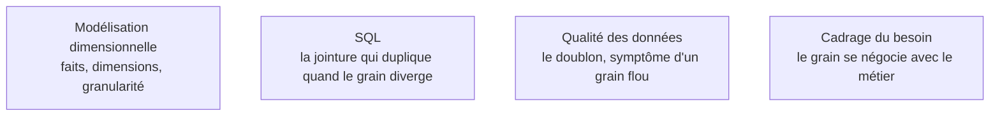

Niveau attendu : **référence**. La phrase qui dit ce que représente une ligne de faits engage dix ans de modèle : c'est le sujet sur lequel ce poste ne délègue à personne.

Écrire en une phrase ce que représente **une ligne** de la table de faits : « une ligne de commande d'un produit par un client à une date ». Tout le reste du modèle en découle, et changer le grain plus tard signifie réécrire le modèle et tous les rapports qui en dépendent.

## Ce qu'il faut savoir faire

- Choisir toujours le grain le plus fin disponible. Agréger ensuite est facile, désagréger est impossible, et le gain de stockage d'un grain grossier ne compense jamais les questions qu'il rend définitivement inaccessibles.
- Écrire la phrase du grain dans la documentation du modèle, au même endroit que le code, avant d'écrire la première requête. Un grain implicite produit des doubles comptages qu'on découvre en réunion, pas en revue.
- Reconnaître le symptôme du grain mélangé : des totaux qui doublent quand on ajoute un second sujet. Le diagnostic est toujours le même — deux grains différents dans une seule table.
- Créer une **nouvelle table de faits** plutôt que de modifier le grain d'une table existante. Un nouveau besoin qui exige un autre grain justifie une table de plus ; la migration d'un grain coûte davantage que la reconstruction.
- Distinguer les trois types de faits et choisir en fonction de la question : transactionnel (un événement), instantané périodique (un état à une date), instantané cumulé (un processus avec ses étapes). Le mauvais type rend certaines questions impossibles.
- Accepter les faits sans mesure et les clés dégénérées. Un fait peut n'être qu'un événement — une visite, une connexion — et la mesure est alors le comptage ; un numéro de commande porté dans la table de faits sans dimension associée est normal.

## Les notions mobilisées

- [[notions/modelisation-dimensionnelle]] — les définitions du grain, des faits et des dimensions ; ici on traite la décision et ses suites.
- [[notions/sql]] — c'est la jointure entre deux grains qui duplique les lignes, et il faut savoir la lire dans un plan.
- [[notions/qualite-des-donnees]] — un test d'unicité sur la clé de grain est le premier test à écrire, et celui qui attrape le plus.
- [[notions/cadrage-besoin]] — le grain est une décision métier déguisée en décision technique ; elle se pose au cadrage.

> [!warning] Piège
> La grande table plate unique. Elle marche merveilleusement pour le premier tableau de bord, puis on y ajoute un second sujet, et les mesures du premier se retrouvent dupliquées par les lignes du second : les totaux doublent. Quand on le découvre, six rapports publient déjà des chiffres faux et personne ne sait depuis quand.

## Pour apprendre

- [Fact Table vs Dimension Table](https://www.simplilearn.com/fact-table-vs-dimension-table-article) — la mise au point courte et correcte, suffisante pour démarrer.
- [Normalization vs Denormalization](https://codilime.com/blog/normalization-vs-denormalization-in-databases/) — pourquoi le bon réflexe transactionnel est le mauvais réflexe décisionnel.
- [Documentation dbt](https://docs.getdbt.com/docs/build/documentation) — comment déclarer un grain et le faire tenir par un test plutôt que par une convention.
