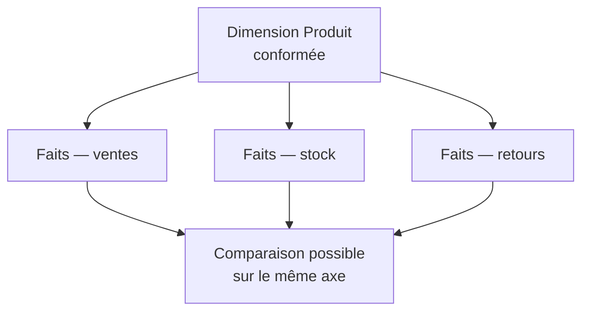

Une dimension « Produit » partagée à l'identique par les faits ventes, stock et retours permet de comparer les trois sur la même maille. Sans conformité, chaque domaine a son référentiel et aucune comparaison transverse n'est possible : c'est le symptôme le plus fiable d'un entrepôt construit rapport par rapport.

## Ce qu'il faut savoir faire

- Identifier les trois ou quatre dimensions qui doivent être conformes dès le premier domaine modélisé — date, produit, client, entité organisationnelle — et les construire une fois pour toutes, avant d'en avoir besoin ailleurs.
- Reconnaître qu'une dimension conforme est d'abord un accord entre équipes, pas une table. La difficulté n'est presque jamais technique : c'est que deux directions ne découpent pas la clientèle de la même façon.
- Accepter qu'une dimension conforme puisse être un sous-ensemble. Un domaine peut n'utiliser que dix des quarante attributs, à condition qu'il utilise les mêmes clés et les mêmes valeurs — c'est la conformité qui compte, pas l'exhaustivité.
- Préférer l'étoile au flocon par défaut. Le flocon se justifie sur une hiérarchie profonde et réellement partagée, ou sur une dimension très volumineuse ; la plupart des flocons rencontrés ne sont pas un choix mais des tables transactionnelles remontées telles quelles.
- Assumer la dénormalisation comme un choix de **lisibilité** autant que de performance. Un utilisateur qui voit une dimension « Client » avec quarante attributs plats sait s'en servir ; il abandonnera devant six tables normalisées à joindre lui-même.
- Traiter l'apparition d'un second référentiel produit comme un incident de gouvernance, pas comme un détail de modélisation. C'est le moment où la conformité se perd, et elle ne se rattrape qu'au prix d'une reprise complète.

## Les notions mobilisées

- [[notions/modelisation-dimensionnelle]] — la définition des dimensions conformes et des schémas en étoile et en flocon.
- [[notions/entrepot-de-donnees]] — le data mart n'est légitime que s'il consomme les dimensions conformes, jamais s'il les recrée.
- [[notions/gestion-parties-prenantes]] — conformer une dimension, c'est faire renoncer une direction à son référentiel ; cela se négocie.
- [[notions/qualite-des-donnees]] — un test d'intégrité référentielle entre faits et dimension est ce qui maintient la conformité dans le temps.

> [!tip] Le signe qui ne trompe pas
> Demander combien de tables « client » existent dans l'entrepôt. Au-delà d'une, chaque comparaison entre domaines repose sur une réconciliation manuelle que quelqu'un refait tous les mois — et cette personne est généralement la mieux placée pour décrire ce qu'il faudrait conformer.

## Pour apprendre

- [Star Schema vs Snowflake Schema](https://www.thoughtspot.com/data-trends/data-modeling/star-schema-vs-snowflake-schema) — l'arbitrage entre les deux, avec ses conséquences sur les jointures.
- [Fact Table vs Dimension Table](https://www.simplilearn.com/fact-table-vs-dimension-table-article) — les rôles respectifs, avant d'aborder le partage entre domaines.
- [Normalization vs Denormalization](https://codilime.com/blog/normalization-vs-denormalization-in-databases/) — pourquoi la dénormalisation est ici cohérente avec la charge, et non un compromis.
