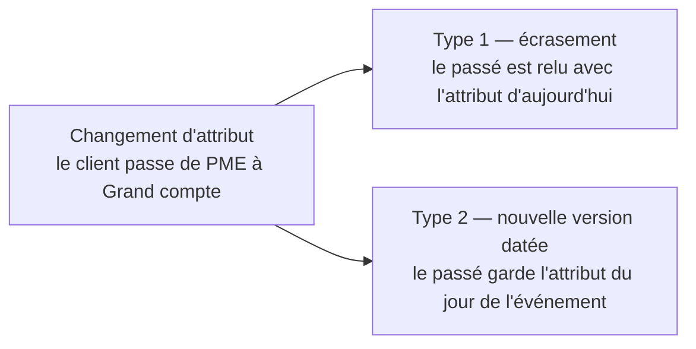

Niveau attendu : **autonomie**. Reclasser le passé ou pas est une réponse métier : le BI Analyst instruit le choix, en montre le coût et l'implémente, mais ne tranche pas seul.

Si un client change de segment, veut-on que ses ventes passées soient reclassées, ou qu'elles restent attachées à l'ancien segment ? Les deux réponses sont légitimes selon l'usage. La question se pose au métier ; elle ne se tranche pas par défaut.

## Ce qu'il faut savoir faire

- Poser la question indicateur par indicateur, en la formulant en termes d'usage : « quand vous regardez les ventes de l'an dernier, voulez-vous les voir avec la segmentation d'aujourd'hui ou celle de l'époque ». Formulée ainsi, elle se tranche en une minute.
- Mettre en place le type 2 quand l'analyse doit refléter l'état au moment de l'événement : une clé technique, une date de début, une date de fin, un indicateur de version courante. Le coût est une colonne de jointure et un peu de discipline.
- Réserver le type 1 aux attributs de pure correction — une faute de frappe dans un libellé, un code erroné. Écraser un attribut porteur de sens réécrit silencieusement l'histoire.
- Anticiper plutôt que migrer. Ajouter l'historisation après coup suppose de reconstituer des états passés qu'on n'a plus, et la reconstitution est souvent impossible : c'est la décision la plus coûteuse à repousser.
- Faire porter la jointure de fait sur la **clé technique** de la version, pas sur l'identifiant métier. C'est ce qui fait que le fait reste attaché à la bonne version, et c'est l'erreur d'implémentation la plus courante.
- Documenter le choix dans le dictionnaire des métriques, à côté de la mesure concernée. Une même table de faits peut être lue des deux façons ; sans mention explicite, chaque rapport choisira au hasard.

## Les notions mobilisées

- [[notions/modelisation-dimensionnelle]] — les types d'historisation y sont définis ; ici, on traite la conduite de la décision.
- [[notions/lignage-des-donnees]] — l'historisation est ce qui rend un chiffre passé reproductible, donc défendable.
- [[notions/gestion-parties-prenantes]] — c'est une décision métier à faire prendre au bon niveau, pas un paramètre technique.
- [[notions/qualite-des-donnees]] — un test sur le non-chevauchement des périodes de validité est indispensable dès la première version.

> [!warning] Piège
> Choisir le type 1 par défaut parce qu'il est plus simple, sans poser la question. Le jour où la finance constate que le chiffre d'affaires par segment de l'an dernier a changé depuis le mois dernier, le problème n'est plus technique : c'est la crédibilité de l'entrepôt qui est en cause, et l'explication ne rattrape rien.

## Pour apprendre

- [Fact Table vs Dimension Table](https://www.simplilearn.com/fact-table-vs-dimension-table-article) — les dimensions à évolution lente et leurs types, présentés simplement.
- [Star Schema vs Snowflake Schema](https://www.thoughtspot.com/data-trends/data-modeling/star-schema-vs-snowflake-schema) — le cadre dans lequel l'historisation s'implante.
- [Delta Lake — Databricks](https://docs.databricks.com/aws/en/delta) — le voyage dans le temps au niveau du stockage, qui complète l'historisation sans la remplacer.
