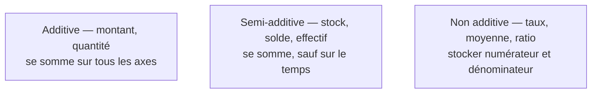

Niveau attendu : **référence**. Un taux sommé à un niveau d'agrégation supérieur est l'erreur la plus difficile à détecter, et le BI Analyst est le seul dans la salle à la voir venir.

Un montant s'additionne sur toutes les dimensions ; un stock s'additionne entre produits mais pas dans le temps ; un taux ne s'additionne jamais. C'est l'erreur la plus fréquente et la plus difficile à détecter, parce que le total faux reste plausible.

## Ce qu'il faut savoir faire

- Classer chaque mesure du modèle dans l'une des trois catégories, et l'écrire dans sa définition. Une mesure dont l'additivité n'est pas déclarée sera sommée par défaut par l'outil de restitution, sans avertissement.
- Stocker le numérateur et le dénominateur d'un ratio, et calculer le rapport à la restitution. C'est la seule façon d'obtenir un taux juste à tous les niveaux d'agrégation.
- Traiter les mesures semi-additives explicitement : pour un stock ou un solde, l'agrégation temporelle est « la dernière valeur », pas la somme. La plupart des outils savent le faire, à condition qu'on le déclare.
- Vérifier le **test du ratio de ratios** dès le premier modèle : si la marge affichée sur le total national est la moyenne des marges régionales, la couche somme des pourcentages et tous les agrégats sont faux.
- Se méfier du comptage distinct, qui n'est pas additif non plus. Le nombre de clients distincts par région ne se somme pas en nombre de clients distincts au national, et l'écart passe inaperçu tant que personne ne recoupe.
- Préférer une mesure supplémentaire à une exception documentée. Une mesure « chiffre d'affaires hors avoirs » explicite coûte une ligne ; une note de bas de page sur une mesure ambiguë ne sera jamais lue.

## Les notions mobilisées

- [[notions/modelisation-dimensionnelle]] — l'additivité y est définie ; ici, ce sont ses conséquences dans les outils de restitution.
- [[notions/statistiques-descriptives]] — une moyenne de moyennes n'est pas une moyenne, et c'est la même erreur sous un autre nom.
- [[notions/outils-decisionnels]] — chaque plateforme a sa façon de déclarer une règle d'agrégation, et ses défauts silencieux.
- [[notions/qualite-des-donnees]] — un test de cohérence entre deux niveaux d'agrégation attrape l'erreur avant la réunion.

> [!tip] Le contrôle en trente secondes
> Comparer le total affiché au niveau le plus agrégé avec la somme calculée directement sur la table de faits. S'ils diffèrent, la mesure n'est pas additive et l'outil l'a sommée quand même. Ce contrôle se fait une fois par mesure et il attrape presque tout.

## Pour apprendre

- [Fact Table vs Dimension Table](https://www.simplilearn.com/fact-table-vs-dimension-table-article) — les types de mesures et leur comportement à l'agrégation.
- [Engineering Statistics Handbook — NIST](https://www.itl.nist.gov/div898/handbook/) — sur les moyennes et ce qu'elles supportent comme opérations.
- [Documentation dbt](https://docs.getdbt.com/docs/build/documentation) — pour attacher l'additivité à la définition plutôt qu'à la mémoire de l'équipe.
