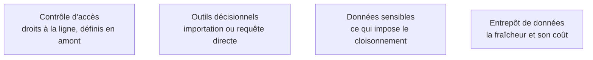

Deux décisions par tableau de bord, prises séparément et souvent confondues : qui voit quelles lignes, et par quel chemin la donnée arrive dans l'outil.

## Ce qu'il faut savoir faire

- Définir les droits d'accès à la ligne dans la couche sémantique ou dans l'entrepôt, **jamais** en dupliquant le rapport par périmètre. Les rapports dupliqués divergent, et un droit d'accès qui vit dans une copie de rapport est un incident de confidentialité en attente.
- Choisir le mode d'accès par tableau de bord et non une fois pour toute la plateforme. L'importation copie la donnée dans l'outil — rapide, décalée ; la requête directe interroge l'entrepôt — fraîche, dépendante de sa charge et de son coût.
- Faire dépendre ce choix de la fraîcheur réellement exigée, établie au cadrage. Une requête directe sur un tableau de bord consulté deux fois par semaine est une dépense sans contrepartie.
- Faire porter les droits par un référentiel d'appartenance — service, région, entité — et non par une liste de personnes. Une liste nominative est fausse dès la première mutation, et personne ne la corrige.
- Vérifier l'application effective des droits en se connectant avec un compte de test de chaque profil, avant l'ouverture. C'est le contrôle qui prend une heure et qui évite l'incident le plus embarrassant du métier.
- Prévoir l'export en tenant compte des droits : un utilisateur qui exporte ne doit pas obtenir plus que ce qu'il voit, et beaucoup d'implémentations laissent passer l'écart.

## Les notions mobilisées

- [[notions/controle-d-acces]] — le modèle de droits, appliqué ici à la ligne d'une table de faits plutôt qu'à une ressource.
- [[notions/outils-decisionnels]] — chaque plateforme implémente les droits à la ligne à sa façon, avec ses limites.
- [[notions/donnees-sensibles]] — le cloisonnement par service est une obligation, pas une option de configuration.
- [[notions/entrepot-de-donnees]] — la requête directe reporte la charge et le coût sur le moteur, ce qui se mesure.

> [!warning] Piège
> Restreindre l'accès en masquant un visuel plutôt qu'en filtrant les lignes. Le masquage est cosmétique : la donnée est chargée, elle apparaît dans l'export, dans le cache et dans l'inspection du rapport. Une restriction qui ne s'applique pas à la requête n'est pas une restriction.

## Pour apprendre

- [Texte du RGPD](https://gdpr-info.eu/) — ce que la minimisation implique concrètement sur les droits d'accès.
- [Metabase — dépôt](https://github.com/metabase/metabase) — un outil libre où les droits à la ligne se lisent dans le code.
- [Snowflake in 20 minutes](https://docs.snowflake.com/en/user-guide/tutorials/snowflake-in-20minutes) — les droits portés par l'entrepôt plutôt que par l'outil de restitution.
