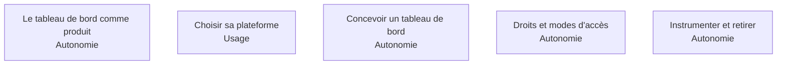

La seule partie du travail que l'organisation voit, ce qui la rend à la fois surévaluée et négligée : on juge le BI Analyst sur l'esthétique de ses tableaux de bord, et on ne finance jamais leur maintenance.

## Les cinq sujets

**Porte de sortie** : un tableau de bord dont les quinze chiffres proviennent tous de la couche sémantique, avec son propriétaire, son coût mensuel et sa date de revue.

## Ma progression

- [ ] [[parcours/bi-analyst/restitution/le-tableau-de-bord-comme-produit|Le tableau de bord comme produit]] — les cinq choses que presque aucune organisation n'a
- [ ] [[parcours/bi-analyst/restitution/choisir-sa-plateforme|Choisir sa plateforme]] — intégrée, exploration, sémantique en code, libre
- [ ] [[parcours/bi-analyst/restitution/concevoir-un-tableau-de-bord|Concevoir un tableau de bord]] — le graphique se déduit de la question, pas du goût
- [ ] [[parcours/bi-analyst/restitution/droits-et-modes-d-acces|Droits et modes d'accès]] — à la ligne, en importation ou en requête directe
- [ ] [[parcours/bi-analyst/restitution/instrumenter-et-retirer|Instrumenter et retirer]] — une équipe BI se juge à ce qu'elle a retiré
