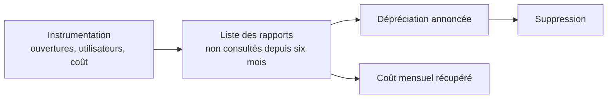

Niveau attendu : **autonomie**. Proposer le retrait d'un tableau de bord que plus personne n'ouvre est une conversation qu'il faut savoir engager, chiffres d'usage à l'appui.

Toutes les plateformes majeures exposent qui ouvre quoi, combien de fois, et à quel coût de calcul. Presque personne ne l'exploite. C'est pourtant ce qui permet la seule conversation qui fasse baisser la dette de reporting.

## Ce qu'il faut savoir faire

- Activer l'instrumentation dès la mise en service, pas le jour où le parc devient ingérable. Les journaux d'usage sont rarement rétroactifs, et leur absence rend toute demande de suppression indéfendable.
- Croiser l'usage avec le coût de calcul. La liste qui fait décider n'est pas « les rapports non consultés », c'est « les rapports non consultés depuis six mois et ce qu'ils coûtent par mois ».
- Arriver en comité avec cette liste et demander l'autorisation de retirer. Sans ces chiffres, la demande se heurte toujours à « mais j'en ai peut-être besoin » ; avec eux, l'arbitrage devient possible.
- Déprécier avant de supprimer : annoncer, laisser fonctionner un cycle, mesurer qui réagit. Un rapport que personne ne réclame pendant un cycle complet peut être retiré sans risque.
- Journaliser aussi ce que les utilisateurs cherchent sans trouver — filtres appliqués, exports, recherches. C'est l'inventaire le plus honnête de ce que le modèle ne couvre pas encore.
- Publier le taux d'usage comme un indicateur de l'équipe BI elle-même. Une équipe qui suit la part de ses rapports réellement consultés se pilote ; une équipe qui suit le nombre de rapports produits accumule.

## Les notions mobilisées

- [[notions/mesure-d-usage-produit]] — l'instrumentation de la consultation, transposée du produit au tableau de bord.
- [[notions/observabilite]] — les journaux d'usage relèvent de la même discipline que la supervision technique.
- [[notions/roi-des-projets-ia]] — l'usage rapporté au coût, seule base d'un arbitrage de suppression.
- [[notions/conduite-du-changement]] — retirer un rapport consulté par une personne influente est un sujet de conduite du changement.

> [!tip] Ce que l'instrumentation révèle toujours
> Une poignée de rapports concentre l'essentiel des consultations, et une longue traîne n'est ouverte que par son auteur. Le chiffre exact surprend chaque organisation qui le mesure pour la première fois, et c'est lui qui justifie enfin de financer la maintenance des quelques rapports qui comptent.

## Pour apprendre

- [Visual Best Practices — Tableau](https://help.tableau.com/current/blueprint/en-us/bp_visual_best_practices.htm) — la partie gouvernance du parc de rapports, souvent négligée.
- [Documentation Grafana](https://grafana.com/docs/) — pour construire le tableau de bord de l'usage et du coût, hors de la plateforme mesurée.
- [Superset — dépôt](https://github.com/apache/superset) — un outil libre dont les journaux d'usage sont directement interrogeables.
