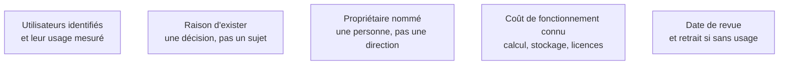

Niveau attendu : **autonomie**. Imposer un propriétaire, un coût et une date de retrait est un arbitrage qu'on défend seul, contre une organisation qui ne finance jamais la maintenance.

Un tableau de bord a des utilisateurs identifiés, une raison d'exister formulée en termes de décision, un propriétaire, un coût de fonctionnement et une date de retrait. La plupart des organisations n'ont aucune de ces cinq choses, et c'est pourquoi elles finissent avec des centaines de rapports dont l'usage est inconnu.

## Ce qu'il faut savoir faire

- Exiger les cinq attributs avant de construire, pas après. Un tableau de bord sans propriétaire nommé et sans date de revue est une dette qu'on souscrit sans échéancier.
- Formuler la raison d'exister en termes de décision : « cette page sert à décider du réapprovisionnement hebdomadaire », pas « cette page suit les stocks ». La première formulation permet de juger si la page marche ; la seconde non.
- Faire provenir tous les chiffres de la couche sémantique. L'essentiel de la valeur ne vient pas du choix du graphique : il vient du fait que les quinze chiffres affichés sortent d'une définition unique, et non de quinze formules écrites dans l'outil.
- Fixer la règle dès le départ : tout nouveau tableau de bord a un propriétaire nommé et une date de revue, et un rapport sans usage à sa revue est déprécié puis supprimé.
- Distinguer le suivi de l'exploration, et ne pas les mélanger dans un même objet. Le suivi affiche peu de chiffres et se consulte souvent ; l'exploration offre beaucoup de dimensions et se consulte rarement.
- Refuser poliment la demande dont la réponse à « quelle décision changera » est « aucune ». Ce refus est la contribution la plus rentable qu'un BI Analyst puisse apporter, et la plus difficile à faire accepter.

## Les notions mobilisées

- [[notions/mesure-d-usage-produit]] — un tableau de bord se pilote comme un produit, avec ses chiffres d'usage.
- [[notions/outils-decisionnels]] — la plateforme impose ce qu'on peut instrumenter et ce qu'on peut restreindre.
- [[notions/roi-des-projets-ia]] — le coût de fonctionnement rapporté à la décision qu'il permet.
- [[notions/cadrage-besoin]] — la raison d'exister se formule au cadrage, pas au moment de la mise en service.

> [!warning] Piège
> Empiler les tableaux de bord sans jamais en retirer. Chaque nouveau rapport ajoute une surface à maintenir, une chance de divergence avec la couche sémantique, et une occasion d'afficher un chiffre différent de celui du voisin. Une équipe BI se juge autant à ce qu'elle a retiré qu'à ce qu'elle a produit.

## Pour apprendre

- [Visual Best Practices — Tableau](https://help.tableau.com/current/blueprint/en-us/bp_visual_best_practices.htm) — indépendant de l'outil malgré la source, y compris sur le cycle de vie.
- [Fundamentals of Data Visualization](https://clauswilke.com/dataviz/introduction.html) — libre et en ligne, sur ce qu'un objet de restitution doit porter.
- [5 Principles of Data Ethics for Business](https://online.hbs.edu/blog/post/data-ethics) — utile sur la responsabilité attachée à ce qu'on publie.
