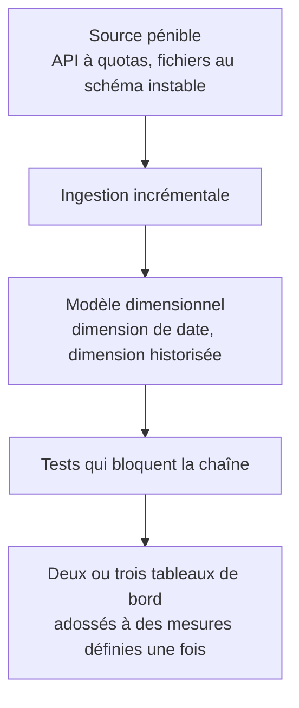

Le portfolio d'un BI Analyst ne se démontre pas comme celui d'un Data Analyst. Un carnet d'analyse bien présenté montre une capacité à répondre ; ce métier-ci doit montrer une capacité à **construire un socle réutilisable** — plus difficile à mettre en vitrine, et beaucoup plus discriminant à l'entretien.

## Ce qu'il faut savoir faire

- Construire un seul projet de bout en bout qui vaut quelque chose, plutôt que dix tableaux de bord sur des données propres. Ce qui le rend démonstratif : une source réellement pénible, une ingestion incrémentale, un modèle avec sa dimension de date et une dimension historisée, des tests bloquants, et des mesures définies une seule fois.
- Montrer le dépôt, le graphe de dépendances des modèles, le dictionnaire des métriques, et un exemple de test qui a attrapé une vraie erreur. Un recruteur compétent regardera ça avant les captures d'écran.
- Documenter une décision de modélisation **et son alternative** — « j'ai choisi ce grain plutôt que celui-là, voilà ce que ça permet et ce que ça coûte ». C'est exactement la question de l'entretien technique, et presque aucun candidat ne sait y répondre.
- Monter la démonstration en local : fichiers Parquet, moteur embarqué, transformation versionnée, outil libre pour la restitution. Aucun compte cloud, aucune facture, et exactement les mêmes pratiques qu'en entreprise. C'est aussi la pile la plus utile pour prototyper un modèle avant de le porter chez un client.
- Préparer les trois exercices attendus : du SQL avec fenêtrage, une modélisation sur énoncé métier, et une mise en situation de désaccord sur un chiffre. Les deux derniers sont ceux qui départagent.
- Négocier avec des exemples chiffrés de ce que le travail a supprimé — rapports retirés, heures de retraitement manuel économisées, incidents évités. Le poste est souvent positionné plus bas que sa contribution réelle, parce que son livrable est invisible quand il fonctionne.

## Les notions mobilisées

- [[notions/transformation-dbt]] — la pièce centrale de ce que le portfolio doit montrer : modèles versionnés, testés, documentés.
- [[notions/modelisation-dimensionnelle]] — c'est la compétence évaluée en entretien, sur énoncé et sans outil.
- [[notions/sql]] — le fenêtrage, testé systématiquement, et sur lequel aucune préparation ne se rattrape sur le moment.
- [[notions/outils-decisionnels]] — déployer et opérer un outil libre apprend plus que n'importe quelle certification.
- [[notions/redaction-technique]] — un portfolio se lit ; la qualité de ce qui l'accompagne compte autant que le code.

> [!tip] Sur les certifications
> Elles servent au filtrage des candidatures, rarement à la compétence. Celle qui a le meilleur rendement est celle de la plateforme utilisée par les entreprises visées, et rien d'autre. Le temps équivalent passé à déployer un outil libre en apprend davantage — cache, droits, couche sémantique — mais ne passe pas les filtres automatiques.

> [!warning] Piège
> Construire son portfolio sur des jeux de données déjà propres. Ils ne permettent de démontrer aucune des compétences du métier : pas de schéma qui change, pas de doublon, pas de définition ambiguë, pas d'historisation à décider. Prendre une source médiocre et montrer ce qu'on en a fait est le seul terrain où le travail se voit.

## Pour apprendre

- [dbt Learn — catalogue de cours](https://learn.getdbt.com/catalog) — les parcours gratuits, à faire dans l'ordre sur un projet réel.
- [Documentation DuckDB](https://duckdb.org/docs/) — le moteur qui rend la démonstration possible en local, sans compte ni facture.
- [Metabase — dépôt](https://github.com/metabase/metabase) et [Superset — dépôt](https://github.com/apache/superset) — les déployer soi-même est le meilleur cours sur le fonctionnement d'un outil décisionnel.
- [15 Rules for Negotiating a Job Offer — HBR](https://hbr.org/2014/04/15-rules-for-negotiating-a-job-offer) — la préparation de la négociation, avec des exemples chiffrés en main.
