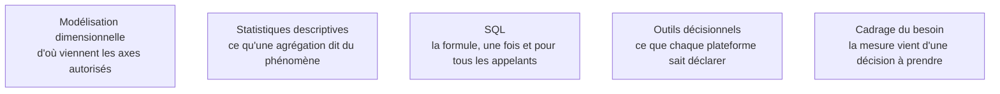

Niveau attendu : **référence**. Formule et règle d'agrégation posées une seule fois : c'est le livrable qui distingue ce poste de tous les autres rôles de la data.

Une mesure se définit par sa formule **et** sa règle d'agrégation. « Chiffre d'affaires » se somme, « nombre de clients distincts » ne se somme pas, « taux de marge » se recalcule à chaque niveau depuis ses deux composants. Une couche sémantique correcte sait faire ces trois choses différemment ; un champ calculé dans un rapport n'en sait faire qu'une.

## Ce qu'il faut savoir faire

- Faire passer à chaque mesure le **test du ratio de ratios** : si la marge affichée sur le total national n'est pas la moyenne des marges régionales, la couche calcule correctement ; si elle l'est, elle somme des pourcentages et tous les agrégats sont faux. À vérifier dès le premier modèle.
- Déclarer les dimensions par lesquelles une mesure a le droit d'être découpée. C'est ce qui interdit par construction les croisements absurdes — un stock ventilé par campagne marketing, un taux de conversion par fournisseur.
- Porter les hiérarchies et les périodes comparables dans la couche, pour donner un sens univoque à « le mois dernier » et « à la même période l'an dernier ». Recalculées dans chaque rapport, elles divergent en trois mois.
- Commencer par les dix à quinze chiffres qui apparaissent réellement dans les instances de pilotage, et les verrouiller complètement — définition, propriétaire, tests, documentation — avant d'en ajouter un seul.
- Nommer un propriétaire métier par mesure : une personne, pas une direction. C'est elle qui valide un changement de définition, et c'est elle qu'on cite quand le chiffre est contesté.
- Faire générer la documentation depuis les définitions. Si la documentation vit dans un tableur et les définitions dans le code, elles divergeront en trois mois — le dictionnaire des métriques et la couche sémantique doivent être le même objet.

## Les notions mobilisées

- [[notions/modelisation-dimensionnelle]] — les axes d'analyse légitimes d'une mesure sortent du modèle, pas d'une préférence.
- [[notions/statistiques-descriptives]] — comprendre ce qu'une somme, une moyenne ou un distinct disent réellement.
- [[notions/sql]] — la formule s'écrit une fois, et son plan d'exécution compte autant que son résultat.
- [[notions/outils-decisionnels]] — chaque plateforme a sa syntaxe de mesure et ses limites d'agrégation non additive.
- [[notions/cadrage-besoin]] — une mesure sans décision associée est une dette de maintenance déguisée en livrable.

> [!warning] Piège
> Construire la couche sémantique comme un exercice d'exhaustivité. Modéliser deux cents mesures dont trente sont utilisées produit un objet que personne ne maîtrise et dont chaque évolution fait peur. Le critère de réussite n'est pas le nombre de mesures, c'est le nombre de réunions qui ne discutent plus du chiffre.

## Pour apprendre

- [Documentation dbt](https://docs.getdbt.com/docs/build/documentation) — comment une définition devient un objet versionné et documenté automatiquement.
- [Fact Table vs Dimension Table](https://www.simplilearn.com/fact-table-vs-dimension-table-article) — les types de mesures et leur comportement à l'agrégation.
- [Engineering Statistics Handbook — NIST](https://www.itl.nist.gov/div898/handbook/) — sur ce que les agrégations supportent et ne supportent pas.
