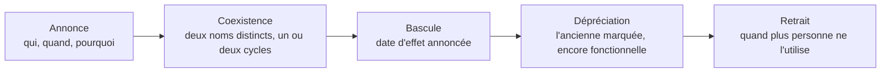

Niveau attendu : **référence**. Le réflexe de versionner une définition plutôt que de l'écraser n'existe nulle part ailleurs dans l'organisation : s'il n'est pas porté ici, il ne l'est pas du tout.

Changer une définition se fait comme un changement d'interface publique : annonce, date d'effet, période où l'ancienne et la nouvelle coexistent sous deux noms, journal du changement. Un chiffre historique qui bouge du jour au lendemain sans explication détruit plus de confiance que six mois de retard de livraison.

## Ce qu'il faut savoir faire

- Annoncer avant de changer, avec une date d'effet. L'annonce coûte un message ; son absence coûte une réunion où la direction constate que son chiffre a bougé et demande qui a décidé.
- Faire coexister l'ancienne et la nouvelle définition sous **deux noms distincts** pendant un ou deux cycles de pilotage. C'est ce qui permet au métier de constater l'écart plutôt que de le subir.
- Déprécier au lieu de supprimer : marquer la mesure comme obsolète, la laisser fonctionner, mesurer qui l'utilise encore, puis la retirer. La suppression brutale casse toujours un rapport dont on ignorait l'existence.
- Tenir le journal des décisions de définition dans le dépôt — date, les deux positions, ce qui a été tranché et par qui. C'est le document le plus utile à transmettre lors d'une prise de poste, et celui qui clôt les débats rouverts.
- Chiffrer l'écart entre l'ancienne et la nouvelle définition avant l'annonce. « La nouvelle définition réduit le chiffre de 3,2 % » est une information exploitable ; « la définition change » ne l'est pas.
- Ne jamais recalculer l'historique en silence. Si le passé doit être réécrit, c'est une décision annoncée avec sa date, et l'ancien historique reste consultable au moins un exercice.

## Les notions mobilisées

- [[notions/conception-d-api]] — une définition publiée est une interface : versionnement, dépréciation, contrat de stabilité.
- [[notions/gestion-parties-prenantes]] — l'annonce se prépare avec ceux qui seront évalués sur le chiffre, avant les autres.
- [[notions/redaction-technique]] — le journal des décisions vaut par sa brièveté et sa régularité, pas par son exhaustivité.
- [[notions/conduite-du-changement]] — faire adopter une nouvelle définition suit les mêmes règles que tout changement d'outil.
- [[notions/mesure-d-usage-produit]] — savoir qui utilise encore l'ancienne mesure est la condition pour la retirer sans incident.

> [!tip] Cinq minutes par décision
> Une entrée de journal se rédige en cinq minutes : la date, les deux positions en une ligne chacune, la décision, le nom de celui qui l'a prise. Six mois plus tard, quand les personnes ont changé et que personne ne se souvient pourquoi « client actif » compte quatre-vingt-dix jours et pas trente, c'est ce fichier qui évite de tout rejouer.

## Pour apprendre

- [Documentation dbt](https://docs.getdbt.com/docs/build/documentation) — comment marquer une dépréciation et la faire apparaître dans la documentation générée.
- [Roadmap Technical Writer](https://roadmap.sh/technical-writer) — la rédaction d'une annonce de changement qui soit lue et comprise.
- [Stakeholder Management Guide](https://simplystakeholders.com/resources/guides/stakeholder-management/) — à qui annoncer, dans quel ordre, et pourquoi l'ordre compte.
