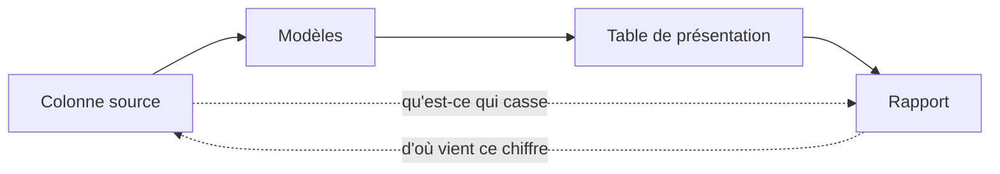

Niveau attendu : **autonomie**. Lire le lignage dans les deux sens s'apprend sur un outil ; répondre à « qu'est-ce qui casse si je modifie cette colonne » engage sa signature.

Le lignage se lit dans deux sens. Descendant pour répondre à « ce chiffre vient d'où » ; **montant** pour répondre à « si je modifie cette colonne source, quels rapports cassent ». Le second est celui qui évite les incidents, et c'est celui que la plupart des catalogues font mal.

## Ce qu'il faut savoir faire

- Exiger que le lignage aille **jusqu'aux rapports**, pas seulement jusqu'aux tables. Beaucoup de catalogues s'arrêtent à la frontière de l'outil de restitution, et c'est précisément là que se trouve la surprise.
- Le faire générer depuis le code plutôt que le saisir. Le graphe de dépendances produit par l'outil de transformation est la seule documentation qui ne se périme pas, parce qu'elle est dérivée de ce qui s'exécute.
- Savoir remonter en quelques minutes d'un chiffre contesté jusqu'à la ligne source. Cette capacité ne s'improvise pas le jour où on en a besoin : elle se construit dans la chaîne de transformation.
- Passer l'analyse d'impact avant chaque modification de modèle, et la rendre obligatoire en revue. « Ce changement touche quatre modèles et deux rapports » doit figurer dans la demande de fusion.
- Conserver, à côté du lignage technique, le lien entre une mesure et son propriétaire métier. Le lignage dit d'où vient le chiffre ; il ne dit pas qui décide de ce qu'il signifie.
- Utiliser le lignage pour répondre aux demandes d'effacement de données personnelles. Sans lui, retrouver toutes les traces d'une personne est une enquête ; avec lui, c'est une requête.

## Les notions mobilisées

- [[notions/lignage-des-donnees]] — la traçabilité, les catalogues et l'analyse d'impact ; ici, l'exigence est qu'il aille jusqu'au rapport.
- [[notions/transformation-dbt]] — le graphe de dépendances généré depuis le code, qui constitue le socle du lignage.
- [[notions/rgpd]] — le droit d'accès et d'effacement suppose de savoir retrouver chaque trace d'une personne.
- [[notions/qualite-des-donnees]] — le lignage est ce qui transforme un test échoué en diagnostic, au lieu d'une alerte isolée.

> [!tip] La question qui teste un catalogue
> « Si cette colonne disparaît demain, quels tableaux de bord affichent une erreur ? » Un catalogue qui ne répond pas à cette question en quelques secondes ne sert qu'à la conformité. C'est aussi la démonstration la plus convaincante à faire devant une direction qui doute de l'intérêt du sujet.

## Pour apprendre

- [What Is Data Lineage? — IBM](https://www.ibm.com/think/topics/data-lineage) — la définition de référence et les deux sens de lecture.
- [The Ultimate Guide To Data Lineage](https://montecarlo.ai/blog-data-lineage) — le versant pratique, y compris la frontière des outils de restitution.
- [Documentation dbt](https://docs.getdbt.com/docs/build/documentation) — le graphe de dépendances généré, à voir fonctionner sur un projet réel.
