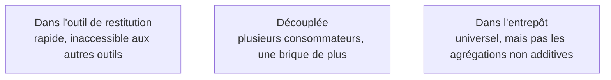

Trois emplacements possibles, trois compromis. En pratique, une combinaison : les tables de présentation portent les mesures additives, la couche découplée ou l'outil portent le reste.

## Ce qu'il faut savoir faire

- Situer le compromis de chaque option. **Dans l'outil de restitution** : le plus rapide à mettre en place, mais les définitions restent inaccessibles aux autres outils et au SQL direct. **Découplée** : les mesures sont exposées à plusieurs consommateurs par une interface commune, au prix d'une brique de plus à opérer. **Dans l'entrepôt**, en vues et tables de présentation : le plus universel, puisque tout ce qui parle SQL y a accès, mais incapable de porter les agrégations non additives et les périodes comparables sans démultiplier les vues.
- Combiner plutôt que choisir. Les mesures additives descendent dans les tables de présentation, où elles servent tout le monde ; les ratios, les comptages distincts et les périodes comparables restent dans une couche qui sait les calculer.
- Vérifier ce que chaque option permet de tester automatiquement. Une définition dans l'entrepôt se teste comme un modèle ; une définition dans un outil de restitution se teste rarement, et c'est son principal défaut.
- Compter le nombre de consommateurs avant de payer une couche découplée. Avec un seul outil de restitution, elle ajoute un composant sans bénéfice immédiat ; avec trois consommateurs dont un assistant conversationnel, elle devient la seule réponse cohérente.
- Ne jamais dupliquer une définition entre deux emplacements. Deux implémentations de la même mesure divergeront, et le jour où elles divergent personne ne saura laquelle fait foi.
- Traiter les droits d'accès à la ligne comme un attribut de la couche, pas du rapport. C'est le même objet qui porte la définition et le périmètre visible par chacun.

## Les notions mobilisées

- [[notions/outils-decisionnels]] — ce que chaque plateforme sait porter en propre, et ce qu'elle laisse au SQL.
- [[notions/entrepot-de-donnees]] — les tables de présentation en sont la forme la plus simple et la plus universelle.
- [[notions/transformation-dbt]] — la couche découplée y est souvent adossée, ce qui la rend versionnée et testée.
- [[notions/controle-d-acces]] — les droits à la ligne se définissent ici, une fois, plutôt que par duplication de rapports.
- [[notions/conception-d-api]] — une couche découplée est une interface, avec les obligations de stabilité que cela implique.

> [!tip] L'argument qui finance ce travail
> La couche sémantique est devenue l'interface par laquelle les assistants interrogent les données. Un modèle de langage branché sur les tables brutes doit devenir sa propre couche sémantique à chaque question, et il le fait mal. C'est le meilleur argument disponible devant une direction, parce qu'il rend visible un travail qui ne l'était pas.

## Pour apprendre

- [What is dbt](https://www.getdbt.com/product/what-is-dbt) — la logique de définitions versionnées, en amont de toute couche sémantique.
- [Documentation dbt](https://docs.getdbt.com/docs/build/documentation) — la mise en œuvre côté entrepôt et côté couche découplée.
- [Metabase — dépôt](https://github.com/metabase/metabase) — un outil libre à déployer pour voir concrètement où les définitions peuvent vivre.
