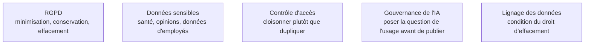

En BI, le biais n'arrive presque jamais par un algorithme : il arrive par le **périmètre**. Un tableau de bord de satisfaction construit sur les répondants à un questionnaire mesure la satisfaction de ceux qui répondent.

## Ce qu'il faut savoir faire

- Appliquer la **minimisation** au modèle : il n'a presque jamais besoin du nom, seulement d'un identifiant pseudonymisé et d'attributs de segmentation. C'est la mesure la moins coûteuse et la plus efficace du sujet.
- Résoudre la tension entre conservation et effacement. L'entrepôt conserve par nature, ce qui entre en contradiction directe avec l'obligation d'effacement : il faut une politique de purge, ou d'agrégation au-delà d'un seuil, écrite et appliquée par la chaîne.
- Documenter le périmètre et les exclusions **à côté du chiffre**, pas dans une annexe. Ce qui est compté, ce qui ne l'est pas, sur quelle population : c'est ce qui distingue un indicateur d'un argument.
- Poser la question de l'usage avant de publier une mesure par personne. Un indicateur de productivité par équipe devient un outil d'évaluation individuelle dès qu'il est diffusé, quelle que soit l'intention initiale.
- Fixer un seuil d'agrégation minimale pour les populations petites. Un indicateur sur un effectif de trois personnes réidentifie, et cette règle doit être dans le modèle, pas dans la vigilance de celui qui publie.
- Savoir que le CCPA californien pose des exigences voisines sur son champ d'application : le mécanisme de réponse — retrouver, extraire, effacer — est le même, et il repose sur le lignage.

## Les notions mobilisées

- [[notions/rgpd]] — les obligations européennes ; l'angle BI est la tension entre conservation d'historique et effacement.
- [[notions/donnees-sensibles]] — les catégories particulières, qui déplacent toute l'architecture quand elles sont présentes.
- [[notions/controle-d-acces]] — cloisonner par service et par ligne plutôt que dupliquer un rapport par périmètre.
- [[notions/gouvernance-ia]] — la question de l'usage, posée avant la publication et non après la controverse.
- [[notions/lignage-des-donnees]] — sans lui, aucune demande d'effacement n'est traitable dans les délais.

> [!warning] Piège
> Publier un indicateur par personne « pour information ». L'usage dérive toujours vers l'évaluation individuelle, et le retrait ultérieur est plus difficile que le refus initial. Si la mesure est justifiée, elle se publie avec son périmètre, ses exclusions et l'accord explicite de ceux qu'elle mesure.

## Pour apprendre

- [Texte du RGPD](https://gdpr-info.eu/) — la source, à consulter plutôt que les résumés commerciaux.
- [CCPA — Attorney General de Californie](https://oag.ca.gov/privacy/ccpa) — l'équivalent américain et son champ d'application.
- [5 Principles of Data Ethics for Business](https://online.hbs.edu/blog/post/data-ethics) — court et exploitable, notamment sur la question du périmètre.
