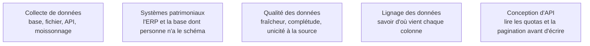

Niveau attendu : **autonomie**. L'inventaire des modes de défaillance se construit et se tient à jour, mais chaque source a son propriétaire ailleurs dans l'entreprise.

L'inventaire des sources n'est pas une formalité de début de projet : c'est la liste de ce qui cassera, avec la date approximative. Une base transactionnelle change de schéma quand l'applicatif est mis à jour, une API SaaS impose des quotas et réécrit l'historique, un export manuel disparaît quand la personne qui le produit part en congé.

## Ce qu'il faut savoir faire

- Tenir un inventaire où chaque source porte cinq colonnes : le propriétaire applicatif, la fréquence de mise à disposition, le mode de rechargement, la présence d'une colonne de dernière modification, et la réponse à « cette source peut-elle réécrire le passé ». La dernière colonne détermine si l'historique est stable.
- Traiter le **fichier déposé à la main** comme la source la plus dangereuse. Un classeur mis chaque lundi sur un partage réseau finit toujours par être la clé d'un tableau de bord de direction, et il n'a ni schéma stable, ni propriétaire, ni historique.
- Ingérer ce type de fichier avec une validation de schéma stricte qui **refuse** le fichier plutôt que d'accepter une colonne renommée, et archiver chaque version reçue. Le jour où le chiffre est contesté, c'est l'archive brute qui tranche.
- Anticiper le mode de défaillance propre à chaque famille : rupture de schéma côté applicatif, réécriture rétroactive et quota côté API SaaS, volume et horodatage côté télémétrie, disparition pure et simple côté export humain.
- Demander à chaque équipe source un préavis de changement de schéma, par écrit. C'est le seul levier disponible, et il transforme une rupture subie en engagement rompu.
- Repérer la source à laquelle le métier se fie réellement, qui n'est presque jamais la source officielle. C'est elle qu'il faudra alimenter ou remplacer.

## Les notions mobilisées

- [[notions/collecte-de-donnees]] — les quatre canaux d'extraction et la fiabilité qu'on peut en attendre, avant de choisir.
- [[notions/systemes-patrimoniaux]] — l'ERP dont le schéma documenté décrit l'intention d'origine, pas quinze ans d'usages détournés.
- [[notions/qualite-des-donnees]] — les dimensions de qualité se constatent à la source avant de se tester dans la chaîne.
- [[notions/lignage-des-donnees]] — l'inventaire est le premier étage du lignage, celui que les catalogues automatiques ne reconstituent pas.
- [[notions/conception-d-api]] — quotas, pagination et fenêtres de rétention se lisent dans la documentation, pas au moment de la panne.

> [!warning] Piège
> Prendre pour argent comptant la description du modèle de données fournie par la DSI. Le champ « commentaire » porte souvent un code de statut, la table archivée est encore écrite par trois traitements, et la colonne « date » existe en trois versions incompatibles. Vérifier par requête, systématiquement, avant de concevoir quoi que ce soit.

## Pour apprendre

- [Roadmap Data Engineer](https://roadmap.sh/data-engineer) — le versant amont de l'ingestion, pour savoir ce qui se négocie et ce qui se subit.
- [Documentation PostgreSQL](https://www.postgresql.org/docs/) — la source transactionnelle la plus courante, dont il faut savoir lire le catalogue système.
- [What Is Data Quality? — IBM](https://www.ibm.com/think/topics/data-quality) — les dimensions de qualité, appliquées ici au constat d'entrée.
- [Documentation Kafka](https://kafka.apache.org/quickstart) — pour situer ce qu'est réellement une source en flux, avant d'en accepter une.
