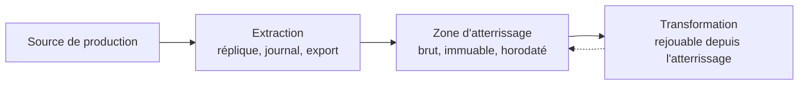

Niveau attendu : **autonomie**. Découplage, incrémental et quotas se conçoivent et se déboguent en pleine nuit ; l'exploitation de la base source, elle, reste à l'équipe applicative.

Aller chercher la donnée directement dans la base de production marche pendant trois mois, puis une requête d'agrégation dégrade l'applicatif en pleine journée. Le vrai coût est ailleurs : le modèle décisionnel se retrouve couplé au schéma applicatif, et chaque évolution du produit casse un rapport.

## Ce qu'il faut savoir faire

- Découpler par une couche d'ingestion, toujours. Ce n'est pas de la bureaucratie : c'est ce qui rend l'applicatif et le modèle décisionnel modifiables indépendamment l'un de l'autre.
- Construire l'extraction incrémentale sur une colonne de dernière modification ou un journal de transactions. Si la source n'en a aucun, l'extraction sera complète, et son coût plafonnera le volume traitable — c'est une contrainte d'architecture, pas un détail technique.
- Prévoir la donnée qui arrive en retard. Un incrémental strict laisse des trous silencieux ; une fenêtre de reprise glissante sur quelques jours, ou un rechargement complet périodique, les rattrape.
- Ne jamais rejouer l'ingestion depuis la source pour corriger une erreur de logique. On rejoue depuis l'atterrissage brut, ce qui suppose de l'avoir conservé — et c'est la raison d'être de cette zone.
- Négocier une réplique de lecture ou une fenêtre nocturne plutôt que d'interroger la base primaire. Quand ni l'une ni l'autre n'est possible, le sujet remonte au propriétaire de l'applicatif, pas à une astuce de requête.
- Consigner pour chaque extraction son horodatage et son périmètre. Sans ces deux métadonnées, aucune réconciliation n'est possible le jour où un chiffre est contesté.

## Les notions mobilisées

- [[notions/collecte-de-donnees]] — les métadonnées d'extraction, qui font la différence entre une donnée fiable et une donnée plausible.
- [[notions/systemes-patrimoniaux]] — sur un système ancien, l'extraction est souvent le seul point de contact possible, et il est fragile.
- [[notions/orchestration-de-flux]] — la reprise sur incident se conçoit ici, pas au moment de l'incident.
- [[notions/qualite-des-donnees]] — la fraîcheur se mesure à l'extraction, avant que les transformations ne la masquent.

> [!tip] La métadonnée qui sauve
> Horodater chaque lot ingéré et garder le nom du fichier ou l'identifiant de la fenêtre extraite. C'est trois colonnes de plus, et c'est la seule façon de répondre en cinq minutes à « depuis quand ce chiffre est-il faux ». Sans elles, la réponse est une journée d'enquête.

## Pour apprendre

- [Documentation Airflow](https://airflow.apache.org/docs) — les notions de fenêtre d'exécution, de rattrapage et de reprise, même si l'outil retenu est un autre.
- [Documentation Prefect](https://docs.prefect.io/v3/get-started) — la même famille de problèmes abordée avec un modèle d'exécution différent, utile en comparaison.
- [Apache Parquet](https://parquet.apache.org/) — le format dans lequel une zone d'atterrissage se conserve sans se périmer.
