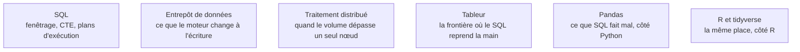

Niveau attendu : **référence**. C'est le seul endroit du parcours où le SQL cesse d'être un moyen pour devenir le livrable lui-même : le Data Analyst s'y arrête à l'autonomie, ce poste y fait autorité.

Ce qui est propre au BI Analyst, c'est que ses requêtes ne sont pas des réponses mais des **définitions** : une requête écrite une fois et exécutée dix mille fois par un outil de restitution, dont le plan d'exécution et le coût comptent autant que le résultat.

## Ce qu'il faut savoir faire

- Écrire du fenêtrage sans hésiter : cumuls, classements, écarts à la période précédente, part d'un total. C'est la famille de fonctions qui distingue un SQL d'analyste d'un SQL d'application, et c'est ce qui est testé en entretien.
- Structurer une requête longue en CTE nommées, une étape par intention. Une requête de deux cents lignes lisible vaut mieux qu'une requête de trente lignes imbriquées que personne ne relira, y compris son auteur.
- Optimiser par réduction du volume lu, pas par astuce de syntaxe : partitionnement par date, colonnes projetées explicitement plutôt que `SELECT *`, agrégations pré-calculées. Lire le plan d'exécution avant de réécrire quoi que ce soit.
- Connaître le modèle de facturation du moteur — au temps de calcul, à la donnée scannée, ou à la capacité réservée. Il dicte la façon d'écrire les requêtes, bien plus que les règles générales d'optimisation.
- Savoir ce qu'une base transactionnelle peut absorber. PostgreSQL tient jusqu'à quelques dizaines de millions de lignes en analytique ; au-delà, la question n'est plus la requête mais le stockage colonnaire.
- Passer à Python ou R uniquement pour ce que SQL fait mal — appeler une API, lire un format exotique, calculer une prévision. Dans la chaîne de transformation, le SQL est testable, lisible par le métier et exécuté par l'entrepôt.

## Les notions mobilisées

- [[notions/sql]] — la mécanique du langage ; l'angle BI est le coût et la stabilité d'une requête exécutée en continu.
- [[notions/entrepot-de-donnees]] — le stockage colonnaire explique pourquoi la même requête change d'ordre de grandeur selon le moteur.
- [[notions/traitement-distribue]] — le seuil à partir duquel la question cesse d'être une question de requête.
- [[notions/tableur]] — la limite au-delà de laquelle un calcul doit remonter dans le SQL pour être tenable.
- [[notions/pandas]] — le complément assumé côté Python, cantonné à ce qui ne s'exprime pas en SQL.
- [[notions/r-et-tidyverse]] — le même rôle côté R, selon l'écosystème déjà en place dans l'entreprise.

> [!tip] La première requête utile
> Sur une table inconnue, elle n'est pas métier : c'est un inventaire. Combien de lignes, depuis quand, combien de valeurs nulles par colonne, quelles valeurs distinctes sur les colonnes censées être normalisées. Elle prend dix minutes et elle évite de concevoir un modèle sur une hypothèse fausse.

## Pour apprendre

- [SQL Window Functions](https://www.thoughtspot.com/sql-tutorial/sql-window-functions) — la meilleure page courte sur le fenêtrage, avec des exemples exécutables.
- [Performance Tuning SQL Queries](https://www.thoughtspot.com/sql-tutorial/sql-performance-tuning) — l'optimisation abordée par le volume lu plutôt que par les astuces.
- [Documentation PostgreSQL](https://www.postgresql.org/docs/) — la référence à consulter sur les plans d'exécution et leur lecture.
- [Documentation DuckDB](https://duckdb.org/docs/) — pour éprouver du SQL analytique sur des fichiers, sans serveur ni compte.
